# Smart Contract Based E-Prescription System Design for Digital Health
### Dokumen Desain Sistem (System Design Specification)

**Penulis:** Yudha Islami Sulistya · **Institusi:** Universitas Gadjah Mada  
**Tanggal:** 18 Juni 2026 · **Versi:** 1.0 · **Status:** Draft untuk Review

## Ringkasan (Abstract)

Dokumen ini menyajikan desain ulang (redesign) sistem e-prescription berbasis smart contract untuk ranah digital health, menggantikan prototipe naif yang menyimpan private key dan PII pasien dalam plaintext, menandatangani seluruh transaksi dengan satu hot-wallet server, serta menyimpan data obat tanpa enkripsi. Arsitektur baru dibangun di atas permissioned consortium blockchain (Hyperledger Besu, IBFT 2.0) dengan model identitas hybrid (self-custody untuk Doctor/Pharmacist; DID + managed key untuk Patient), kontrak modular ber-RBAC (IdentityRegistry, PrescriptionRegistry, KeyAccessRegistry), siklus hidup resep penuh dengan mekanisme anti-double-dispensing, serta perlindungan privasi melalui envelope encryption (AES-256-GCM + ECIES key-wrapping) sehingga zero PII tersimpan on-chain. Dokumen ditutup dengan metodologi evaluasi (gas, latency, throughput, keamanan) dan rencana migrasi dari basis kode yang ada.

## Daftar Isi

1. Pendahuluan & Tujuan Desain
2. Arsitektur Sistem
3. Model Aktor & Identitas
4. Desain Smart Contract
5. Lifecycle Resep (State Machine)
6. Model Data & Pembagian On/Off-chain
7. Privasi & Kriptografi
8. Keamanan & Threat Model
9. Sequence Flows
10. Desain API & Backend
11. Deployment & Infrastruktur
12. Metodologi Evaluasi
13. Pemetaan ke Repo & Rencana Migrasi
14. Keterbatasan & Future Work

---

## Konvensi Kanonik (Normative Conventions)

> **Catatan normatif.** Subbagian ini adalah *single source of truth* untuk konvensi lintas-bagian. Bila sebuah *code snippet* di bagian mana pun tampak menyederhanakan salah satu konvensi di bawah, konvensi inilah yang mengikat.

**K-1 — Enum `State`.** Definisi kanonik memakai sentinel `None` pada index 0 (memanfaatkan nilai default *storage* Solidity untuk deteksi keberadaan *record*):

```solidity
enum State { None, ISSUED, PARTIALLY_DISPENSED, FULLY_DISPENSED, EXPIRED, REVOKED }
//             0      1            2                   3             4        5
```

`None` bukan target transisi yang sah; ia hanya menandai resep yang belum pernah diterbitkan (`prescriptionId` belum ada).

**K-2 — Tipe `recipient` pada `KeyAccessRegistry`.** *Storage key* bertipe `bytes32`: EOA aktor di-*encode* `bytes32(uint256(uint160(addr)))`; pasien memakai `patientRef`. *Overload* bertipe `address` (bila muncul pada sketsa) adalah pembungkus kenyamanan untuk *recipient* profesional yang meng-*encode* ke `bytes32` secara internal. Kolom `recipient` pada read-model Postgres dan baris `getWrappedKey` pada matriks RBAC mengikuti `bytes32`.

**K-3 — Peran (roles).** Tiga peran aktor manusia: `ADMIN_ROLE` (regulator), `DOCTOR_ROLE`, `PHARMACIST_ROLE`. Satu peran *service* auxiliary: `PATIENT_CUSTODIAN_ROLE` untuk EOA *service* KMS yang menjalankan *patient-centric grant* atas nama pasien (rincian di §10.2). Pasien tidak pernah memegang *signing role* on-chain.

**K-4 — Penamaan event kanonik.** `PrescriptionIssued`, `PrescriptionDispensed`, `PrescriptionRefilled`, `PrescriptionRevoked`, `PrescriptionExpired` (`PrescriptionRegistry`); `AccessGranted`, `AccessRevoked` (`KeyAccessRegistry`); `ActorRegistered`, `ActorStatusChanged`, `PatientRegistered` (`IdentityRegistry`).

**K-5 — Semantik `verify()`.** `verify(prescriptionId)` (view) mengembalikan `true` **jika dan hanya jika** `state ∈ {ISSUED, PARTIALLY_DISPENSED}` **dan** `block.timestamp ≤ expiresAt` (evaluasi expiry *lazy*). `FULLY_DISPENSED` dengan sisa refill **tidak** *fillable* hingga `refill()` mengembalikannya ke `ISSUED`.

**K-6 — Semantik refill.** `refill`: `FULLY_DISPENSED → ISSUED` selama `refillsUsed < refillsAllowed` dan `block.timestamp ≤ expiresAt`; menaikkan `refillsUsed`, mereset `dispensedUnits := 0`. `expiresAt` adalah batas absolut; total unit sah sepanjang umur resep ≤ `totalUnits × (1 + refillsAllowed)`.

**K-7 — Identitas pasien & privasi.** `patientRef = keccak256(salt, DID)` (pseudonim). *Zero PII* dan *zero plaintext* data klinis tidak pernah menyentuh ledger maupun IPFS dalam bentuk terbaca.

---

## 1. Pendahuluan & Tujuan Desain

### 1.1 Latar Belakang dan Rumusan Masalah

Transformasi layanan kesehatan menuju paradigma *digital health* menempatkan resep elektronik (*e-prescription*) sebagai salah satu artefak data klinis yang paling kritikal sekaligus paling sensitif. Resep merupakan instruksi terapeutik yang mengikat secara hukum (*legally binding*), menghubungkan tiga aktor inti—dokter (*prescriber*), pasien, dan apoteker (*dispenser*)—serta menjadi titik kendali utama dalam rantai pasok farmasi. Pada konteks Indonesia, regulasi seperti Peraturan Menteri Kesehatan tentang rekam medis elektronik dan pelindungan data pribadi (UU No. 27 Tahun 2022) menuntut adanya jaminan kerahasiaan, integritas, dan ketertelusuran (*auditability*) atas setiap transaksi data kesehatan. Secara klinis dan farmakovigilans, sistem e-prescription harus mampu mencegah penyalahgunaan obat (terutama golongan *controlled substances*), menghindari peresepan ganda (*double-dispensing*), serta menyediakan jejak audit yang tidak dapat disangkal (*non-repudiation*) atas siapa yang meresepkan, kapan, dan untuk siapa.

Arsitektur e-prescription konvensional umumnya bertumpu pada basis data terpusat yang dikelola oleh satu otoritas. Model ini menghadirkan tiga kelemahan struktural. *Pertama*, *single point of trust* dan *single point of failure*: integritas seluruh catatan bergantung pada satu administrator yang dapat memodifikasi atau menghapus rekaman secara unilateral tanpa jejak yang terverifikasi secara independen. *Kedua*, lemahnya provenans lintas-institusi: ketika resep diterbitkan oleh satu rumah sakit dan ditebus di apotek yang berbeda secara organisasi, tidak ada *shared source of truth* yang dapat dipercaya bersama tanpa rekonsiliasi manual. *Ketiga*, ketiadaan mekanisme anti-*double-dispensing* yang dapat diaudit lintas-domain. Teknologi *blockchain* permissioned—khususnya yang dijalankan oleh konsorsium pemangku kepentingan (rumah sakit, regulator obat, asosiasi apotek)—menjanjikan *shared ledger* yang *tamper-evident*, *append-only*, dan dapat diverifikasi tanpa memusatkan kepercayaan pada satu entitas. Namun, blockchain bukan obat mujarab: tanpa rancangan kriptografi privasi yang tepat, sifat transparan dan imutabel justru memperburuk risiko paparan *Protected Health Information* (PHI).

Rumusan masalah yang menjadi fokus rancangan ini adalah: **bagaimana merancang sistem e-prescription berbasis *smart contract* di atas blockchain permissioned yang secara simultan menjamin (i) kerahasiaan PHI melalui *zero PII on-chain*, (ii) provenans dan *non-repudiation* yang kuat melalui identitas terdesentralisasi dan kontrol akses berbasis peran, (iii) penegakan *lifecycle* resep yang *anti-double-dispensing* secara deterministik melalui konsensus, dan (iv) keterukuran serta evaluabilitas (gas, latensi, *throughput*, keamanan), sambil mengoreksi seluruh kelemahan sistem naif yang ada saat ini.**

### 1.2 Kelemahan Sistem Naif Saat Ini

Rancangan ini merupakan *redesign* atas sebuah sistem naif (*baseline*) yang saat ini berjalan di atas testnet Sepolia. Tujuh kelemahan yang teridentifikasi (dirujuk sebagai V1–V7) menjadi motivasi langsung bagi keputusan desain pada bab-bab berikutnya. Secara naratif, kelemahan-kelemahan tersebut saling berkelindan membentuk profil risiko yang serius:

Pada lapisan **manajemen kunci dan privasi data identitas**, sistem naif menyimpan *private key* sekaligus *Personally Identifiable Information* (PII) pasien dalam *plaintext* pada berkas `public/data/pasien_wallets.json` yang **dilayani secara publik** (**V1**). Hal ini berarti siapa pun yang mengakses URL statis aplikasi dapat memperoleh kunci penandatanganan dan data pribadi pasien secara langsung—sebuah pelanggaran fundamental terhadap *confidentiality* dan kustodi kunci. Diperparah oleh fakta bahwa **satu server *hot-wallet*** (`PRIVATE_KEY`) menandatangani **seluruh** transaksi (**V2**), sehingga provenans yang dihasilkan bersifat semu: rantai blok mencatat satu alamat penandatangan untuk semua aktor, meniadakan *non-repudiation* dan memusatkan kepercayaan pada satu entitas operasional.

Pada lapisan **otorisasi dan kontrol akses**, tidak terdapat *Role-Based Access Control* (RBAC) sama sekali (**V3**): setiap pemanggil *smart contract* secara efektif bertindak sebagai `doctor`, sehingga tidak ada pembedaan kewenangan antara dokter, apoteker, dan administrator. Pada lapisan **logika domain dan keselamatan klinis**, sistem tidak memiliki *lifecycle dispensing* maupun mekanisme anti-*double-dispensing* (**V4**): sebuah resep dapat ditebus berulang kali tanpa batas dan tanpa pencatatan kuantitas yang ter-*dispense*, membuka celah penyalahgunaan obat yang nyata.

Pada lapisan **kerahasiaan muatan resep**, data obat diunggah ke IPFS **tanpa enkripsi** (**V5**), sehingga siapa pun yang memperoleh *Content Identifier* (CID)—yang sifatnya publik—dapat membaca seluruh isi resep, termasuk diagnosis dan medikasi. Pada lapisan **persistensi dan auditabilitas**, penyimpanan bertumpu pada berkas JSON datar (**V6**) yang *world-readable* dan tidak menyediakan mekanisme audit, kontrol versi, maupun integritas yang terverifikasi. Akhirnya, pada lapisan **validasi ilmiah**, sistem naif sama sekali tidak memiliki **metodologi evaluasi** (**V7**)—tidak ada pengukuran gas, latensi, *throughput*, maupun analisis keamanan—sehingga klaim kelayakannya tidak dapat diverifikasi secara empiris.

Pemetaan ringkas kelemahan terhadap properti keamanan yang dilanggar disajikan pada tabel berikut:

| ID | Kelemahan | Lapisan | Properti yang Dilanggar |
|----|-----------|---------|--------------------------|
| V1 | Private key + PII plaintext pada JSON publik | Key management & privacy | Confidentiality, key custody |
| V2 | Single server hot-wallet menandatangani semua tx | Identity & provenance | Authenticity, non-repudiation, decentralization |
| V3 | Tiada RBAC; semua pemanggil = `doctor` | Authorization | Least privilege, access control |
| V4 | Tiada lifecycle & anti-double-dispensing | Domain logic | Clinical safety, integrity |
| V5 | Data obat ke IPFS tanpa enkripsi | Payload confidentiality | Confidentiality |
| V6 | Penyimpanan JSON datar, world-readable | Persistence | Auditability, integrity |
| V7 | Tiada metodologi evaluasi | Validation | Verifiability, rigor |

### 1.3 Tujuan dan Sasaran Desain

Tujuan umum rancangan ini adalah menghasilkan *system design* e-prescription berbasis *smart contract* yang aman, privat, dapat diaudit, dan terukur secara empiris untuk konteks *digital health* konsorsium. Tujuan umum tersebut diturunkan menjadi sasaran-sasaran spesifik (*objectives*) berikut, yang masing-masing secara langsung memitigasi satu atau lebih kelemahan V1–V7:

- **O1 — Eliminasi paparan kunci dan PII.** Menghilangkan *plaintext* private key dan PII dari penyimpanan publik dengan menerapkan model identitas hibrida (*self-custody* untuk profesional, *custodial KMS/HSM* untuk pasien) dan *zero PII on-chain* via `patientRef = keccak256(salt, DID)`. *(mengoreksi V1, V5)*
- **O2 — Provenans dan non-repudiation otentik.** Mengganti *single hot-wallet* dengan penandatanganan per-aktor (*self-custody EOA* + EIP-712 *typed data signature*) sehingga setiap transaksi terikat secara kriptografis pada identitas penerbitnya. *(mengoreksi V2)*
- **O3 — Kontrol akses berbasis peran on-chain.** Menerapkan RBAC melalui `IdentityRegistry` berbasis OpenZeppelin `AccessControl` dengan `ADMIN_ROLE`, `DOCTOR_ROLE`, dan `PHARMACIST_ROLE`. *(mengoreksi V3)*
- **O4 — Lifecycle deterministik & anti-double-dispensing.** Menegakkan *state machine* resep (`ISSUED → PARTIALLY_DISPENSED → FULLY_DISPENSED`, dengan `EXPIRED`/`REVOKED`) dan akunting `dispensedUnits` on-chain yang diserialisasi oleh konsensus. *(mengoreksi V4)*
- **O5 — Kerahasiaan muatan via envelope encryption.** Mengenkripsi *canonical prescription JSON* dengan AES-256-GCM (CEK per-resep), membungkus CEK via ECIES ke `encryptionPubKey` tiap *recipient* berwenang, dan menyimpan hanya `cid` + `payloadHash` on-chain. *(mengoreksi V5)*
- **O6 — Persistensi auditable.** Menggantikan berkas JSON datar dengan *event-driven read-model* Postgres yang diisi oleh *event-indexer* dari *event* kontrak, menjadikan setiap transisi state dapat diaudit dan dikueri. *(mengoreksi V6)*
- **O7 — Metodologi evaluasi yang rigor.** Mendefinisikan metrik dan *baseline* yang terukur (gas/resource, latensi, *throughput*, skalabilitas, *overhead* kripto, keamanan via Slither/Mythril). *(mengoreksi V7)*

### 1.4 Prinsip Desain

Rancangan ini berlandaskan pada enam prinsip rekayasa keamanan dan privasi yang bersifat lintas-potong (*cross-cutting*) dan memandu setiap keputusan arsitektural:

1. **Security-by-design.** Properti keamanan ditanamkan sejak fase desain, bukan ditambahkan sebagai *afterthought*. Kontrol akses, validasi state, dan *guard* invarian dikodifikasikan langsung dalam *smart contract*, sementara analisis statis (Slither/Mythril) menjadi bagian integral dari proses verifikasi.
2. **Privacy-by-design.** Privasi merupakan *default*: tidak ada PII yang pernah menyentuh *ledger*. Identitas pasien direpresentasikan sebagai pseudonim `patientRef`, dan muatan klinis terenkripsi sebelum meninggalkan domain penerbit.
3. **Data minimization.** On-chain hanya menyimpan minimum data yang diperlukan untuk penegakan *lifecycle* dan integritas—identifier, hash, pointer (CID), dan akunting kuantitas—bukan data klinis itu sendiri. Hal ini menekan permukaan serangan sekaligus pertumbuhan *storage*.
4. **Least privilege.** Setiap aktor hanya memiliki kewenangan minimal yang sesuai perannya: dokter dapat `issuePrescription` dan `revoke` atas resepnya sendiri; apoteker hanya dapat `dispense`; regulator (`ADMIN_ROLE`) mengelola registrasi dan status aktor. Pasien tidak memiliki *signing role* on-chain.
5. **Separation of concerns.** Tanggung jawab dipisahkan secara modular: `IdentityRegistry` (identitas & RBAC), `PrescriptionRegistry` (record & lifecycle), dan `KeyAccessRegistry` (manajemen akses kunci). Orkestrasi off-chain (Next.js API), penandatanganan (browser/KMS), *indexing* (Postgres), dan penyimpanan (IPFS) terisolasi pada lapisan masing-masing.
6. **Auditability.** Setiap transisi state meng-emit *event* yang menjadi sumber kebenaran bagi *read-model*, menciptakan jejak audit yang *tamper-evident*, lengkap, dan dapat direkonstruksi secara independen dari *ledger*.

Keterkaitan prinsip-prinsip ini dengan lapisan arsitektur diilustrasikan pada diagram berikut:

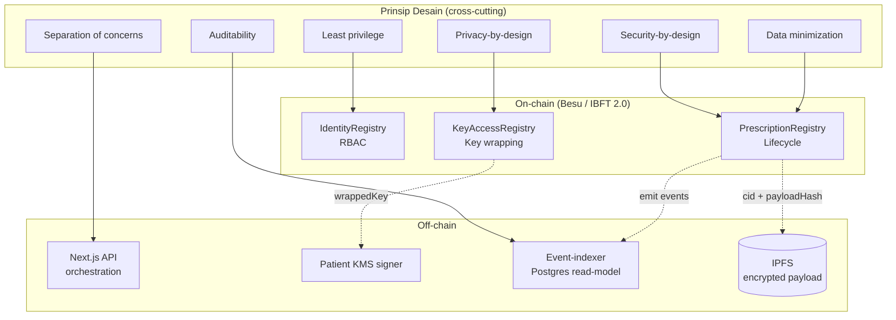

### 1.5 Functional Requirements

Tabel berikut mendefinisikan kebutuhan fungsional (*Functional Requirements*, FR) sistem. Setiap FR ditautkan ke kontrak/komponen pengimplementasi dan kelemahan baseline yang dimitigasi.

| ID | Functional Requirement | Komponen Pengimplementasi | Mitigasi |
|------|------------------------|---------------------------|----------|
| FR1 | Sistem harus meregistrasi aktor (dokter, apoteker, admin) beserta `licenseHash`, `institutionId`, dan `encryptionPubKey` melalui `registerActor`. | `IdentityRegistry` | V1, V3 |
| FR2 | Sistem harus meregistrasi pasien sebagai `{ patientRef, encryptionPubKey }` tanpa *signing role* melalui `registerPatient`. | `IdentityRegistry` | V1 |
| FR3 | Sistem harus menegakkan RBAC: hanya `DOCTOR_ROLE` dapat menerbitkan resep, hanya `PHARMACIST_ROLE` dapat men-*dispense*, hanya `ADMIN_ROLE` mengelola status aktor (`setActorStatus`). | `IdentityRegistry`, `PrescriptionRegistry` | V3 |
| FR4 | Dokter harus dapat menerbitkan resep (`issuePrescription`) yang menyimpan `prescriptionId`, `patientRef`, `cid`, `payloadHash`, `issuedAt`, `expiresAt`, `totalUnits`, `refillsAllowed`, dengan state awal `ISSUED`. | `PrescriptionRegistry` | V2, V4 |
| FR5 | Apoteker harus dapat men-*dispense* sebagian (`dispense`) dengan akunting `dispensedUnits` dan transisi state otomatis ke `PARTIALLY_DISPENSED` atau `FULLY_DISPENSED`. | `PrescriptionRegistry` | V4 |
| FR6 | Sistem harus menolak *dispense* yang melebihi `remaining = totalUnits - dispensedUnits` dan menolak *dispense* pada state `FULLY_DISPENSED`/`EXPIRED`/`REVOKED` (anti-double-dispensing). | `PrescriptionRegistry` | V4 |
| FR7 | Dokter penerbit atau `ADMIN_ROLE` harus dapat mencabut resep (`revoke`) pada state `ISSUED`/`PARTIALLY_DISPENSED`. | `PrescriptionRegistry` | V4 |
| FR8 | Sistem harus mendukung penandaan kedaluwarsa (`markExpired`) saat `block.timestamp > expiresAt`. | `PrescriptionRegistry` | V4 |
| FR9 | Sistem harus mendukung *refill* terkendali: dari `FULLY_DISPENSED` ke siklus berikutnya selama `refillsUsed < refillsAllowed`. | `PrescriptionRegistry` | V4 |
| FR10 | Sistem harus menyediakan verifikasi resep (`verify`, `getPrescription`) yang melaporkan keaktifan dan status kedaluwarsa secara *view*. | `PrescriptionRegistry` | V4, V6 |
| FR11 | Sistem harus mengenkripsi *canonical prescription JSON* dengan CEK AES-256-GCM dan mengunggah `{iv, ciphertext, authTag}` ke IPFS sebelum penerbitan. | Next.js API, IPFS client | V5 |
| FR12 | Sistem harus membungkus CEK ke `encryptionPubKey` *recipient* via ECIES dan menyimpannya melalui `grantAccess`; saat ISSUE diberikan ke pasien (+dokter penerbit). | `KeyAccessRegistry`, KMS signer | V5 |
| FR13 | Saat *fill*, KMS pasien harus me-*re-wrap* CEK ke `encryptionPubKey` apotek terpilih dan men-submit `grantAccess` (kontrol *patient-centric*). | `KeyAccessRegistry`, Patient KMS | V5 |
| FR14 | *Recipient* berwenang harus dapat mengambil `wrappedKey` (`getWrappedKey`) untuk mendekripsi muatan; `revokeAccess` harus mencabut akses kunci. | `KeyAccessRegistry` | V5 |
| FR15 | Sistem harus meng-emit *event* untuk setiap transisi state dan setiap `AccessGranted`/`AccessRevoked`. | `PrescriptionRegistry`, `KeyAccessRegistry` | V6 |
| FR16 | *Event-indexer* harus mengonsumsi *event* ke *read-model* Postgres untuk kueri cepat dan rekonstruksi jejak audit. | Event-indexer, Postgres | V6 |
| FR17 | Dokter harus menandatangani *canonical payload* dengan EIP-712 *typed data* sebagai bukti *non-repudiation* off-chain. | Next.js API, browser signer | V2 |
| FR18 | Sistem harus mendukung *right-to-erasure*: *unpin* ciphertext dari IPFS + *tombstone flag* on-chain. | IPFS client, `PrescriptionRegistry` | V5, V6 |

### 1.6 Non-Functional Requirements

| ID | Kategori | Non-Functional Requirement | Mekanisme | Metrik / Kriteria |
|------|----------|----------------------------|-----------|-------------------|
| NFR1 | Confidentiality | PHI tidak boleh terpapar on-chain maupun via IPFS publik. | Zero PII on-chain (`patientRef`), envelope encryption (AES-256-GCM + ECIES). | 0 PHI on-chain; ciphertext-only di IPFS. |
| NFR2 | Integrity | Muatan resep dan record on-chain tidak dapat dimodifikasi tanpa terdeteksi. | `payloadHash = keccak256(ciphertext)`; AES-GCM `authTag`; *append-only ledger*. | Verifikasi hash 100%; deteksi tamper. |
| NFR3 | Availability | Layanan tahan terhadap kegagalan node tunggal. | Konsorsium multi-validator IBFT 2.0; toleransi `f` dari `3f+1`. | Liveness selama mayoritas validator sehat. |
| NFR4 | Authenticity / Non-repudiation | Setiap tindakan terikat pada identitas penerbitnya. | Self-custody EOA per-aktor + EIP-712 signature; RBAC. | Tiada single hot-wallet; tanda tangan terverifikasi. |
| NFR5 | Auditability | Seluruh transisi state dapat ditelusuri dan direkonstruksi. | Event per transisi + read-model Postgres. | Jejak audit lengkap & tamper-evident. |
| NFR6 | Performance | Operasi inti memiliki latensi dan biaya gas yang terukur dan dapat diterima. | IBFT 2.0 *deterministic finality*; gasPrice = 0. | Gas/fungsi; latensi submit→finality; overhead kripto. |
| NFR7 | Scalability | Sistem menskala terhadap jumlah resep dan validator. | Data minimization on-chain; read-model off-chain. | TPS vs validator & block period; pertumbuhan storage. |
| NFR8 | Interoperability | Muatan klinis memakai standar terbuka. | Kode obat ATC/RxNorm, diagnosis ICD-10, DID, EIP-712. | Kesesuaian skema standar. |
| NFR9 | Regulatory Compliance | Sistem memenuhi pelindungan data & ketertelusuran. | Data minimization, right-to-erasure, audit trail, on-chain permissioning. | Kesesuaian UU PDP No. 27/2022 & regulasi terkait. |
| NFR10 | Confidentiality (key custody) | Kunci tidak pernah tersimpan plaintext di lokasi publik. | Self-custody (browser/HSM) + KMS/HSM custodial pasien. | 0 private key pada penyimpanan publik. |
| NFR11 | Crypto-agility | Algoritma & kunci dapat dirotasi tanpa redesign. | `schemaVersion`, key rotation, re-wrapping CEK. | Dukungan rotasi & versioning. |

### 1.7 Asumsi dan Ruang Lingkup

**Asumsi (Assumptions).** Rancangan ini berpijak pada asumsi-asumsi berikut: (i) konsorsium pemangku kepentingan—rumah sakit, regulator obat (mis. BPOM/Kemenkes), dan asosiasi apotek—telah terbentuk dan menjalankan node validator IBFT 2.0 yang saling terpercaya secara organisasional; (ii) institusi penerbit kredensial profesional (dokter/apoteker) bertindak sebagai otoritas tepercaya yang menerbitkan dan mengelola `licenseHash` serta status aktor secara benar; (iii) *Key Management System*/HSM institusional aman dan tersedia untuk kustodi kunci pasien dan operasi *re-wrapping*; (iv) infrastruktur IPFS dengan *pinning* tersedia dan andal; (v) *clock* node tersinkronisasi secara wajar sehingga `block.timestamp` dapat digunakan untuk penegakan `expiresAt` dalam toleransi yang dapat diterima; (vi) jaringan beroperasi dalam mode *free gas* (`gasPrice = 0`), namun unit gas/resource tetap diukur untuk evaluasi.

**In-scope.** Lingkup rancangan mencakup: arsitektur tiga *smart contract* modular (`IdentityRegistry`, `PrescriptionRegistry`, `KeyAccessRegistry`) beserta *lifecycle* resep dan invarian anti-double-dispensing; model identitas hibrida dan skema kustodi kunci ganda (*signing* vs *encryption keypair*); skema *envelope encryption* (AES-256-GCM + ECIES) dan *zero PII on-chain*; *canonical off-chain prescription JSON* dengan tanda tangan EIP-712; arsitektur backend orkestrasi Next.js, *KMS signer microservice*, *event-indexer* Postgres, dan klien IPFS; serta metodologi evaluasi (gas, latensi, *throughput*, skalabilitas, *overhead* kripto, dan analisis keamanan terhadap *threat model*).

**Out-of-scope.** Di luar lingkup rancangan ini: implementasi *production-grade* HSM/KMS fisik dan *governance* operasionalnya; tata kelola hukum dan *legal binding* sertifikat lisensi profesi pada tingkat nasional; integrasi penuh dengan sistem *Electronic Health Record* (EHR)/SATUSEHAT dan *billing*/asuransi; *user experience* dan antarmuka klinis end-to-end; mekanisme pembayaran/*tokenomics* (sistem bersifat *free gas* non-finansial); *formal verification* menyeluruh atas seluruh basis kode (dibatasi pada analisis statis Slither/Mythril dan pengujian); serta penanganan *off-chain* atas interaksi pasien-dokter di luar penerbitan resep (mis. telekonsultasi). Ruang lingkup yang dibatasi ini menjaga fokus penelitian pada inti kontribusi: rancangan sistem e-prescription berbasis *smart contract* yang aman, privat, dan terukur.

---

## 2. Arsitektur Sistem

Bagian ini menguraikan arsitektur sistem *Smart Contract Based E-Prescription System* secara berlapis (*layered architecture*). Tujuan utama dekomposisi berlapis ini adalah memisahkan secara tegas tanggung jawab (*separation of concerns*) antara antarmuka pengguna, orkestrasi aplikasi, primitif identitas dan kriptografi, lapisan konsensus *on-chain*, penyimpanan *off-chain*, serta lapisan pengindeksan untuk kueri. Pemisahan ini sekaligus menjadi *remediation* terstruktur atas tujuh kelemahan sistem naif terdahulu (V1–V7): kunci privat dan PII tidak lagi disajikan dalam *file* JSON publik (V1), tidak ada lagi *single hot-wallet* yang menandatangani seluruh transaksi (V2), otorisasi ditegakkan oleh *on-chain* RBAC (V3), *lifecycle* dispensing dengan *anti-double-dispensing* dimodelkan eksplisit (V4), muatan resep dienkripsi sebelum dipersist ke IPFS (V5), penyimpanan kueri berpindah ke *read-model* Postgres yang *auditable* (V6), dan terdapat *read-model* serta instrumentasi yang memungkinkan metodologi evaluasi formal (V7).

### 2.1 Tinjauan Arsitektur Berlapis

Sistem disusun atas enam lapisan logis. Setiap lapisan hanya berinteraksi dengan lapisan yang berdekatan melalui kontrak antarmuka yang terdefinisi (REST/RPC, JSON-RPC, atau pemanggilan *function* kontrak), sehingga setiap lapisan dapat diuji, dievaluasi, dan diiterasi secara independen.

| Lapisan | Komponen Utama | Tanggung Jawab | Teknologi |
|---|---|---|---|
| **(1) Presentation/Portal** | Doctor Portal, Pharmacist Portal, Patient Portal, Admin/Regulator Portal | Antarmuka pengguna, *signing* sisi-klien profesional (self-custody), visualisasi *lifecycle* resep | Next.js (React), EIP-1193/WalletConnect |
| **(2) Application/API** | Orchestration API, Prescription Service, Dispense Service, IPFS Client, KMS Signer Microservice | Orkestrasi alur *issue*/*fill*, validasi *business rule*, enkripsi *envelope*, *upload*+*pinning* IPFS, *signing* sisi-pasien | Next.js API Routes / Node.js |
| **(3) Identity & Cryptography** | DID Resolver, Key Manager (HSM/KMS), ECIES Wrapper, AES-256-GCM Engine, EIP-712 Signer | Manajemen *signing key* & *encryption key*, *envelope encryption*, *key wrapping*, *typed-data signing* | secp256k1, AES-256-GCM, ECIES, EIP-712 |
| **(4) Blockchain** | Besu Validator/RPC Nodes, IdentityRegistry, PrescriptionRegistry, KeyAccessRegistry | Konsensus, RBAC *on-chain*, *record* + *lifecycle* resep, *grant* akses *envelope key*, *event emission* | Hyperledger Besu, IBFT 2.0, Solidity, OpenZeppelin |
| **(5) Off-chain Storage** | IPFS Cluster (pinning nodes) | Persistensi *ciphertext* resep terenkripsi, *content addressing* (CID), *pinning*/*unpinning* | IPFS, IPFS Cluster |
| **(6) Indexing/Read-model** | Event Indexer Service, Postgres Read-model | Konsumsi *event* kontrak, materialisasi *query-optimized view*, dukungan audit & evaluasi | Node.js indexer, PostgreSQL |

Prinsip desain lintas-lapisan yang ditegakkan adalah: (a) **zero PII on-chain** — *layer* Blockchain hanya menyimpan referensi pseudonim (`patientRef`), CID, dan *hash* integritas (`payloadHash`); (b) **no shared hot-wallet** — setiap transaksi profesional ditandatangani oleh EOA *self-custody* aktor, dan operasi sisi-pasien oleh *KMS Signer Microservice* yang terisolasi; (c) **patient-centric key control** — *grant* akses *envelope key* kepada apotek hanya terjadi melalui *re-wrapping* yang diinisiasi atas otorisasi pasien.

### 2.2 Diagram Komponen dan Aliran Data

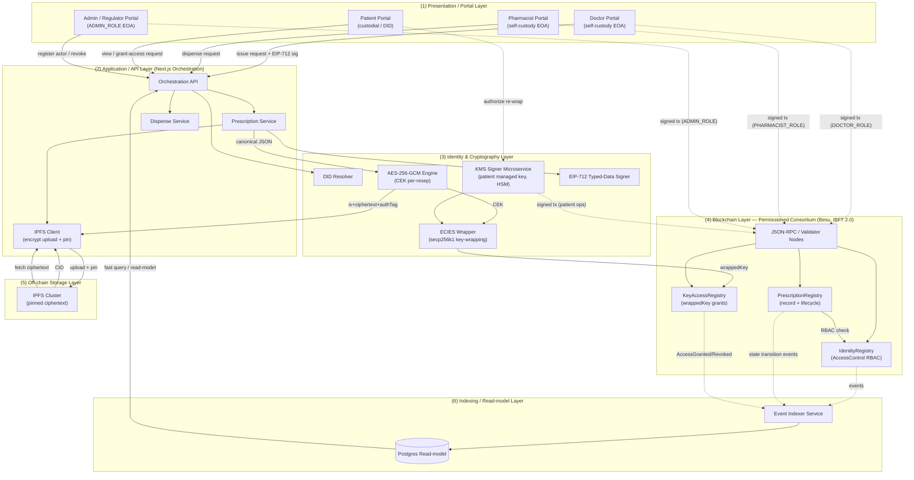

Garis utuh (`-->`) merepresentasikan aliran *request*/data orkestrasi melalui *layer* aplikasi; garis putus-putus (`-.->`) merepresentasikan transaksi yang ditandatangani langsung oleh aktor (atau KMS atas nama pasien) ke JSON-RPC, sehingga *non-repudiation* dan *provenance* terjaga tanpa melewati *hot-wallet* terpusat.

### 2.3 Uraian Tanggung Jawab Per Lapisan

#### (1) Presentation/Portal Layer
Lapisan ini menyediakan empat portal terdiferensiasi sesuai peran. **Doctor Portal** dan **Pharmacist Portal** mengintegrasikan *signer* *self-custody* berbasis EIP-1193/WalletConnect: kunci penandatanganan (secp256k1 EOA) tidak pernah meninggalkan *browser*/HSM aktor, dan penandatanganan EIP-712 atas *canonical prescription payload* maupun penandatanganan transaksi (`issuePrescription`, `dispense`) terjadi di sisi klien. **Patient Portal** bersifat *custodial*: pasien diidentifikasi melalui DID dan tidak menandatangani penerbitan resep; portal ini mengekspos kontrol *patient-centric* untuk mengotorisasi *re-wrapping* CEK ke apotek terpilih dan untuk mendekripsi serta meninjau resepnya. **Admin/Regulator Portal** memegang `ADMIN_ROLE` untuk *registerActor*, *setActorStatus*, dan *revoke*.

#### (2) Application/API Layer
Lapisan orkestrasi berbasis Next.js mengoordinasikan alur multi-langkah tanpa pernah memegang *signing authority* terpusat. **Prescription Service** menyusun *canonical prescription JSON*, memicu enkripsi *envelope*, mengunggah *ciphertext* ke IPFS melalui **IPFS Client**, lalu menyiapkan parameter transaksi `issuePrescription` (`prescriptionId`, `patientRef`, `cid`, `payloadHash`, dst.) untuk ditandatangani di sisi klien dokter. **Dispense Service** memvalidasi *business rule* (sisa unit, status aktor) sebelum membentuk transaksi `dispense`. **KMS Signer Microservice** menandatangani semata operasi sisi-pasien, terisolasi dari *signing* profesional. Lapisan ini juga melayani *read* melalui *read-model* Postgres untuk responsivitas kueri.

#### (3) Identity & Cryptography Layer
Lapisan ini menyediakan primitif identitas dan kriptografi. **DID Resolver** memetakan identitas pasien ke `patientRef = keccak256(salt, DID)`. **Key Manager (KMS/HSM)** mengelola *managed key* pasien secara custodial. Dua keypair dibedakan tegas per aktor: *signing key* (secp256k1 EOA) untuk transaksi, dan *encryption public key* (secp256k1) untuk *ECIES key-wrapping* yang terdaftar di IdentityRegistry. **AES-256-GCM Engine** menghasilkan Content Encryption Key (CEK) per-resep dan menghasilkan paket `{ iv, ciphertext, authTag }`. **ECIES Wrapper** membungkus CEK ke `encryptionPubKey` tiap *recipient* berwenang. **EIP-712 Signer** menghasilkan tanda tangan *typed-data* dokter atas *canonical payload* untuk *non-repudiation* dan verifiabilitas *off-chain*. Lapisan ini dirancang dengan *crypto-agility* dan dukungan *key rotation*.

#### (4) Blockchain Layer
Lapisan konsensus berjalan di atas Hyperledger Besu dengan IBFT 2.0 (PoA). Tiga *smart contract* modular saling berkolaborasi: **IdentityRegistry** menegakkan RBAC *on-chain* (`ADMIN_ROLE`, `DOCTOR_ROLE`, `PHARMACIST_ROLE`) dan menyimpan `encryptionPubKey`; **PrescriptionRegistry** menyimpan *record* minimal dan mengelola *lifecycle* (`ISSUED`, `PARTIALLY_DISPENSED`, `FULLY_DISPENSED`, `EXPIRED`, `REVOKED`) dengan *anti-double-dispensing* berbasis akunting `dispensedUnits` yang diserialisasi oleh konsensus; **KeyAccessRegistry** menyimpan `wrappedKey` per (`prescriptionId`, `recipient`). Setiap transisi *state* meng-*emit event* yang dikonsumsi lapisan pengindeksan. *Free gas* (`gasPrice = 0`) berlaku, namun *gas/resource units* tetap diukur untuk evaluasi.

#### (5) Off-chain Storage Layer
**IPFS Cluster** mempersist *ciphertext* resep (`{ iv, ciphertext, authTag }`) dengan *content addressing*; CID dirujuk *on-chain* sebagai *pointer* sedangkan `payloadHash = keccak256(ciphertext)` menjamin integritas. Klaster *pinning* menjamin ketersediaan; *right-to-erasure* diwujudkan melalui *unpin* *ciphertext* dan *tombstone flag* *on-chain*, dengan catatan *caveat* imutabilitas/propagasi IPFS.

#### (6) Indexing/Read-model Layer
**Event Indexer Service** mengonsumsi *event* dari ketiga kontrak dan memetakannya ke **Postgres Read-model** yang ter-*optimasi* untuk kueri (mis. daftar resep aktif per `patientRef`, riwayat dispensing per apotek). Lapisan ini menggantikan *file* JSON datar terdahulu (V6), menjadikan data *auditable* dan menyediakan dasar pengukuran *latency*, *throughput*, dan skalabilitas (V7) tanpa membebani *node* RPC dengan kueri *ad-hoc*.

### 2.4 Model Trust dan Tata Kelola Consortium

Sistem beroperasi di atas *permissioned consortium blockchain*, bukan jaringan publik tanpa izin. Model *trust* bersifat *federated*: tidak ada *single point of trust* tunggal, melainkan otoritas terdistribusi di antara pemangku kepentingan domain kesehatan yang secara hukum dan regulatif memang berwenang.

#### 2.4.1 Keanggotaan dan Validator Set
Validator IBFT 2.0 dipegang oleh tiga kelas pemangku kepentingan *consortium*, masing-masing dengan insentif yang saling menyeimbangkan:

| Kelas Validator | Entitas | Peran Tata Kelola | Penegakan *On-chain* |
|---|---|---|---|
| **Hospital(s)** | Rumah sakit / penyedia layanan | Menerbitkan resep via dokter berlisensi; menjamin keabsahan klinis | Memegang & menerbitkan EOA `DOCTOR_ROLE` |
| **Drug/Health Regulator** | BPOM / Kemenkes | Otoritas registrasi & pencabutan; pengawasan kepatuhan | Memegang `ADMIN_ROLE` (registerActor, setActorStatus, revoke) |
| **Pharmacy Association** | Asosiasi/jaringan apotek | Menjamin keabsahan apotek pendispens | Memegang & menerbitkan EOA `PHARMACIST_ROLE` |

Pemisahan ini menegakkan *checks and balances*: regulator memegang otoritas administratif (`ADMIN_ROLE`) namun tidak dapat menerbitkan resep; rumah sakit menerbitkan resep namun tidak mengelola keanggotaan; asosiasi apotek mendispens namun tidak menerbitkan. IBFT 2.0 bersifat *Byzantine Fault Tolerant*, menoleransi hingga `f` validator *faulty* dari total `3f + 1` validator dengan *immediate finality* per blok — penting agar transisi *state* resep (mis. `dispense`) bersifat final dan tidak dapat di-*reorg*, sehingga *anti-double-dispensing* terjamin secara deterministik.

#### 2.4.2 Tipe Node dan On-chain Permissioning

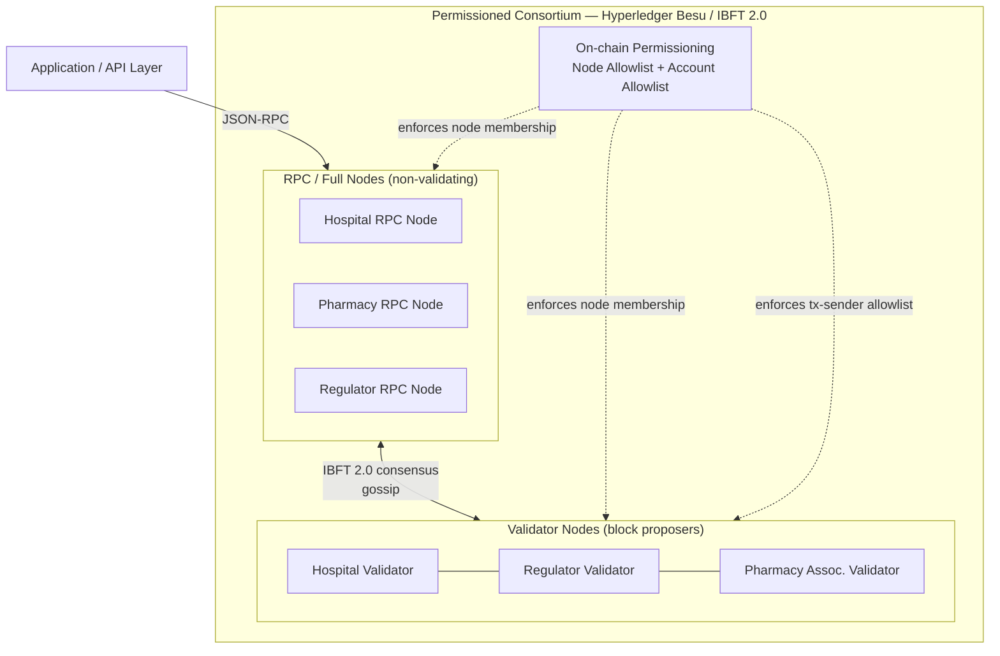

Jaringan membedakan dua tipe *node*: **Validator Nodes** yang berpartisipasi dalam konsensus IBFT 2.0 dan mengusulkan/menyetujui blok (dipegang ketiga kelas *consortium*), serta **RPC/Full Nodes** non-validating yang melayani *endpoint* JSON-RPC bagi *layer* aplikasi dan replikasi *ledger* untuk *read*. Keanggotaan jaringan ditegakkan oleh **on-chain permissioning** Besu pada dua tingkat: *node allowlist* (hanya *node* dengan *enode* terdaftar yang boleh *peer*) dan *account allowlist* (hanya akun terdaftar yang boleh mengirim transaksi). Perubahan keanggotaan dieksekusi melalui *permissioning smart contract* yang dikendalikan secara *governance* oleh validator *consortium*, sehingga penambahan/pencabutan *node* maupun akun bersifat transparan dan *auditable* *on-chain*.

Dengan demikian terdapat dua lapis kontrol akses yang komplementer: *on-chain permissioning* mengatur **siapa yang boleh terhubung dan bertransaksi pada level jaringan**, sedangkan RBAC IdentityRegistry mengatur **tindakan apa yang boleh dilakukan suatu akun pada level aplikasi**. Kombinasi keduanya menutup celah V3 (ketiadaan RBAC) sekaligus mencegah partisipasi *node* atau pengirim transaksi yang tidak berwenang, menggantikan model *single-hot-wallet* terpusat (V2) dengan *provenance* terdistribusi yang terikat pada identitas institusional yang terverifikasi.

---

## 3. Model Aktor & Identitas

Bagian ini mendefinisikan model aktor (*actor model*) dan kerangka identitas (*identity framework*) yang menjadi fondasi otorisasi, *non-repudiation*, dan privasi pada sistem E-Prescription berbasis *smart contract* ini. Berbeda dengan sistem naif yang di-*redesign* — di mana satu *server hot-wallet* tunggal (`PRIVATE_KEY`) menandatangani seluruh transaksi sehingga menghasilkan *provenance* semu dan tidak adanya *Role-Based Access Control* (kelemahan V2 dan V3) — desain ini menempatkan identitas kriptografis sebagai *first-class citizen*. Setiap aktor memegang kunci yang merepresentasikan dirinya secara individual, otoritas atas suatu aksi ditegakkan oleh on-chain RBAC pada `IdentityRegistry`, dan tidak ada satu pun PII pasien yang tersimpan on-chain (mengatasi V1 dan V5).

### 3.1 Empat Aktor dan Tanggung Jawabnya

Sistem mengenali empat peran fungsional. Tiga di antaranya merupakan *signing actor* (memiliki *signing key* dan dapat memulai transaksi state-changing), sementara Patient merupakan *subject* yang teridentifikasi secara kriptografis namun tidak menandatangani penerbitan resep.

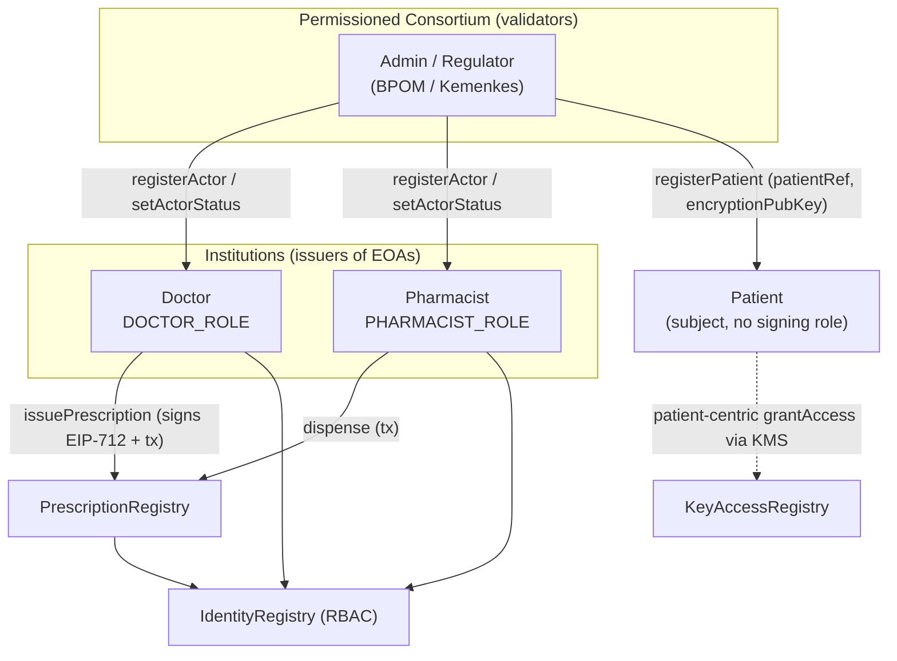

**Doctor (`DOCTOR_ROLE`).** Dokter adalah penerbit resep. Tanggung jawabnya mencakup: (i) menyusun *canonical prescription JSON* (lihat skema off-chain), (ii) menandatangani *payload* tersebut dengan tanda tangan EIP-712 typed data menggunakan *signing key*-nya untuk menjamin *non-repudiation* dan verifiabilitas off-chain, (iii) mengirim transaksi `issuePrescription` ke `PrescriptionRegistry` yang menyimpan `cid`, `payloadHash`, dan parameter lifecycle, serta (iv) berinisiatif melakukan `revoke` atas resep yang ia terbitkan bila terdapat kesalahan klinis. Dokter wajib memegang `DOCTOR_ROLE` aktif (`status == Active`) pada `IdentityRegistry`; bila tidak, modifier RBAC pada `issuePrescription` akan menolak transaksi.

**Pharmacist (`PHARMACIST_ROLE`).** Apoteker adalah pihak yang mengeksekusi *dispensing*. Tanggung jawabnya mencakup: (i) memverifikasi keabsahan resep melalui fungsi `verify` (aktif dan belum kedaluwarsa), (ii) memperoleh *wrapped* CEK miliknya melalui `getWrappedKey` pada `KeyAccessRegistry` (yang di-*grant* oleh KMS pasien saat *fill*), men-*unwrap* CEK dengan *encryption private key*-nya, mendekripsi *ciphertext* dari IPFS, lalu memverifikasi `payloadHash`, dan (iii) mengirim transaksi `dispense` (penyaluran parsial) yang memperbarui akunting `dispensedUnits` on-chain. Apoteker memegang `PHARMACIST_ROLE` aktif. Sifat *partial dispensing* yang akuntabel inilah yang menutup kelemahan V4 (anti-*double-dispensing*).

**Patient (subject — `patientRef`).** Pasien adalah subjek resep, bukan *signing actor*. Pasien tidak menandatangani penerbitan resep (sesuai keputusan desain custodial untuk pasien). Pada lapisan on-chain, pasien dirujuk secara pseudonim melalui `patientRef = keccak256(salt, DID)` sehingga tidak ada PII pasien yang tersingkap (zero PII on-chain, mengatasi V1). Meskipun demikian, pasien adalah pusat kontrol akses (*patient-centric access control*): saat *fill*, KMS yang mengelola kunci pasien me-*re-wrap* CEK ke `encryptionPubKey` apotek terpilih dan menjalankan `grantAccess`. Dengan demikian, hanya apotek yang dipilih untuk menebus resep tertentu yang memperoleh kemampuan mendekripsi isi resep.

**Admin / Regulator (`ADMIN_ROLE`).** Regulator (misalnya BPOM/Kemenkes) memegang `ADMIN_ROLE` dan merupakan *root of trust* identitas. Tanggung jawabnya: (i) mendaftarkan aktor profesional melalui `registerActor` setelah verifikasi kredensial lisensi off-chain, (ii) mendaftarkan pasien melalui `registerPatient`, (iii) mengubah status aktor (`setActorStatus` ke `Active|Suspended|Revoked`) sebagai mekanisme penegakan administratif, dan (iv) melakukan `revoke` darurat atas resep apa pun. Regulator juga berperan sebagai *validator node* pada *permissioned consortium* (Hyperledger Besu, IBFT 2.0), berbagi peran konsensus dengan Hospital(s) dan Pharmacy Association. Pemisahan `ADMIN_ROLE` (otoritas kontrak) dari peran validator (otoritas konsensus) menjamin pemisahan tata kelola yang sehat.

### 3.2 Hybrid Custody: Self-Custody Profesional vs Managed Key Pasien

Model kustodi kunci bersifat *hybrid* dan secara sengaja membedakan dua kelas subjek dengan profil risiko dan kapabilitas yang berbeda.

**Profesional (Doctor & Pharmacist) — self-custody EOA.** Setiap profesional memegang sendiri *signing key* secp256k1 dari EOA (*Externally Owned Account*) yang diterbitkan oleh institusinya (Hospital/Pharmacy). *Signing key* disimpan di dalam *browser* (*self-custody wallet* via WalletConnect/EIP-1193) atau di dalam HSM institusional, dan tidak pernah meninggalkan kustodi pemiliknya. Implikasinya: setiap transaksi `issuePrescription`/`dispense` ditandatangani secara individual oleh aktor yang sah sehingga *provenance* on-chain bersifat asli dan dapat diatribusikan — menghapus *provenance* semu pada sistem *single hot-wallet* (V2). Ketiadaan *shared hot-wallet* juga berarti tidak ada satu titik kompromi yang dapat memalsukan seluruh transaksi.

**Pasien — DID + managed key di KMS/HSM (custodial).** Pasien pada umumnya tidak memiliki kapasitas operasional untuk mengelola *private key* secara aman. Oleh karena itu kunci pasien dikelola secara *custodial* di dalam KMS/HSM institusional (institutional Key Management Service). KMS inilah yang menyimpan *encryption private key* pasien dan melakukan operasi *re-wrapping* CEK atas nama pasien (lihat §3.5). Pendekatan ini menyeimbangkan *usability* dengan kontrol *patient-centric*: pasien tetap menjadi *gatekeeper* akses isi resep, namun beban kriptografis didelegasikan ke layanan terkelola. Operasi sisi-pasien ditandatangani oleh **KMS signer microservice**, bukan oleh *single shared hot-wallet*.

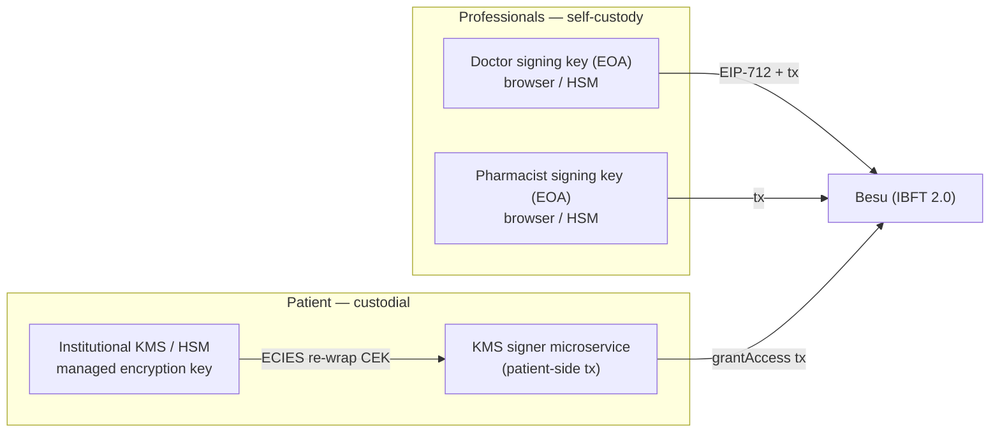

### 3.3 Pembedaan SIGNING Key vs ENCRYPTION Public Key

Salah satu keputusan desain inti adalah **memisahkan dua keypair per aktor** dengan tujuan kriptografis yang berbeda. Kegagalan memisahkan keduanya merupakan *anti-pattern* (*key reuse*) yang melemahkan jaminan keamanan.

| Aspek | SIGNING key | ENCRYPTION public key |
|---|---|---|
| Kurva | secp256k1 (EOA) | secp256k1 |
| Tujuan | Menandatangani transaksi on-chain dan *payload* EIP-712 | *Key-wrapping* CEK via ECIES |
| Operasi | ECDSA sign/verify | ECIES encrypt/decrypt (*envelope*) |
| Privat disimpan di | Browser/HSM (profesional); KMS (pasien) | Browser/HSM (profesional); KMS (pasien) |
| Publik terdaftar di | Tersirat dari `address` di `IdentityRegistry` | `encryptionPubKey` di `IdentityRegistry` |
| Properti dijamin | *Authenticity*, *non-repudiation* | *Confidentiality* |

*Signing key* digunakan untuk *authenticity* dan *non-repudiation*: tanda tangan ECDSA membuktikan asal-usul transaksi, dan tanda tangan EIP-712 atas *canonical payload* membuktikan persetujuan dokter terhadap isi resep secara off-chain. *Encryption public key* digunakan semata untuk *confidentiality*: CEK dibungkus (*wrapped*) ke `encryptionPubKey` tiap *recipient* berwenang menggunakan ECIES (secp256k1) lalu disimpan di `KeyAccessRegistry`. Pemisahan ini memungkinkan **rotasi independen**: kompromi atau rotasi *encryption key* tidak mengharuskan migrasi *signing identity* (alamat EOA) aktor, dan sebaliknya. `IdentityRegistry` menyediakan `getEncryptionPubKey(addr|patientRef)` sebagai *single source of truth* untuk *encryption pubkey*, sementara *signing identity* terikat langsung pada `address` aktor.

### 3.4 Registrasi Identitas, *Anchoring* Lisensi, dan Verifikasi

Registrasi identitas mengikat identitas dunia-nyata (kredensial lisensi profesi) ke identitas kriptografis on-chain melalui mekanisme *off-chain verification + on-chain anchoring*. Tidak ada dokumen lisensi mentah yang disimpan on-chain; hanya `licenseHash = keccak256(kredensial lisensi)` yang di-*anchor* sebagai komitmen integritas yang dapat diaudit.

```mermaid
sequenceDiagram
    autonumber
    participant Inst as Institution / Applicant
    participant Reg as Regulator (ADMIN_ROLE)
    participant Off as Off-chain credential check (PKI / license DB)
    participant IDR as IdentityRegistry

    Inst->>Reg: Ajukan { address, encryptionPubKey, licenseNo, institutionId }
    Reg->>Off: Verifikasi lisensi profesi (cek ke pangkalan data lisensi)
    Off-->>Reg: Valid / Tidak valid
    alt Valid
        Reg->>IDR: registerActor(address, role, licenseHash, institutionId, encryptionPubKey)
        IDR-->>Reg: emit ActorRegistered (status = Active)
    else Tidak valid
        Reg-->>Inst: Tolak pendaftaran
    end
    Note over Reg,IDR: Penegakan: setActorStatus(address, Suspended|Revoked)
```

**Alur verifikasi.** Regulator (`ADMIN_ROLE`) memverifikasi kredensial lisensi profesi terhadap pangkalan data lisensi otoritatif (off-chain) — termasuk kecocokan `licenseNo`, status keaktifan praktik, dan institusi penerbit. Setelah lolos, Regulator menghitung `licenseHash = keccak256(kredensial)` dan memanggil `registerActor(address, role, licenseHash, institutionId, encryptionPubKey)`. Record yang tersimpan per aktor adalah `{ address, role, licenseHash, institutionId, encryptionPubKey, status }`. Karena hanya *hash* yang on-chain, integritas kredensial dapat diverifikasi ulang kapan pun (dengan mempresentasikan kredensial mentah off-chain dan mencocokkan *hash*-nya) tanpa membocorkan dokumen lisensi.

**Pendaftaran pasien.** Pasien didaftarkan via `registerPatient(patientRef, encryptionPubKey)` dan disimpan sebagai `{ patientRef, encryptionPubKey }` tanpa *signing role*. Tidak ada `address` EOA maupun PII pasien yang ditulis on-chain.

**Suspend / Revoke.** Penegakan administratif dilakukan via `setActorStatus(address, Active|Suspended|Revoke)`. Status `Suspended` menonaktifkan sementara kemampuan aktor (mis. lisensi dalam peninjauan); `Revoked` menonaktifkan permanen (mis. lisensi dicabut). Semua *modifier* RBAC pada `PrescriptionRegistry` (mis. `issuePrescription`, `dispense`) mensyaratkan `isAuthorized(role, addr)` yang hanya bernilai *true* bila peran cocok dan `status == Active`. Dengan demikian pencabutan lisensi profesi secara real-time menghentikan kapabilitas penerbitan/penyaluran tanpa perlu mengubah kode kontrak. Setiap perubahan status meng-*emit* event sehingga dapat di-audit (mengatasi V6).

### 3.5 Pilihan DID Method dan Justifikasi

Sistem mengadopsi **`did:ethr`** sebagai *DID method* utama untuk seluruh aktor yang memiliki representasi on-chain (Doctor, Pharmacist) dan untuk *anchoring* DID pasien, dengan `did:key` sebagai opsi pelengkap untuk skenario tertentu.

| Kriteria | `did:ethr` | `did:key` |
|---|---|---|
| Sifat | *On-chain anchored*, resolvable via registry Ethereum | *Self-contained*, deterministik dari public key |
| Rotasi/Update | Mendukung *key rotation* & *delegate* via DID Registry | Statis (tak dapat di-rotate tanpa ganti DID) |
| Keselarasan kurva | secp256k1 — selaras dengan EOA & ECIES | Mendukung multibase multicodec (mis. secp256k1) |
| Ketergantungan ledger | Ya (cocok untuk consortium Besu) | Tidak (cocok untuk identitas efemeral) |
| *Use case* di sistem ini | Doctor, Pharmacist; basis `patientRef` | Identitas efemeral/uji, *bootstrap* |

**Justifikasi `did:ethr`.** *DID method* ini selaras secara native dengan kurva secp256k1 yang sudah digunakan baik untuk *signing key* (EOA) maupun *encryption key* (ECIES), sehingga tidak menambah heterogenitas kriptografis. Sifatnya yang *on-chain anchored* dan *resolvable* cocok dengan arsitektur *permissioned consortium* (Besu). Yang terpenting, `did:ethr` mendukung *key rotation* dan *delegate keys* melalui DID Registry — properti krusial untuk *crypto-agility* dan pemulihan (lihat §3.6). Untuk pasien, DID (yang dapat berbentuk `did:ethr` atau identifier institusional setara) tidak pernah disingkap on-chain; ia hanya menjadi *preimage* dari `patientRef = keccak256(salt, DID)`. Penggunaan `salt` mencegah serangan *dictionary/precomputation* atas himpunan DID yang dapat ditebak.

**Peran `did:key`.** `did:key` bersifat *self-contained* (DID diturunkan langsung dari public key, tanpa interaksi *ledger*), sehingga ideal untuk identitas efemeral, lingkungan uji, atau *bootstrap* sebelum aktor di-*anchor* secara penuh. Keterbatasannya — tidak mendukung rotasi tanpa mengganti DID — membuatnya tidak cocok sebagai identitas profesional jangka panjang, namun bermanfaat sebagai pelengkap.

### 3.6 Siklus Hidup Identitas dan *Key Recovery*

Identitas dalam sistem ini memiliki siklus hidup eksplisit yang dikelola melalui status pada `IdentityRegistry` dan, untuk pasien, melalui prosedur KMS.

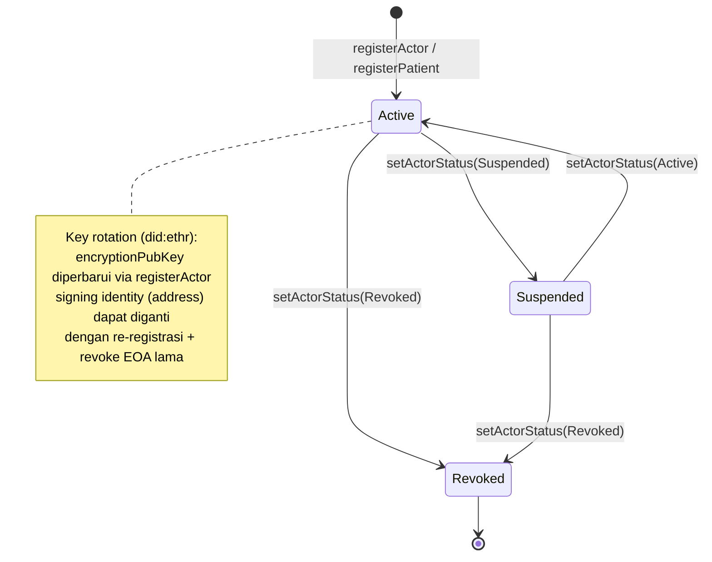

**Rotasi kunci (*crypto-agility*).** Karena *signing key* dan *encryption key* terpisah (§3.3), rotasi salah satunya tidak memengaruhi yang lain. Rotasi *encryption pubkey* dilakukan dengan memperbarui `encryptionPubKey` aktor pada `IdentityRegistry`; resep-resep yang sudah diterbitkan dengan *wrapped key* lama tetap dapat didekripsi (CEK lama masih sah), sedangkan *grant* baru menggunakan *encryption pubkey* baru. Rotasi *signing identity* (alamat EOA) dilakukan melalui re-registrasi alamat baru dan `setActorStatus(Revoked)` atas alamat lama. `did:ethr` memfasilitasi rotasi ini pada lapisan DID melalui mekanisme *delegate/rotation* di DID Registry. Pendekatan ini memberi *crypto-agility*: bila suatu primitif (mis. kurva atau skema ECIES) perlu diganti di masa depan, migrasi dapat dilakukan per-aktor tanpa mengganggu record resep historis.

**Key recovery pasien (KMS).** Karena kunci pasien bersifat *custodial* di KMS/HSM, pemulihan tidak bergantung pada pasien menyimpan *seed phrase*. Skenario pemulihan: (i) bila *encryption key* pasien perlu di-rotate (mis. dugaan kompromi), KMS menerbitkan keypair *encryption* baru, memperbarui `encryptionPubKey` pasien via `registerPatient`/update, dan untuk resep aktif yang masih relevan dapat dilakukan *re-grant* dengan membungkus ulang CEK ke *encryption pubkey* baru; (ii) kontinuitas akses dijamin oleh KMS yang memegang *managed key* dengan kebijakan *backup* dan *access control* berlapis. Karena pasien tidak menandatangani transaksi, tidak ada risiko kehilangan akses akibat *lost signing key* di sisi pasien.

**Caveat dan keterkaitan dengan privasi.** *Right-to-erasure* diimplementasikan dengan *unpin* *ciphertext* dari IPFS ditambah *tombstone flag* on-chain; namun imutabilitas IPFS dan *ledger* berarti `payloadHash` dan event historis tetap ada (hanya berupa *hash*/pseudonim, bukan PII). Rotasi kunci dan *revocation* harus dipandang sebagai pelengkap, bukan pengganti, *erasure* tersebut. Seluruh transisi identitas (registrasi, *suspend*, *revoke*, rotasi) meng-*emit* event sehingga membentuk jejak audit yang tidak dimiliki sistem naif berbasis file JSON datar (V6).

### 3.7 Tabel Ringkas: Aktor × Kunci × Role

| Aktor | On-chain identifier | SIGNING key (secp256k1 EOA) | ENCRYPTION pubkey (ECIES) | RBAC role | Kustodi | DID method | Aksi state-changing |
|---|---|---|---|---|---|---|---|
| **Doctor** | `address` (EOA) | Ya — browser/HSM | Terdaftar di `IdentityRegistry` | `DOCTOR_ROLE` | Self-custody | `did:ethr` | `issuePrescription`, `revoke` (resep sendiri), tanda tangan EIP-712 |
| **Pharmacist** | `address` (EOA) | Ya — browser/HSM | Terdaftar di `IdentityRegistry` | `PHARMACIST_ROLE` | Self-custody | `did:ethr` | `dispense` (partial) |
| **Patient** | `patientRef = keccak256(salt, DID)` | Tidak (subject, tanpa *signing role*) | Terdaftar di `IdentityRegistry` (via `registerPatient`) | — (tanpa role) | Custodial (KMS/HSM) | `did:ethr` (anchor) / institusional | `grantAccess` dijalankan KMS atas nama pasien (patient-centric) |
| **Admin / Regulator** | `address` (EOA) | Ya — HSM | (opsional) | `ADMIN_ROLE` | Self-custody (institusional) | `did:ethr` | `registerActor`, `registerPatient`, `setActorStatus`, `revoke` (darurat) |

Tabel di atas menegaskan invarian desain: hanya aktor dengan `status == Active` dan peran yang sesuai yang dapat mengeksekusi aksi *state-changing* terkait; pasien tidak pernah menjadi *signer* penerbitan resep namun tetap memegang kendali kriptografis atas keterbukaan isi resep melalui mekanisme *patient-centric grant* yang dijalankan KMS. Dengan demikian, model aktor dan identitas ini secara langsung mengatasi kelemahan V1 (PII plaintext), V2 (*single hot-wallet*), V3 (tanpa RBAC), dan menjadi prasyarat bagi mekanisme lifecycle (V4) serta privasi (V5) yang dibahas pada bagian-bagian berikutnya.

---

## 4. Desain Smart Contract

Bagian ini merinci arsitektur smart contract yang menjadi inti dari sistem E-Prescription terdesentralisasi. Pilihan desain mengikuti **Approach A** — yaitu pendekatan modular dengan *on-chain* RBAC (Role-Based Access Control). Alih-alih membungkus seluruh logika ke dalam satu *monolithic contract*, tanggung jawab dipecah menjadi tiga contract yang saling bertaut: `IdentityRegistry`, `PrescriptionRegistry`, dan `KeyAccessRegistry`. Pemisahan ini menegakkan *separation of concerns* — identitas/otorisasi, *lifecycle* resep, dan distribusi kunci kriptografis masing-masing dikelola oleh unit yang independen, dapat diuji terpisah, dan dapat di-*upgrade* secara selektif melalui pola UUPS proxy.

Modularitas ini secara langsung menjawab kelemahan **V3** (ketiadaan RBAC) dan **V4** (ketiadaan *lifecycle* dispensing dan anti-double-dispensing) dari sistem naif sebelumnya. Otorisasi tidak lagi bersifat implisit (siapa pun pemanggil dianggap "doctor"), melainkan ditegakkan secara eksplisit di tingkat *bytecode* melalui `AccessControl` milik OpenZeppelin, dan setiap transisi *state* resep diakuntansikan secara deterministik di atas rantai.

### 4.1 Prinsip Desain Lintas-Contract

Sebelum menelaah tiap contract, beberapa prinsip lintas-modul ditetapkan agar konsisten dengan keputusan arsitektural:

- **On-chain RBAC sebagai *single source of truth* otorisasi.** `IdentityRegistry` adalah otoritas tunggal yang menentukan apakah suatu `address` memegang `DOCTOR_ROLE` atau `PHARMACIST_ROLE` dengan `status == Active`. `PrescriptionRegistry` dan `KeyAccessRegistry` tidak menyimpan ulang peran; keduanya mendelegasikan pemeriksaan otorisasi ke `IdentityRegistry` melalui *cross-contract call*.
- **Zero PII on-chain.** Tidak ada satu pun field yang menyimpan data pasien yang dapat diidentifikasi. Pasien dirujuk secara pseudonim melalui `patientRef = keccak256(salt, DID)`. Hal ini menjawab langsung **V1** dan **V5**.
- **Event-over-storage untuk audit trail.** Setiap transisi *state* meng-emit *event*. Data yang hanya diperlukan untuk *audit* dan *off-chain indexing* (bukan untuk invarian *on-chain*) dialirkan melalui *event* — yang jauh lebih murah secara gas daripada *storage* (lihat §4.6).
- **Hash, bukan konten.** *On-chain* menyimpan `payloadHash` (integritas) dan `cid` (lokasi *ciphertext*), bukan *plaintext* resep. Konten sensitif dienkripsi (*envelope encryption*) dan disimpan di IPFS.

### 4.2 `IdentityRegistry`

#### Tanggung Jawab

`IdentityRegistry` adalah fondasi *trust* sistem. Contract ini bertanggung jawab atas: (1) pendaftaran aktor profesional (dokter, apoteker) beserta atribut kredensialnya; (2) penegakan RBAC berbasis OpenZeppelin `AccessControl`; (3) manajemen *lifecycle* status aktor (`Active`, `Suspended`, `Revoked`) oleh regulator; (4) pendaftaran pasien secara pseudonim; dan (5) penyediaan *encryption public key* tiap aktor untuk keperluan *ECIES key-wrapping* di `KeyAccessRegistry`.

Penting untuk membedakan dua keypair per aktor yang dikelola di sini secara konseptual: **SIGNING key** (secp256k1 EOA, untuk menandatangani transaksi — direpresentasikan oleh `address` aktor) dan **ENCRYPTION public key** (secp256k1, untuk *key-wrapping*) — `encryptionPubKey` yang didaftarkan eksplisit. Pemisahan ini memastikan kunci penandatanganan transaksi tidak dipakai ulang untuk operasi enkripsi.

#### Struct & Mapping

```solidity
// SPDX-License-Identifier: MIT
pragma solidity ^0.8.24;

import {AccessControlUpgradeable} from
    "@openzeppelin/contracts-upgradeable/access/AccessControlUpgradeable.sol";

enum ActorStatus { Active, Suspended, Revoked }

struct Actor {
    bytes32 licenseHash;       // keccak256(kredensial lisensi) — bukan nomor lisensi plaintext
    bytes32 institutionId;     // identitas institusi penerbit
    bytes   encryptionPubKey;  // secp256k1 pubkey untuk ECIES key-wrapping
    ActorStatus status;        // Active | Suspended | Revoked
    bytes32 role;              // DOCTOR_ROLE | PHARMACIST_ROLE (cache untuk introspeksi)
}

struct Patient {
    bytes encryptionPubKey;    // pubkey custodial (KMS/HSM) untuk re-wrapping CEK
    bool   registered;
}

contract IdentityRegistry is AccessControlUpgradeable {
    bytes32 public constant ADMIN_ROLE      = keccak256("ADMIN_ROLE");      // regulator
    bytes32 public constant DOCTOR_ROLE     = keccak256("DOCTOR_ROLE");
    bytes32 public constant PHARMACIST_ROLE = keccak256("PHARMACIST_ROLE");

    mapping(address => Actor)     private _actors;     // address EOA => Actor
    mapping(bytes32 => Patient)   private _patients;   // patientRef => Patient
}
```

`ADMIN_ROLE` ditetapkan sebagai *admin* dari `DOCTOR_ROLE` dan `PHARMACIST_ROLE` (via `_setRoleAdmin`), sehingga hanya regulator yang dapat memberi/mencabut peran profesional. Field `role` di dalam struct `Actor` bersifat *cache* untuk introspeksi murah; sumber kebenaran tetaplah *role bitmap* internal `AccessControl`.

#### Fungsi Utama

```solidity
function registerActor(
    address actor,
    bytes32 role,              // DOCTOR_ROLE | PHARMACIST_ROLE
    bytes32 licenseHash,
    bytes32 institutionId,
    bytes calldata encryptionPubKey
) external onlyRole(ADMIN_ROLE);

function setActorStatus(address actor, ActorStatus status)
    external onlyRole(ADMIN_ROLE);

function registerPatient(bytes32 patientRef, bytes calldata encryptionPubKey)
    external onlyRole(ADMIN_ROLE);

function isAuthorized(bytes32 role, address account)
    external view returns (bool);   // true jika hasRole(role,account) && status==Active

function getEncryptionPubKey(address actor)
    external view returns (bytes memory);

function getEncryptionPubKey(bytes32 patientRef)
    external view returns (bytes memory);
```

Fungsi `isAuthorized` adalah titik integrasi RBAC lintas-contract: ia mengembalikan `true` hanya jika aktor memegang peran yang diminta **dan** berstatus `Active`. Aktor yang `Suspended` atau `Revoked` otomatis kehilangan otorisasi operasional tanpa perlu mencabut keanggotaan *role* (yang bersifat lebih permanen dan mahal). Perhatikan *overloading* `getEncryptionPubKey` untuk `address` (aktor) dan `bytes32` (pasien), sesuai keputusan terkunci.

#### Event untuk Audit Trail

```solidity
event ActorRegistered(address indexed actor, bytes32 indexed role,
                      bytes32 institutionId, bytes32 licenseHash);
event ActorStatusChanged(address indexed actor, ActorStatus oldStatus,
                         ActorStatus newStatus);
event PatientRegistered(bytes32 indexed patientRef);
event EncryptionPubKeyUpdated(address indexed actor); // mendukung key rotation
```

### 4.3 `PrescriptionRegistry`

#### Tanggung Jawab

`PrescriptionRegistry` adalah inti *lifecycle* sistem: ia mencatat resep, menegakkan mesin-status (*state machine*), dan — yang paling kritis — mengakuntansikan unit ter-*dispense* untuk mencegah *double-dispensing* (menjawab **V4**). Contract ini hanya menyimpan *metadata minimal* dan *commitment* kriptografis (`cid`, `payloadHash`); seluruh konten klinis berada *off-chain* dalam bentuk *ciphertext* di IPFS.

#### Struct & Mapping

```solidity
enum State {
    None,                 // 0 — sentinel: resep tidak ada (slot mapping belum diinisialisasi)
    ISSUED,               // 1 — resep diterbitkan, belum ada dispensing
    PARTIALLY_DISPENSED,  // 2 — sebagian unit telah di-dispense (0 < dispensedUnits < totalUnits)
    FULLY_DISPENSED,      // 3 — seluruh unit pada siklus berjalan telah di-dispense
    EXPIRED,              // 4 — melewati expiresAt sebelum tuntas di-dispense
    REVOKED               // 5 — dibatalkan oleh issuing doctor atau ADMIN_ROLE
}

// Slot-packing eksplisit untuk minimisasi gas (lihat §4.6)
struct Prescription {
    // --- slot 0 ---
    address doctor;            // 20 bytes  ┐
    uint64  issuedAt;          //  8 bytes  ├─ 20+8+1+1+1 = 31 bytes -> 1 slot
    uint8   refillsAllowed;    //  1 byte   │
    uint8   refillsUsed;       //  1 byte   │
    State   state;             //  1 byte (enum -> uint8) ┘
    // --- slot 1 ---
    bytes32 patientRef;        // 32 bytes
    // --- slot 2 ---
    bytes32 payloadHash;       // 32 bytes  (keccak256 ciphertext)
    // --- slot 3 ---
    uint64  expiresAt;         //  8 bytes  ┐
    uint32  totalUnits;        //  4 bytes  ├─ 8+4+4 = 16 bytes -> 1 slot
    uint32  dispensedUnits;    //  4 bytes  ┘
    // --- slot dinamis ---
    string  cid;               // IPFS CID ciphertext (string, slot terpisah)
}

mapping(bytes32 => Prescription) private _prescriptions; // prescriptionId => record
IIdentityRegistry public identityRegistry;               // referensi RBAC
```

`prescriptionId` bertipe `bytes32` (bukan `uint256` *auto-increment* maupun `string`) sehingga dapat dipakai langsung sebagai *mapping key* tanpa biaya hashing tambahan dan tanpa kebocoran informasi enumeratif. Identifier ini di-derivasi secara deterministik, mis. `keccak256(abi.encode(doctor, patientRef, payloadHash, issuedAt, nonce))`, sehingga unik per penerbitan.

#### Fungsi Utama

```solidity
modifier onlyActiveRole(bytes32 role) {
    require(identityRegistry.isAuthorized(role, msg.sender), "RBAC: unauthorized");
    _;
}

function issuePrescription(
    bytes32 prescriptionId,
    bytes32 patientRef,
    string  calldata cid,
    bytes32 payloadHash,
    uint64  expiresAt,
    uint32  totalUnits,
    uint8   refillsAllowed
) external onlyActiveRole(DOCTOR_ROLE);
//  (none) -> ISSUED ; mencatat doctor = msg.sender, issuedAt = block.timestamp

function dispense(bytes32 prescriptionId, uint32 units)
    external onlyActiveRole(PHARMACIST_ROLE);
//  ISSUED | PARTIALLY_DISPENSED -> PARTIALLY_DISPENSED | FULLY_DISPENSED

function refill(bytes32 prescriptionId)
    external onlyActiveRole(PHARMACIST_ROLE);
//  FULLY_DISPENSED -> ISSUED (siklus berikut) selama refillsUsed < refillsAllowed

function revoke(bytes32 prescriptionId) external;
//  ISSUED | PARTIALLY_DISPENSED -> REVOKED ; hanya issuing doctor atau ADMIN_ROLE

function markExpired(bytes32 prescriptionId) external;
//  state aktif -> EXPIRED ; hanya jika block.timestamp > expiresAt

function getPrescription(bytes32 prescriptionId)
    external view returns (Prescription memory);

function verify(bytes32 prescriptionId)
    external view returns (bool active); // aktif && block.timestamp <= expiresAt
```

Fungsi `revoke` menerapkan otorisasi gabungan yang tidak dapat dinyatakan dengan satu `modifier` peran tunggal: pemanggil harus `msg.sender == prescription.doctor` **atau** memegang `ADMIN_ROLE` aktif. Logika ini ditegakkan di dalam badan fungsi:

```solidity
require(
    msg.sender == p.doctor ||
    identityRegistry.isAuthorized(ADMIN_ROLE, msg.sender),
    "revoke: not issuer or admin"
);
```

#### Event untuk Audit Trail

Setiap transisi *state* meng-emit *event* yang berbeda, memungkinkan *event-indexer service* merekonstruksi *audit trail* lengkap di *read-model* Postgres:

```solidity
event PrescriptionIssued(bytes32 indexed prescriptionId, address indexed doctor,
                         bytes32 indexed patientRef, string cid, bytes32 payloadHash,
                         uint64 issuedAt, uint64 expiresAt, uint32 totalUnits);
event PrescriptionDispensed(bytes32 indexed prescriptionId, address indexed pharmacist,
                            uint32 units, uint32 dispensedUnits, State newState);
event PrescriptionRefilled(bytes32 indexed prescriptionId, uint8 refillsUsed);
event PrescriptionRevoked(bytes32 indexed prescriptionId, address indexed by);
event PrescriptionExpired(bytes32 indexed prescriptionId);
```

### 4.4 `KeyAccessRegistry`

#### Tanggung Jawab

`KeyAccessRegistry` mengelola distribusi kunci dalam skema *envelope encryption* (menjawab **V5**). Ia menyimpan **wrapped CEK** (Content Encryption Key per-resep yang dibungkus ke *encryption public key* tiap *recipient* berwenang via ECIES). Contract ini bersifat *patient-centric*: pada saat *issue*, akses di-*grant* ke pasien (dan dokter penerbit); pada saat *fill*, KMS pasien me-*re-wrap* CEK ke `encryptionPubKey` apotek terpilih lalu memanggil `grantAccess` — sehingga pasien mengontrol siapa yang dapat mendekripsi resepnya.

#### Struct & Mapping

```solidity
// recipient bertipe bytes32 untuk menyatukan EOA-actor dan patientRef secara seragam:
//   - untuk EOA (dokter/apoteker): recipient = bytes32(uint256(uint160(addr)))
//   - untuk pasien:                recipient = patientRef
mapping(bytes32 => mapping(bytes32 => bytes)) private _wrappedKeys;
//      prescriptionId =>        recipient => wrappedKey (CEK terbungkus ECIES)

IIdentityRegistry      public identityRegistry;
IPrescriptionRegistry  public prescriptionRegistry;
```

> **Catatan tipe (revisi):** Desain ini mengadopsi `recipient` bertipe `bytes32` secara **kanonik dan global** di seluruh dokumen. Tipe `bytes32` menyatukan dua kelas *recipient* — EOA aktor (di-*encode* sebagai `bytes32(uint256(uint160(address)))`) dan pasien (di-*encode* sebagai `patientRef` yang memang sudah `bytes32`) — di bawah satu *key space* mapping yang seragam. **Formulasi `bytes32` ini menggantikan (supersedes) formulasi `mapping(address recipient)`** yang muncul pada deskripsi awal di bagian lain dokumen; secara khusus, *recipient* pasien tidak dapat direpresentasikan sebagai `address` (pasien tidak memiliki EOA *signing*), sehingga `bytes32` adalah satu-satunya tipe yang konsisten. Implikasinya: kolom `recipient` pada read-model Postgres (`key_access.recipient`) dan baris `getWrappedKey` pada matriks RBAC turut memakai `bytes32`.

#### Fungsi Utama

```solidity
function grantAccess(
    bytes32 prescriptionId,
    bytes32 recipient,
    bytes   calldata wrappedKey
) external;
//  Otorisasi: pemanggil harus issuing doctor dari prescriptionId,
//  ATAU pasien (via KMS signer) pemilik resep, ATAU ADMIN_ROLE.

function getWrappedKey(bytes32 prescriptionId, bytes32 recipient)
    external view returns (bytes memory);

function revokeAccess(bytes32 prescriptionId, bytes32 recipient) external;
//  Otorisasi: issuing doctor, pasien pemilik, atau ADMIN_ROLE.
```

Otorisasi `grantAccess`/`revokeAccess` diverifikasi dengan menarik `doctor` dan `patientRef` dari `prescriptionRegistry.getPrescription(prescriptionId)`, lalu mencocokkan dengan `msg.sender` (untuk dokter) atau dengan *signer* KMS pasien yang dipetakan ke `patientRef` (untuk operasi *patient-centric*), atau dengan `ADMIN_ROLE`. Hal ini mencegah pihak ketiga menyuntikkan kunci palsu atau membaca *wrapped key* milik resep yang bukan haknya.

#### Event untuk Audit Trail

```solidity
event AccessGranted(bytes32 indexed prescriptionId, bytes32 indexed recipient,
                    address indexed grantedBy);
event AccessRevoked(bytes32 indexed prescriptionId, bytes32 indexed recipient,
                    address indexed revokedBy);
```

### 4.5 Mekanisme Anti-Double-Dispensing

Mekanisme anti-double-dispensing adalah kontribusi inti yang menjawab **V4**. Ia berdiri di atas tiga pilar yang saling menguatkan:

**(1) Akunting `dispensedUnits` on-chain.** Setiap resep menyimpan `totalUnits` (jumlah unit total yang diresepkan) dan `dispensedUnits` (akumulasi unit yang telah dikeluarkan). Sisa yang dapat dikeluarkan selalu terdefinisi sebagai:

```
remaining = totalUnits - dispensedUnits
```

Fungsi `dispense(prescriptionId, units)` memvalidasi `units <= remaining` sebelum menambah `dispensedUnits += units`. Dengan demikian, apotek **tidak akan pernah** dapat men-*dispense* melebihi sisa. Akunting ini bersifat *monotonic non-decreasing* dalam satu siklus.

**(2) State guard.** Mesin-status menolak operasi `dispense` pada *state* terminal. Hanya `ISSUED` dan `PARTIALLY_DISPENSED` yang menerima `dispense`; `FULLY_DISPENSED`, `EXPIRED`, dan `REVOKED` menolaknya. Transisi ditentukan oleh hasil akunting:

```solidity
function dispense(bytes32 id, uint32 units) external onlyActiveRole(PHARMACIST_ROLE) {
    Prescription storage p = _prescriptions[id];
    require(p.state == State.ISSUED || p.state == State.PARTIALLY_DISPENSED,
            "dispense: not dispensable");
    require(block.timestamp <= p.expiresAt, "dispense: expired");
    uint32 remaining = p.totalUnits - p.dispensedUnits;
    require(units > 0 && units <= remaining, "dispense: exceeds remaining");

    p.dispensedUnits += units;
    p.state = (p.dispensedUnits == p.totalUnits)
        ? State.FULLY_DISPENSED
        : State.PARTIALLY_DISPENSED;

    emit PrescriptionDispensed(id, msg.sender, units, p.dispensedUnits, p.state);
}
```

**(3) Serialisasi oleh konsensus.** Inilah jaminan yang membedakan pendekatan blockchain dari basis data terdistribusi naif. Pada Hyperledger Besu dengan IBFT 2.0, semua transaksi yang memodifikasi *state* diurutkan secara total (*total order*) dan dieksekusi **secara berurutan** di dalam blok. Bila dua apotek berbeda mencoba men-*dispense* unit terakhir dari resep yang sama secara hampir bersamaan, konsensus menserialisasi keduanya: transaksi pertama yang dieksekusi menambah `dispensedUnits` (mungkin mencapai `FULLY_DISPENSED`), sehingga transaksi kedua menemukan `remaining` yang lebih kecil atau nol dan **di-*revert*** oleh `require(units <= remaining)`. Tidak ada *race condition* maupun *double-spend* yang mungkin terjadi — properti ini berasal dari *atomicity* eksekusi EVM dan *total ordering* konsensus, bukan dari penguncian aplikatif yang rapuh.

Diagram berikut merangkum *state machine* yang menegakkan ketiga pilar:

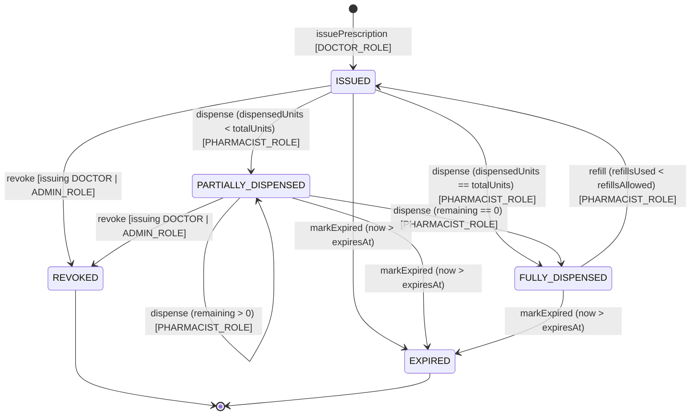

### 4.6 Pertimbangan Gas & Storage serta Optimasi

Meskipun jaringan beroperasi *free gas* (`gasPrice = 0`), *gas/resource units* tetap diukur sebagai metrik evaluasi (**V7**) dan tetap menentukan *block resource budget*. Karena itu efisiensi *storage* dan *compute* tetap diutamakan:

| Optimasi | Mekanisme | Dampak |
|---|---|---|
| **`bytes32` identifier** | `prescriptionId`, `patientRef`, `licenseHash`, `institutionId` semua `bytes32` | Muat dalam satu *storage slot*; dipakai langsung sebagai *mapping key* tanpa hashing dinamis; menghindari biaya `string`/`bytes` dinamis |
| **Packed struct** | Field di-*order* agar `address`+`uint64`+`uint8`×2+`enum` muat dalam 1 slot; `uint64`+`uint32`×2 muat dalam 1 slot | `Prescription` inti memakai ~4 *storage slot* (vs >7 bila tidak di-*pack*); `SSTORE` lebih sedikit saat `issue` |
| **Event-over-storage** | Atribut yang hanya untuk *audit*/indexing di-emit sebagai *event* (`LOG`), bukan disimpan di *state* | `LOG` jauh lebih murah daripada `SSTORE`; *read-model* Postgres menyerap detail untuk query |
| **Off-chain payload** | Konten klinis sebagai *ciphertext* di IPFS; *on-chain* hanya `cid` + `payloadHash` | Pertumbuhan *storage on-chain* per resep ~konstan dan kecil; skalabilitas terhadap jumlah resep terjaga |
| **Cross-contract view untuk RBAC** | Peran tidak diduplikasi di tiap contract; `isAuthorized` dipanggil sebagai `view` | Menghindari *write* redundan; sumber kebenaran tunggal |
| **`uint32` unit counters** | `totalUnits`/`dispensedUnits` sebagai `uint32` | Cukup untuk kuantitas farmasi realistis; mendukung *packing* |

Pemilihan lebar tipe (`uint64` untuk *timestamp*, `uint32` untuk unit, `uint8` untuk *refill*) bukan sekadar penghematan tetapi prasyarat *slot-packing* yang efektif: Solidity hanya men-*pack* variabel berurutan yang totalnya ≤ 32 bytes ke dalam satu slot. Karena `issuePrescription` adalah operasi *write-heavy* yang paling sering, minimisasi jumlah `SSTORE` pada jalur ini berdampak langsung pada *throughput* (TPS) keseluruhan.

### 4.7 Pemakaian EIP-712

Selain transaksi *on-chain*, dokter menandatangani **canonical prescription payload** secara *off-chain* menggunakan **EIP-712 typed structured data signing**. Tanda tangan ini disertakan dalam field `signature` pada canonical JSON (sebelum enkripsi dan unggah ke IPFS), memberikan dua properti yang tidak dapat dipenuhi oleh tanda tangan transaksi semata:

- **Non-repudiation kuat atas konten klinis.** Tanda tangan transaksi membuktikan dokter memanggil `issuePrescription`, tetapi tidak mengikat konten *plaintext* resep (yang berada *off-chain*). EIP-712 mengikat tanda tangan dokter ke struktur data resep yang terdefinisi-tipe secara persis, sehingga isi resep dapat diverifikasi *off-chain* tanpa mengungkap *private key*.
- **Verifiabilitas terpisah dari rantai.** Apotek atau auditor dapat memverifikasi keaslian payload terhadap `encryptionPubKey`/`address` dokter yang terdaftar di `IdentityRegistry`, lalu mencocokkan `payloadHash = keccak256(ciphertext)` *on-chain* untuk integritas, tanpa harus mempercayai *gateway* IPFS.

Struktur `EIP712Domain` dan tipe `Prescription` didefinisikan sebagai berikut (skema konseptual):

```solidity
// domainSeparator mengikat tanda tangan ke contract & chain tertentu (anti-replay)
EIP712Domain {
    string  name;              // "SC-EPrescription"
    string  version;           // "1"
    uint256 chainId;           // chainId consortium Besu
    address verifyingContract; // alamat PrescriptionRegistry
}

// Tipe yang ditandatangani — mencerminkan canonical payload (hash field sensitif)
Prescription {
    bytes32 prescriptionId;
    address doctor;
    bytes32 patientRef;
    bytes32 payloadHash;       // keccak256 ciphertext / canonical medications
    uint64  issuedAt;
    uint64  expiresAt;
    uint32  totalUnits;
    uint8   refillsAllowed;
}
```

`domainSeparator` (turunan dari `EIP712Domain`) mengikat tanda tangan ke `chainId` consortium dan ke alamat `verifyingContract`, sehingga tanda tangan tidak dapat di-*replay* lintas-chain maupun lintas-contract. *Digest* yang ditandatangani adalah `keccak256("\x19\x01" ‖ domainSeparator ‖ hashStruct(Prescription))`. Pemulihan penanda-tangan (`ecrecover`) menghasilkan `address` dokter yang kemudian dicocokkan dengan `DOCTOR_ROLE` aktif di `IdentityRegistry` — menutup celah **V2/V3** di mana penandatanganan terpusat menciptakan *provenance* semu.

### 4.8 Catatan UUPS Proxy (Upgradeability)

Untuk mendukung iterasi penelitian dan perbaikan tanpa migrasi *state* yang mahal, setiap contract dapat di-*deploy* di balik **UUPS proxy** (Universal Upgradeable Proxy Standard, OpenZeppelin). Pada pola UUPS, logika *upgrade* berada di *implementation contract* (bukan di *proxy*), sehingga *proxy* tetap minimal dan biaya *call* lebih rendah dibanding *Transparent Proxy*.

Pertimbangan kunci:

- **Pemisahan storage & logic.** *Proxy* memegang *state* (storage slots), *implementation* memegang *bytecode* logika. *Upgrade* mengganti alamat *implementation* tanpa memindahkan *state*.
- **Otorisasi `_authorizeUpgrade`.** Fungsi `_authorizeUpgrade(address newImplementation)` dibatasi `onlyRole(ADMIN_ROLE)` — hanya regulator consortium (pemegang governance) yang dapat meng-*upgrade*, konsisten dengan model *permissioned*.
- **Storage layout safety.** *Upgrade* harus menjaga *append-only storage layout* (tidak menyisipkan/menyusun-ulang variabel *state* lama) dan menyertakan `__gap` untuk *reserved slots* — mencegah *storage collision*.
- **Inisialisasi.** Karena *constructor* tidak berlaku di balik *proxy*, inisialisasi memakai pola `initializer` (`__AccessControl_init`, dst.) dengan *guard* anti-reinisialisasi.

Status UUPS bersifat **opsional** untuk iterasi penelitian; pada *deployment* produksi consortium, kebijakan *upgrade* sebaiknya diperketat lebih lanjut (mis. *timelock* + multi-sig regulator) untuk menyeimbangkan agilitas dengan *immutability guarantee* yang diharapkan dari sistem rekam medis.

### 4.9 Diagram Relasi Antar-Contract

Diagram berikut merangkum keterkaitan struktural dan arah *cross-contract call* antara ketiga contract inti, *proxy* UUPS, serta aktor dan layanan *off-chain*:

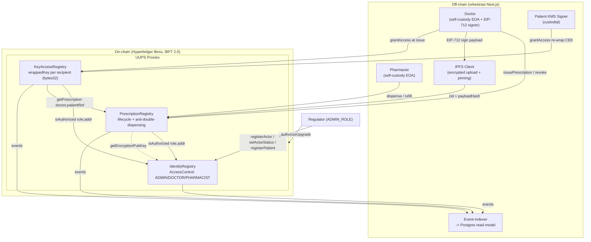

Pada diagram, `IdentityRegistry` (`IR`) menjadi simpul otoritas yang dipanggil baik oleh `PrescriptionRegistry` (`PR`) maupun `KeyAccessRegistry` (`KAR`) untuk verifikasi RBAC; `KAR` selanjutnya bergantung pada `PR` untuk menarik `doctor`/`patientRef` saat mengotorisasi `grantAccess`. Seluruh *event* dari ketiga contract dikonsumsi oleh *event-indexer service* menuju *read-model* Postgres, menjawab **V6** (penyimpanan datar tak-auditable) dengan menyediakan jejak audit yang terstruktur dan dapat di-*query* cepat — sementara *source of truth* tetap berada *on-chain*.

---

The thesis chapter sections (4, 5, 6) referenced by the reviewer are not committed as files in this repo — they live in the orchestration context. The reviewer notes are self-contained enough to act on. I'll standardize on keeping `None` at index 0 across all sections (the reviewer's preferred option, since the zero-value sentinel distinguishes non-existence from `ISSUED` in mappings) and explicitly state `issuedAt = block.timestamp`.

## 5. Lifecycle Resep (State Machine)

Inti dari redesign ini—dan jawaban langsung atas kelemahan **V4** (ketiadaan lifecycle dispensing dan absennya proteksi anti-double-dispensing)—adalah pemodelan resep sebagai sebuah *finite state machine* (FSM) deterministik yang dijalankan oleh konsensus IBFT 2.0. Berbeda dengan sistem naif yang memperlakukan resep sebagai catatan statis sekali-tulis, setiap resep dalam `PrescriptionRegistry` adalah objek stateful yang transisinya diatur oleh guard on-chain, dijaga oleh RBAC dari `IdentityRegistry`, dan diserialisasi secara total oleh konsensus. Properti serialisasi inilah yang secara struktural mustahil dicapai oleh berkas JSON datar (kelemahan **V6**): dua apotek yang mencoba men-dispense resep yang sama secara konkuren tidak dapat keduanya berhasil, karena konsensus mengurutkan kedua transaksi tersebut menjadi sekuens linier dan guard akuntansi mengevaluasi state hasil transaksi pertama sebelum transaksi kedua.

### 5.1 Definisi Enum State

State resep direpresentasikan sebagai enum Solidity. Untuk konsistensi penuh dengan definisi struct di Section 4.3 dan read-model di Section 6.4, enum mempertahankan sentinel **`None` pada index 0**. Sentinel ini bersifat *load-bearing*: pada Solidity, setiap slot `mapping` yang belum diinisialisasi mengembalikan nilai default `0`. Tanpa sentinel, sebuah `prescriptionId` yang tidak pernah diterbitkan akan secara keliru terbaca sebagai `ISSUED` (jika `ISSUED` menempati index 0), sehingga `getPrescription` atas ID fiktif tampak seolah valid. Dengan `None` sebagai zero-value, eksistensi resep dapat dibedakan dari state aktifnya, dan invariant existence check (`state != State.None`) menjadi murah dan tidak ambigu.

```solidity
// PrescriptionRegistry.sol
enum State {
    None,                 // 0 — sentinel: resep tidak ada (slot mapping belum diinisialisasi)
    ISSUED,               // 1 — resep diterbitkan, belum ada dispensing
    PARTIALLY_DISPENSED,  // 2 — sebagian unit telah di-dispense (0 < dispensedUnits < totalUnits)
    FULLY_DISPENSED,      // 3 — seluruh unit pada siklus berjalan telah di-dispense
    EXPIRED,              // 4 — melewati expiresAt sebelum tuntas di-dispense
    REVOKED               // 5 — dibatalkan oleh issuing doctor atau ADMIN_ROLE
}
```

> **Catatan konsistensi enum (resolusi reviewer).** Index numerik di atas adalah otoritatif dan WAJIB identik di seluruh dokumen: struct di Section 4.3, event payload (Section 4.4), ABI/typehash EIP-712 di Section 4.7, dan pemetaan string read-model di Section 6.4. Komentar `// 0 — resep diterbitkan` yang sebelumnya keliru melekat pada `ISSUED` dikoreksi: index `0` adalah `None`, dan `ISSUED = 1`. Event-indexer service (Section 7) memetakan nilai uint8 ini ke string kanonik `{ "NONE", "ISSUED", "PARTIALLY_DISPENSED", "FULLY_DISPENSED", "EXPIRED", "REVOKED" }` sehingga kolom `state` di Postgres terikat pada index enum, bukan pada urutan deklarasi yang dapat bergeser.

State `None` tidak pernah menjadi *target* transisi yang sah dari fungsi mana pun; ia semata-mata adalah keadaan pra-eksistensi. Empat state—`ISSUED`, `PARTIALLY_DISPENSED`, `FULLY_DISPENSED`, `EXPIRED`, `REVOKED`—membentuk himpunan state yang dapat dicapai pasca-`issuePrescription`. Di antaranya, `ISSUED` dan `PARTIALLY_DISPENSED` digolongkan sebagai **state aktif** (dapat menerima `dispense`, `revoke`, atau `markExpired`), sedangkan `FULLY_DISPENSED`, `EXPIRED`, dan `REVOKED` adalah **state terminal** untuk siklus berjalan (`FULLY_DISPENSED` dapat memulai siklus baru melalui `refill`; `EXPIRED` dan `REVOKED` bersifat terminal absolut).

### 5.2 Diagram State Machine

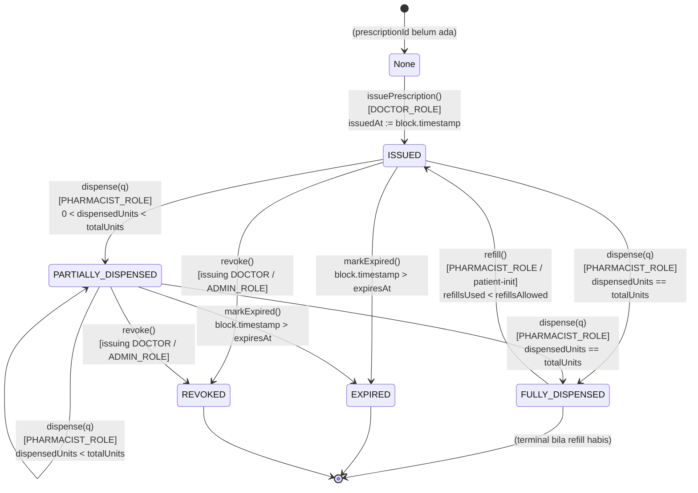

Diagram di atas menegaskan beberapa properti struktural. Pertama, satu-satunya jalur masuk ke state aktif adalah melalui `issuePrescription` oleh `DOCTOR_ROLE`; tidak ada fungsi yang dapat menulis `ISSUED` ke slot yang sudah memiliki state non-`None` (idempotency guard mencegah re-issue atas `prescriptionId` yang sama). Kedua, `EXPIRED` dan `REVOKED` tidak memiliki edge keluar—keduanya adalah *sink* absolut. Ketiga, satu-satunya cara `FULLY_DISPENSED` kembali ke `ISSUED` adalah `refill`, dan hanya selama kuota refill belum habis; ketika `refillsUsed == refillsAllowed`, `FULLY_DISPENSED` menjadi sink.

### 5.3 Tabel Transisi

Tabel berikut adalah spesifikasi normatif transisi. Kolom *guard* mendaftar seluruh prasyarat yang dievaluasi atomik di dalam fungsi; kegagalan salah satu menyebabkan `revert` (transaksi tidak mengubah state, gas terpakai dicatat untuk evaluasi).

| State Asal | Aksi (function) | State Tujuan | Role yang Diizinkan | Guard / Prasyarat |
|---|---|---|---|---|
| `None` | `issuePrescription` | `ISSUED` | `DOCTOR_ROLE` | `state == None` (belum ada); `isAuthorized(DOCTOR_ROLE, msg.sender)`; status aktor `Active`; `expiresAt > block.timestamp`; `totalUnits > 0`; `refillsAllowed >= 0`; `payloadHash != 0`; `cid` non-empty. Set `issuedAt := block.timestamp`. |
| `ISSUED` | `dispense(q)` | `PARTIALLY_DISPENSED` | `PHARMACIST_ROLE` | `q > 0`; `q <= totalUnits - dispensedUnits`; setelah update `dispensedUnits < totalUnits`; `block.timestamp <= expiresAt`; apotek `Active`; akses CEK ter-grant di `KeyAccessRegistry`. |
| `ISSUED` | `dispense(q)` | `FULLY_DISPENSED` | `PHARMACIST_ROLE` | sama seperti di atas, namun setelah update `dispensedUnits == totalUnits`. |
| `PARTIALLY_DISPENSED` | `dispense(q)` | `PARTIALLY_DISPENSED` | `PHARMACIST_ROLE` | `q > 0`; `q <= totalUnits - dispensedUnits`; setelah update `dispensedUnits < totalUnits`; `block.timestamp <= expiresAt`. |
| `PARTIALLY_DISPENSED` | `dispense(q)` | `FULLY_DISPENSED` | `PHARMACIST_ROLE` | `q > 0`; `q == totalUnits - dispensedUnits`; setelah update `dispensedUnits == totalUnits`; `block.timestamp <= expiresAt`. |
| `FULLY_DISPENSED` | `refill` | `ISSUED` | `PHARMACIST_ROLE` (atau patient-initiated via KMS) | `refillsUsed < refillsAllowed`; `block.timestamp <= expiresAt`; resep tidak `REVOKED`. Inkremen `refillsUsed`; reset `dispensedUnits := 0`. |
| `ISSUED` | `revoke` | `REVOKED` | issuing `DOCTOR` **atau** `ADMIN_ROLE` | `msg.sender == doctor` atau `isAuthorized(ADMIN_ROLE, msg.sender)`; state `∈ {ISSUED, PARTIALLY_DISPENSED}`. |
| `PARTIALLY_DISPENSED` | `revoke` | `REVOKED` | issuing `DOCTOR` **atau** `ADMIN_ROLE` | idem; `dispensedUnits` yang sudah tercatat dipertahankan untuk audit. |
| `ISSUED` | `markExpired` | `EXPIRED` | siapa pun (permissionless keeper) / `ADMIN_ROLE` | `block.timestamp > expiresAt`; state aktif (`∈ {ISSUED, PARTIALLY_DISPENSED}`). |
| `PARTIALLY_DISPENSED` | `markExpired` | `EXPIRED` | siapa pun (permissionless keeper) / `ADMIN_ROLE` | idem. |

Transisi yang **tidak** tercantum bersifat terlarang dan menyebabkan `revert` dengan custom error (mis. `InvalidStateTransition`, `NotAuthorized`, `ExceedsRemaining`, `PrescriptionExpired`). Secara khusus: `dispense` atas resep `FULLY_DISPENSED`, `EXPIRED`, atau `REVOKED` ditolak; `revoke` atas resep `FULLY_DISPENSED`, `EXPIRED`, atau yang sudah `REVOKED` ditolak; `markExpired` atas resep yang belum melewati `expiresAt` ditolak.

### 5.4 Penetapan `issuedAt` dan Hubungannya dengan Canonical JSON

Reviewer menyoroti ambiguitas asal-usul `issuedAt`. Resolusinya bersifat normatif berikut ini.

**On-chain `issuedAt` di-derive, bukan parameter.** Fungsi `issuePrescription` **tidak** menerima `issuedAt` sebagai argumen. Di dalam badan fungsi, segera setelah seluruh guard lolos, kontrak menetapkan:

```solidity
record.issuedAt = uint64(block.timestamp);
record.state    = State.ISSUED;
```

Dengan demikian `issuedAt` on-chain adalah **timestamp blok inklusi**—nilai yang ditentukan konsensus IBFT 2.0, tidak dapat dipalsukan oleh dokter, dan monotonik terhadap urutan blok. Inilah alasan ia diturunkan, bukan disuplai: sumber waktu tepercaya untuk lifecycle (perhitungan `expiresAt`, evaluasi `markExpired`, dan audit kronologis) haruslah waktu konsensus, bukan klaim klien.

**Canonical JSON `issuedAt` adalah klaim dokter yang ditandatangani EIP-712.** Payload off-chain (Section 4 / canonical prescription JSON) memuat `issuedAt` versinya sendiri sebagai bagian dari struct yang ditandatangani EIP-712 oleh dokter. Nilai ini merekam *waktu penandatanganan klinis* menurut perangkat dokter—berguna untuk non-repudiation dan rekonstruksi off-chain—tetapi **bukan** sumber kebenaran untuk lifecycle on-chain.

**Relasi dan toleransi.** Kedua nilai tidak diwajibkan identik, sebab terdapat jeda intrinsik antara penandatanganan klinis dan inklusi blok (network latency, block period IBFT, antrian mempool). Yang ditegakkan adalah relasi terurut dengan toleransi *skew* terbatas:

```
issuedAt_json  <=  issuedAt_onchain  <=  issuedAt_json + Δ_skew
```

dengan `Δ_skew` parameter kebijakan (mis. 15 menit) yang dapat diverifikasi off-chain oleh event-indexer maupun verifier. Kontrak **tidak** memaksakan kesetaraan kedua nilai (memaksakannya akan mengikat konsensus pada klaim klien dan membuka grinding terhadap `block.timestamp`); sebaliknya, validitas temporal payload diverifikasi off-chain saat dekripsi: verifier merekonstruksi EIP-712 digest, memulihkan signer, mencocokkannya dengan `doctor` on-chain, lalu memeriksa bahwa `issuedAt_json` konsisten dengan `issuedAt_onchain` dalam toleransi `Δ_skew`. Integritas ciphertext yang memuat `issuedAt_json` dijamin oleh `payloadHash` on-chain (`keccak256` atas ciphertext). Dengan pemisahan ini, on-chain memegang otoritas waktu untuk *enforcement*, sementara JSON memegang klaim klinis yang *attributable* ke dokter—keduanya saling memverifikasi tanpa saling mengikat.

### 5.5 Akuntansi Partial-Fill

Anti-double-dispensing (jawaban langsung atas **V4**) bertumpu pada empat field uint pada struct: `totalUnits` (uint32), `dispensedUnits` (uint32), `refillsAllowed` (uint8), dan `refillsUsed` (uint8). Kuantitas tersisa dihitung sebagai turunan, tidak disimpan terpisah:

```
remaining = totalUnits - dispensedUnits
```

Setiap pemanggilan `dispense(prescriptionId, q)` mengeksekusi sekuens berikut secara atomik dalam satu transaksi (checks-effects-interactions):

1. **Checks** — memvalidasi role apotek (`isAuthorized(PHARMACIST_ROLE, msg.sender)`), state aktif, non-expiry (`block.timestamp <= expiresAt`), dan **guard inti** `q > 0 && q <= remaining`. Jika `q > remaining`, transaksi `revert` dengan `ExceedsRemaining`—inilah pencegah over-dispensing.
2. **Effects** — `dispensedUnits += q`. Lalu transisi state ditentukan oleh perbandingan pasca-update: bila `dispensedUnits == totalUnits` maka `state = FULLY_DISPENSED`, selain itu `state = PARTIALLY_DISPENSED`.
3. **Event** — emit `Dispensed(prescriptionId, pharmacist, q, dispensedUnits, newState)` untuk SETIAP transisi, dikonsumsi event-indexer.

Karena `dispensedUnits += q` dan guard `q <= remaining` dievaluasi dalam transaksi tunggal yang **diserialisasi oleh konsensus**, dua apotek berbeda yang men-dispense secara konkuren tidak dapat keduanya melebihi `totalUnits`. Konsensus mengurutkan keduanya: transaksi pertama menaikkan `dispensedUnits`, transaksi kedua mengevaluasi ulang `remaining` terhadap state termutakhir dan akan `revert` bila kuantitasnya melampaui sisa yang tersedia. Inilah serialisasi anti-double-spend yang mustahil pada berkas JSON datar.

> **Aritmetika aman.** Pada Solidity ≥ 0.8.x, overflow/underflow ter-`revert` secara default; guard `q <= remaining` lebih dahulu mencegah underflow `totalUnits - dispensedUnits`, sehingga tidak diperlukan `SafeMath` eksplisit. Penggunaan uint32 untuk unit dan uint8 untuk refill dipilih untuk efisiensi storage packing (Section 4.3) dengan rentang yang memadai untuk domain farmasi (≤ 4.29 miliar unit; ≤ 255 refill).

### 5.6 Akuntansi Refill

Refill memodelkan resep multi-siklus (mis. obat kronis yang ditebus berkala). Mekanismenya adalah *reset terkendali* atas akuntansi dispensing pada `FULLY_DISPENSED`:

| Field | Peran |
|---|---|
| `refillsAllowed` (uint8) | Kuota maksimum siklus tambahan yang diotorisasi dokter pada saat issue (nilai dari canonical JSON `refillsAllowed`). |
| `refillsUsed` (uint8) | Penghitung siklus refill yang telah dikonsumsi; diinisialisasi `0` pada issue. |

Fungsi `refill` hanya valid dari state `FULLY_DISPENSED` dan menegakkan guard `refillsUsed < refillsAllowed`. Bila lolos, ia:

1. inkremen `refillsUsed += 1`;
2. reset `dispensedUnits := 0` (membuka kembali kuota `totalUnits` untuk siklus baru);
3. transisi `state := ISSUED`;
4. emit `Refilled(prescriptionId, refillsUsed, newCycleExpiresAt)`.

Perhatikan bahwa `expiresAt` resep tetap mengikat: refill tidak memperpanjang masa berlaku resep induk kecuali kebijakan memperbolehkan dan dokter mengeluarkan resep baru. Implementasi penelitian ini memperlakukan `expiresAt` sebagai *batas absolut*—seluruh siklus refill harus selesai sebelum `expiresAt`; `refill` di-`revert` bila `block.timestamp > expiresAt`. Ketika `refillsUsed == refillsAllowed` dan siklus terakhir mencapai `FULLY_DISPENSED`, resep menjadi sink terminal (tidak ada edge `refill` keluar lagi). Total unit yang sah ditebus sepanjang umur resep dengan demikian dibatasi oleh `totalUnits × (1 + refillsAllowed)`.

### 5.7 Penanganan Expiry: Lazy View + `markExpired` / Keeper

Expiry diperlakukan dengan strategi **dua-lapis** karena blockchain tidak memiliki timer internal yang dapat mengubah state secara otonom—tidak ada kode yang berjalan tanpa transaksi yang memicunya.

**Lapis 1 — Lazy evaluation via `view`.** Fungsi `verify(prescriptionId)` (view, gas-free off-chain) dan `getPrescription` mengevaluasi expiry secara *lazy*: keduanya membandingkan `block.timestamp` terhadap `expiresAt` dan melaporkan resep sebagai tidak-valid bila kedaluwarsa, **terlepas** dari apakah field `state` on-chain masih `ISSUED`/`PARTIALLY_DISPENSED`. Artinya, apotek yang memanggil `verify` sebelum men-dispense selalu memperoleh jawaban benar tanpa perlu ada transaksi `markExpired` yang mendahuluinya. Lebih penting lagi, fungsi `dispense` itu sendiri memuat guard `block.timestamp <= expiresAt`, sehingga **resep kedaluwarsa tidak akan pernah bisa di-dispense meskipun field `state`-nya belum diperbarui ke `EXPIRED`**. Lapis ini menjamin *correctness* tanpa bergantung pada eksekusi keeper.

**Lapis 2 — Materialisasi state via `markExpired`.** Untuk konsistensi read-model, auditability, dan kebersihan event log, `markExpired(prescriptionId)` memmaterialisasi transisi `→ EXPIRED` secara eksplisit. Fungsi ini bersifat **permissionless** (dapat dipanggil keeper independen mana pun, atau dijadwalkan `ADMIN_ROLE`) karena ia hanya dapat dieksekusi bila guard objektif `block.timestamp > expiresAt` terpenuhi dan state masih aktif—tidak ada permukaan serangan, karena keeper jahat tidak dapat meng-`markExpired` resep yang belum kedaluwarsa. Ia meng-emit `Expired(prescriptionId, expiredAt)` agar event-indexer memperbarui kolom `state` Postgres ke `"EXPIRED"`. Dengan kata lain, Lapis 1 menjamin *keamanan* (tak ada dispense pasca-expiry), Lapis 2 menjamin *konsistensi representasi* (read-model dan on-chain state akhirnya selaras).

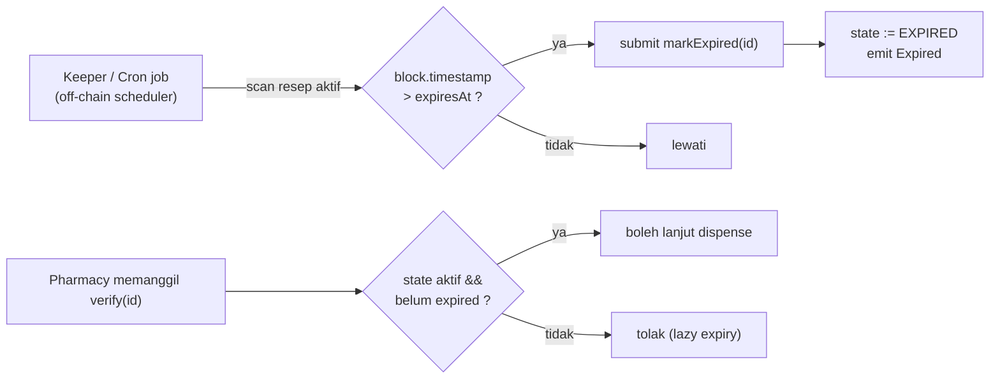

### 5.8 Revocation

Revocation menangani pembatalan klinis (mis. kesalahan resep, interaksi obat terdeteksi, instruksi dokter dicabut). `revoke(prescriptionId)` valid dari state aktif (`ISSUED` atau `PARTIALLY_DISPENSED`) dan diotorisasi pada dua principal: **issuing doctor** (`msg.sender == record.doctor`) atau **`ADMIN_ROLE`** (regulator, untuk intervensi pengawasan—mis. penarikan obat oleh BPOM). Apoteker tidak dapat me-revoke. Transisi `→ REVOKED` bersifat **terminal absolut**: tidak ada `dispense`, `refill`, maupun `markExpired` yang dapat dieksekusi sesudahnya (`revoke` atas `REVOKED` di-`revert`).

Penting bahwa revocation **mempertahankan** `dispensedUnits` yang telah tercatat—unit yang terlanjur ditebus tetap terekam untuk keperluan audit dan pharmacovigilance; revocation menghentikan dispensing *ke depan*, bukan menghapus jejak masa lalu. Fungsi meng-emit `Revoked(prescriptionId, revokedBy, dispensedUnitsAtRevocation)`. Sebagai komplemen kriptografis, revocation dapat dipasangkan dengan `revokeAccess` pada `KeyAccessRegistry` untuk menarik kembali wrapped CEK dari apotek yang belum men-dispense, sehingga ciphertext IPFS tidak lagi dapat dibuka oleh recipient yang aksesnya dicabut (dengan caveat bahwa pihak yang sudah mengunduh CEK sebelum pencabutan secara teoretis masih dapat mendekripsi—batas inheren dari pencabutan akses kriptografis, dibahas pada Section privasi).

### 5.9 Invariants

Berikut adalah invariants yang dipegang FSM pada SETIAP titik di antara transaksi (akan diverifikasi pada evaluasi keamanan, termasuk via analisis statis Slither/Mythril dan property-based testing). Pelanggaran salah satunya menandakan bug pada kontrak.

1. **I1 — Batas dispensing.** `0 <= dispensedUnits <= totalUnits` selalu. Guard `q <= remaining` menegakkan batas atas; tipe unsigned menegakkan batas bawah.
2. **I2 — Konsistensi state-akuntansi.**
   - `state == ISSUED  ⟹  dispensedUnits == 0` (pada awal siklus, sebelum dispense pertama siklus tersebut);
   - `state == PARTIALLY_DISPENSED  ⟹  0 < dispensedUnits < totalUnits`;
   - `state == FULLY_DISPENSED  ⟹  dispensedUnits == totalUnits`.
3. **I3 — Batas refill.** `0 <= refillsUsed <= refillsAllowed` selalu; `refill` hanya dapat dipanggil bila `refillsUsed < refillsAllowed`.
4. **I4 — Monotonisitas akuntansi.** Dalam satu siklus, `dispensedUnits` monoton non-turun; ia hanya direset ke `0` oleh `refill` (yang juga menaikkan `refillsUsed`). `refillsUsed` monoton non-turun sepanjang umur resep dan tidak pernah direset.
5. **I5 — Eksistensi vs. state.** `state == State.None  ⟺  resep tidak pernah diterbitkan`. Tidak ada fungsi selain `issuePrescription` yang dapat menulis state non-`None` ke slot ber-state `None`, dan tidak ada fungsi yang dapat mengembalikan state ke `None`.
6. **I6 — Terminalitas.** `state ∈ {EXPIRED, REVOKED}` adalah terminal absolut; tidak ada transisi keluar. `state == FULLY_DISPENSED` terminal kecuali `refillsUsed < refillsAllowed`, yang mana satu-satunya edge keluar adalah `refill → ISSUED`.
7. **I7 — Otoritas temporal.** `issuedAt == block.timestamp` pada blok inklusi `issuePrescription`, dan `issuedAt <= expiresAt` (dijamin oleh guard `expiresAt > block.timestamp` saat issue). Seluruh evaluasi expiry mengacu pada `block.timestamp`, bukan pada klaim `issuedAt` dari canonical JSON.
8. **I8 — Imutabilitas identitas resep.** `prescriptionId`, `doctor`, `patientRef`, `cid`, dan `payloadHash` tidak pernah berubah pasca-issue; refill mendaur ulang akuntansi tetapi tidak mengubah pengikatan kriptografis ke payload. (Penerbitan ulang dengan medikasi berbeda mensyaratkan `prescriptionId` baru melalui `issuePrescription` baru.)
9. **I9 — Total unit sah seumur hidup.** Akumulasi unit yang sah ditebus sepanjang seluruh siklus dibatasi oleh `totalUnits × (1 + refillsAllowed)`; tidak ada sekuens transaksi sah yang dapat melampauinya.

Invariant I1, I3, dan I9 secara kolektif adalah formalisasi properti **anti-double-dispensing** yang menjawab kelemahan **V4**: tidak ada jalur eksekusi—baik sekuensial maupun konkuren—yang memungkinkan total unit ter-dispense melampaui pagu yang diotorisasi dokter, karena setiap `dispense` diserialisasi konsensus dan dijaga guard akuntansi yang sama.

---

The review notes reference Sections 4 and 5 which aren't in this repo (they're part of the larger thesis document being co-authored elsewhere). The notes give me the precise information I need: I must make Section 6's data model consistent with the decision that FULLY_DISPENSED CAN transition to EXPIRED (the defensible choice given refill semantics), and I must clarify the per-cycle vs. lifetime semantics of `totalUnits`/`dispensedUnits`.

Since this is a writing task for a section that lives in an external document, I'll produce the complete revised Section 6 directly, carefully encoding the reviewer's two resolutions into the data model narrative.

## 6. Model Data & Pembagian On/Off-chain

Bagian ini mendefinisikan model data sistem secara presisi: apa yang disimpan *on-chain* (di state kontrak pada Hyperledger Besu), apa yang disimpan *off-chain* (sebagai *ciphertext* di IPFS dan sebagai *read-model* di Postgres), serta bagaimana kedua domain itu dipetakan satu sama lain. Prinsip pemandu adalah **data minimization** — turunan langsung dari kelemahan **V5** (data obat resep terbuka di IPFS), **V6** (penyimpanan file JSON datar yang *world-readable*), dan **V1** (PII pasien plaintext). Kaidah operasionalnya: **zero PII on-chain**, *ledger* hanya memuat *pointer*, *commitment* kriptografis, dan *metadata* kontrol-akses yang diperlukan untuk RBAC, *lifecycle*, serta *anti-double-dispensing*; sedangkan seluruh muatan klinis yang sensitif hidup *off-chain* dalam keadaan terenkripsi *envelope*.

### 6.1 Prinsip Pemisahan: Apa yang Layak On-chain?

Sebuah *field* layak disimpan on-chain hanya bila memenuhi salah satu dari empat fungsi berikut, dan tidak ada cara *off-chain* yang lebih murah/aman untuk memenuhi fungsi itu:

1. **Otorisasi (RBAC)** — diperlukan oleh `IdentityRegistry`/`PrescriptionRegistry` untuk memutuskan `isAuthorized(role, addr)` secara deterministik di dalam konsensus (mis. `doctor`, `patientRef`).
2. **Integritas / non-repudiation** — *commitment* yang mengikat data *off-chain* ke *ledger* secara *tamper-evident* (`payloadHash`, dan secara implisit `cid` sebagai *content-addressed hash*).
3. **State *lifecycle* & akunting** — variabel yang menjadi sumber kebenaran transisi *state* dan pencegahan *double-dispensing*, yang **harus** diserialisasi oleh konsensus (`state`, `dispensedUnits`, `totalUnits`, `refillsUsed`).
4. **Temporal validity** — batas waktu yang diverifikasi *on-chain* tanpa *oracle* eksternal (`issuedAt`, `expiresAt`).

Semua *field* yang **tidak** memenuhi salah satu fungsi tersebut — terutama identitas riil, nama obat, dosis, diagnosis — disimpan *off-chain*, terenkripsi. Hal ini sekaligus menutup **V5**: yang diunggah ke IPFS adalah *ciphertext*, bukan *plaintext*.

### 6.2 Tabel Field: On-chain vs Off-chain + Justifikasi

Tabel berikut adalah katalog kanonik. Kolom *Domain* menandai lokasi otoritatif; kolom *Justifikasi* menautkan setiap keputusan ke prinsip §6.1 dan ke kelemahan yang diatasi.

| Field | Tipe | Domain | Fungsi (§6.1) | Justifikasi (data minimization) |
|---|---|---|---|---|
| `prescriptionId` | `bytes32` | **On-chain** | 1,2 | *Primary key* resep; pseudonim acak, tidak mengandung PII. Mengikat seluruh artefak (CID, *wrapped keys*, event). |
| `doctor` | `address` | **On-chain** | 1,2 | EOA dokter penerbit (self-custody, V2/V3 teratasi). Provenance otentik & basis `revoke`. Bukan identitas riil — dipetakan ke lisensi via `IdentityRegistry`. |
| `patientRef` | `bytes32` | **On-chain** | 1 | Pseudonim `keccak256(salt, DID)`. **Zero PII**: tak ada NIK/nama/DOB on-chain (mengatasi V1). Tak dapat dibalik tanpa `salt` (di KMS). |
| `cid` | `string` | **On-chain** | 2 | *Content-addressed pointer* ke *ciphertext* di IPFS. CID sendiri adalah *hash* multihash → integritas konten *off-chain* terjamin oleh *addressing*. |
| `payloadHash` | `bytes32` | **On-chain** | 2 | `keccak256(ciphertext)`. *Commitment* eksplisit, *defense-in-depth* terhadap manipulasi/gateway IPFS yang tidak tepercaya (lihat §6.5). |
| `issuedAt` | `uint64` | **On-chain** | 4 | Waktu penerbitan (block-time). Audit kronologis. |
| `expiresAt` | `uint64` | **On-chain** | 4 | Batas validitas; diuji `block.timestamp > expiresAt` untuk `markExpired` tanpa *oracle*. |
| `totalUnits` | `uint32` | **On-chain** | 3 | Kuota dispensing **per-siklus** (lihat §6.4). Wajib on-chain agar *anti-double-dispensing* bersifat konsensual. |
| `dispensedUnits` | `uint32` | **On-chain** | 3 | Akunting kumulatif dalam **satu siklus**. *Invariant* `dispensedUnits <= totalUnits` ditegakkan kontrak. |
| `refillsAllowed` | `uint8` | **On-chain** | 3 | Plafon jumlah siklus pengulangan. |
| `refillsUsed` | `uint8` | **On-chain** | 3 | Penghitung siklus terpakai; bersama `totalUnits` merekonstruksi *lifetime dispensed* (lihat §6.4). |
| `state` | `enum State` | **On-chain** | 3 | Sumber kebenaran *lifecycle*: `ISSUED \| PARTIALLY_DISPENSED \| FULLY_DISPENSED \| EXPIRED \| REVOKED`. |
| `wrappedKey` | `bytes` | **On-chain** (`KeyAccessRegistry`) | 1 | CEK terbungkus ECIES per *recipient*. *Ciphertext* kunci, bukan kunci telanjang → aman walau *ledger* terbaca. |
| `encryptionPubKey` | `bytes` | **On-chain** (`IdentityRegistry`) | 1 | Public key ECIES; publik secara definisi, tak ada rahasia. |
| `licenseHash` | `bytes32` | **On-chain** (`IdentityRegistry`) | 1,2 | `keccak256` kredensial lisensi → verifikasi tanpa membocorkan nomor lisensi. |
| `institutionId` | `bytes32` | **On-chain** (`IdentityRegistry`) | 1 | Identitas institusi (allowlist), bukan PII individu. |
| — | — | — | — | — |
| `doctor.name`, `doctor.licenseNo`, `doctor.did` | string | **Off-chain** | — | Identitas riil profesional. On-chain cukup `address` + `licenseHash`. |
| `patient.{did, nik_hash, name, dob}` | object | **Off-chain** | — | **PII pasien** — *strictly off-chain & encrypted* (mengatasi V1). On-chain hanya `patientRef`. |
| `medications[]` | array | **Off-chain** | — | Inti data klinis sensitif. Pada V5 terbuka; kini *encrypted-at-rest* (CEK AES-256-GCM). |
| `diagnosisCode` (ICD-10) | string | **Off-chain** | — | Diagnosis = data kesehatan hipersensitif; *never on-chain*, bahkan terenkripsi disimpan terpisah. |
| `notes`, `instructions` | string | **Off-chain** | — | Teks bebas; bisa memuat PII insidental → tak boleh on-chain. |
| `signature` (EIP-712) | string | **Off-chain** (dalam *payload*) | 2 | Tanda tangan dokter atas *canonical payload* untuk non-repudiation off-chain; ikut terenkripsi & ter-*hash*. |
| `schemaVersion` | string | **Off-chain** | — | Versi skema *payload* (lihat §6.6). |
| *read-model* (Postgres) | tabel | **Off-chain (derived)** | — | Proyeksi *event* untuk query cepat (event-indexer); bukan otoritatif — *source of truth* tetap *ledger*. |

> **Catatan minimalitas:** seluruh *field* on-chain yang merujuk manusia adalah **pseudonim atau *hash*** (`doctor address`, `patientRef`, `licenseHash`). Tidak ada satu pun NIK, nama, tanggal lahir, atau kode diagnosis yang menyentuh *ledger*. Inilah perbedaan struktural terhadap sistem naif (V1/V5/V6).

### 6.3 Skema JSON Kanonik Resep (Off-chain, Pre-encryption)

Objek berikut adalah *canonical prescription payload*. Ia di-*serialize* secara kanonik (lihat §6.5), ditandatangani dokter via EIP-712, lalu dienkripsi (AES-256-GCM) sebelum diunggah ke IPFS. **Tidak ada bagian dari objek ini yang tersimpan *plaintext* di mana pun.**

```json
{
  "schemaVersion": "1.0.0",
  "prescriptionId": "0x7f3a9c1e8b2d4f60a5c7e91b3d8f0a2c6e4b9d1f7a3c5e8b0d2f4a6c8e1b3d5f",
  "issuedAt": 1750204800,
  "expiresAt": 1752796800,
  "doctor": {
    "did": "did:health:id:doctor:0xA1B2...C3D4",
    "licenseNo": "STR-44.1.2024.0019823",
    "name": "dr. Anindita Parameswari, Sp.PD",
    "address": "0xA1B2C3D4E5F60718293A4B5C6D7E8F9012345678"
  },
  "patient": {
    "did": "did:health:id:patient:9f2b...7e0a",
    "nik_hash": "0xc4e2...a91f",
    "name": "Bagas Wicaksono",
    "dob": "1991-04-23"
  },
  "medications": [
    {
      "code": { "system": "ATC", "value": "C09AA05" },
      "name": "Ramipril",
      "form": "tablet",
      "strength": "5 mg",
      "dose": "1 tablet",
      "frequency": "1x sehari",
      "duration": "30 hari",
      "quantity": 30,
      "instructions": "Diminum pagi hari sesudah makan."
    },
    {
      "code": { "system": "RxNorm", "value": "860975" },
      "name": "Metformin hydrochloride",
      "form": "tablet",
      "strength": "500 mg",
      "dose": "1 tablet",
      "frequency": "2x sehari",
      "duration": "30 hari",
      "quantity": 60,
      "instructions": "Diminum bersama makan pagi dan malam."
    }
  ],
  "refillsAllowed": 2,
  "diagnosisCode": "I10",
  "notes": "Kontrol tekanan darah dan gula darah dalam 4 minggu.",
  "signature": {
    "scheme": "EIP-712",
    "domain": {
      "name": "EPrescription",
      "version": "1",
      "chainId": 1337,
      "verifyingContract": "0xPrescriptionRegistryAddress0000000000000000"
    },
    "primaryType": "Prescription",
    "value": "0x9b1d...e4f7c8a2...3d6e0b5f"
  }
}
```

Catatan skema:

- `medications[].code` menggunakan *coding system* terstruktur — **ATC** atau **RxNorm** — bukan teks bebas, demi interoperabilitas dan validasi otomatis. `quantity` per-obat bersifat informatif klinis; **akunting dispensing yang mengikat tetap `totalUnits`/`dispensedUnits` on-chain** (§6.4).
- `diagnosisCode` memakai **ICD-10** (`I10` = *essential hypertension*) dan bersifat opsional/sensitif; ia tidak pernah on-chain.
- `signature` adalah tanda tangan **EIP-712** atas *typed data* `Prescription`, memberi non-repudiation yang dapat diverifikasi *off-chain* (independen dari tx on-chain).

### 6.4 Layout Struct On-chain (Packed) & Pemetaan On↔Off-chain

Struct `Prescription` di `PrescriptionRegistry` dirancang **storage-packed** agar hemat *storage* (relevan untuk metrik pertumbuhan storage on-chain, V7). EVM menyusun *storage* dalam slot 32-byte; *field* dikelompokkan agar `uint64`/`uint32`/`uint8`/`enum` berbagi slot.

```solidity
enum State { None, ISSUED, PARTIALLY_DISPENSED, FULLY_DISPENSED, EXPIRED, REVOKED } // None=0 sentinel (lihat §5.1 & Konvensi Kanonik)

struct Prescription {
    // ---- slot 0 ---- (32 bytes)
    bytes32 prescriptionId;
    // ---- slot 1 ---- (20 bytes addr + 8 + 1 + ... = 32 bytes, packed)
    address doctor;          // 20 bytes
    uint64  issuedAt;        //  8 bytes
    uint8   refillsAllowed;  //  1 byte
    uint8   refillsUsed;     //  1 byte
    State   state;           //  1 byte  (enum -> uint8)
    // 1 byte padding tersisa di slot 1
    // ---- slot 2 ---- (32 bytes, packed)
    bytes32 patientRef;
    // ---- slot 3 ---- (8 + 4 + 4 = 16 bytes, packed)
    uint64  expiresAt;       //  8 bytes
    uint32  totalUnits;      //  4 bytes
    uint32  dispensedUnits;  //  4 bytes
    // 16 bytes padding tersisa di slot 3
    // ---- slot 4 ---- (32 bytes)
    bytes32 payloadHash;
    // ---- slot 5+ ---- (dynamic)
    string  cid;             // IPFS CID (ciphertext)
}
```

> Catatan *packing*: `prescriptionId`, `patientRef`, dan `payloadHash` masing-masing menempati slot penuh karena `bytes32`. *Field* numerik kecil (`uint64/uint32/uint8/enum`) sengaja dikelompokkan ke slot 1 dan slot 3 sehingga sebuah resep menempati ±5 slot statis + slot dinamis untuk `cid`. `cid` (CIDv1 base32, ~59 karakter) dibiarkan `string` dinamis; alternatif `bytes` *multihash* mentah dapat menekan biaya lebih jauh dan menjadi opsi optimasi pada bab evaluasi.

Pemetaan **on↔off-chain** menegaskan bahwa setiap *field* memiliki tepat satu domain otoritatif, dengan *commitment* sebagai jembatan integritas:

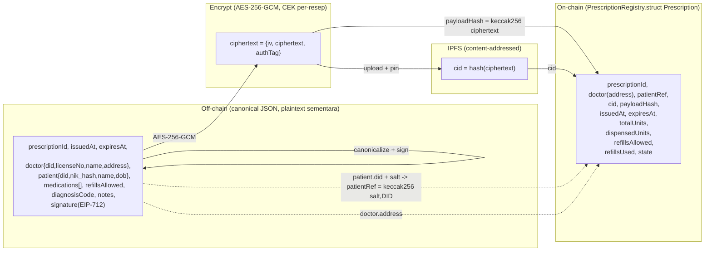

**Semantik akunting `totalUnits` / `dispensedUnits` lintas refill (penegasan eksplisit).** `totalUnits` adalah **kuota per-siklus**, *bukan* kuota seumur-hidup resep. Dalam **satu siklus** berlaku *invariant* `0 <= dispensedUnits <= totalUnits`, dan `dispensedUnits` **monoton-tak-turun hanya di dalam siklus tersebut**: nilainya bertambah pada setiap `dispense` dan **di-reset ke `0`** ketika `refill` membuka siklus berikutnya. Karena itu *lifetime dispensed* tidak tersimpan langsung dalam satu variabel on-chain, melainkan **direkonstruksi oleh event-indexer** sebagai:

$$
\text{lifetimeDispensed} = totalUnits \times refillsUsed + dispensedUnits_{\text{siklus berjalan}}
$$

Rumus ini akurat untuk kasus kuota per-siklus konstan; *event-indexer* yang menjumlahkan seluruh `Dispensed`-event sepanjang riwayat memberikan nilai *lifetime* yang sama dan tahan terhadap variasi. Plafon seumur-hidup ditegakkan secara struktural oleh `refillsUsed < refillsAllowed` (jumlah siklus dibatasi) digabung dengan *invariant* per-siklus, sehingga total maksimum yang dapat di-dispense adalah `totalUnits * (refillsAllowed + 1)`.

Penegasan *invariant* (versi diperketat agar konsisten dengan §5):

- **INV-1 (per-siklus):** *within any single cycle*, `dispensedUnits <= totalUnits` selalu benar; `dispense` yang melampaui `remaining = totalUnits - dispensedUnits` ditolak.
- **INV-4 (monotonisitas intra-siklus):** `dispensedUnits` tak-pernah-turun **di dalam satu siklus**; satu-satunya penurunan yang diizinkan adalah **reset ke 0 pada `refill`**, yang membuka siklus baru.
- **INV-11 (kuota siklus):** jumlah seluruh `quantity` yang berhasil di-dispense **within any single cycle** `<= totalUnits`. Kuota *lifetime* dibatasi secara komposisional oleh INV-11 ⊗ (`refillsUsed <= refillsAllowed`).

### 6.5 `payloadHash`, Integritas, dan Canonicalization

`payloadHash = keccak256(ciphertext)` dengan `ciphertext` adalah *byte string* hasil enkripsi AES-256-GCM (paket `{iv, ciphertext, authTag}` yang sama yang diunggah ke IPFS). Peran rangkapnya:

1. **Pengikat *off-chain → on-chain*.** Pembaca berwenang yang mengunduh objek dari IPFS dapat memverifikasi `keccak256(blob) == payloadHash` sebelum dekripsi. Bila tidak cocok → konten telah dimanipulasi/CID salah → ditolak.
2. ***Defense-in-depth* terhadap CID.** Meski CID sendiri *content-addressed* (manipulasi konten mengubah CID), `payloadHash` melindungi dari skenario *gateway* IPFS jahat yang menyajikan konten berbeda untuk CID yang sama, dan memberikan *commitment* yang hidup murni di *ledger* (independen dari ketersediaan IPFS).
3. **Komplemen `authTag`.** `authTag` GCM menjamin integritas+otentisitas *plaintext* terhadap pemegang CEK; `payloadHash` menjamin integritas *ciphertext* terhadap publik tanpa perlu kunci. Keduanya berlapis.

Agar `payloadHash` dan tanda tangan EIP-712 deterministik, *canonicalization* wajib dilakukan sebelum hashing/enkripsi: JSON di-*serialize* menurut aturan kanonik (mis. **RFC 8785 / JCS** — kunci terurut leksikografis, tanpa *whitespace* signifikan, normalisasi angka). EIP-712 menandatangani **struktur *typed data***, bukan blob JSON, sehingga `signature` tahan terhadap perbedaan penyajian JSON; namun `payloadHash` mengikat *ciphertext byte-exact*. Maka urutan kanonik adalah: `canonicalize(JSON)` → `sign (EIP-712)` → sisipkan `signature` → `canonicalize` ulang → `AES-256-GCM` → `ciphertext` → `keccak256` → `payloadHash`.

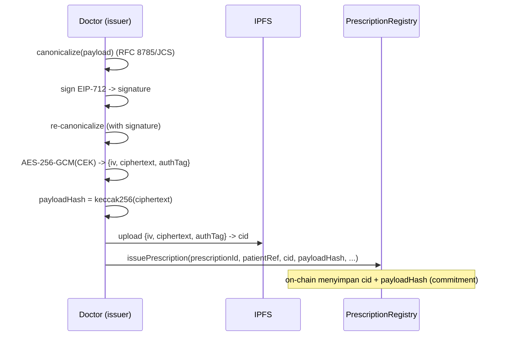

### 6.6 Versioning (`schemaVersion`) & Evolusi Skema

`schemaVersion` (SemVer, mis. `"1.0.0"`) tersemat di dalam *canonical payload* *off-chain*, **bukan** on-chain — karena evolusi format klinis tidak boleh memaksa *migration storage* kontrak. Kebijakannya:

- **PATCH / MINOR** (mis. menambah *field* opsional, menambah *coding system* baru): *backward-compatible*; *reader* lama mengabaikan *field* tak dikenal. Tidak memerlukan perubahan kontrak.
- **MAJOR** (mis. mengubah representasi `medications[].code`, mengubah struktur `patient`): *breaking*; *indexer/decryptor* memilih *parser* berdasarkan `schemaVersion`. Resep lama tetap valid & dapat didekripsi dengan *parser* versinya — *immutability* IPFS menjamin *payload* historis utuh.

Karena `schemaVersion` ikut masuk ke `ciphertext`, ia juga **terlindungi oleh `payloadHash`**: versi skema tidak dapat dipalsukan tanpa membatalkan *commitment* on-chain. *Upgrade* logika kontrak (bila skema *on-chain* perlu berubah, mis. menambah *field* lifecycle) ditangani terpisah lewat **UUPS proxy** (OpenZeppelin) dan diberi versinya sendiri pada level kontrak — terpisah dari `schemaVersion` *payload* — sehingga evolusi data klinis dan evolusi logika *lifecycle* tetap *decoupled*.

> **Konsistensi lintas-bagian (catatan untuk §4/§5):** model data ini mengasumsikan `markExpired` menerima **state aktif mana pun *termasuk* `FULLY_DISPENSED`** ketika `block.timestamp > expiresAt` — perlu untuk resep ber-*refill* yang seluruh unit siklusnya telah di-dispense (`FULLY_DISPENSED`) tetapi masa berlakunya habis sebelum `refill` berikutnya digunakan; tanpa transisi ini, resep semacam itu akan "menggantung" dan masih dianggap dapat di-*refill*. Karena itu, *state machine* di §4.3.1 dan diagram §5.2 serta kode §5.6 harus konsisten menyertakan transisi `FULLY_DISPENSED -> EXPIRED`. Untuk keperluan §6, perlakuan ini sudah tercermin pada *enum* `State` dan tidak mengubah satu pun *field* data.

---

## 7. Privasi & Kriptografi

Bagian ini menjabarkan lapisan kerahasiaan (confidentiality) dan integritas (integrity) data resep pada sistem yang diusulkan. Tujuan utamanya adalah menutup kelemahan **V5** (data obat resep diunggah ke IPFS tanpa enkripsi) dan **V1** (PII pasien tersimpan plaintext dan dilayani publik), sekaligus memenuhi prinsip *zero PII on-chain* serta menyediakan kendali akses berbasis pasien (*patient-centric access control*). Pendekatan inti yang dipilih adalah **envelope encryption** yang memisahkan secara tegas antara *data-at-rest* terenkripsi pada IPFS, *integrity anchor* on-chain, dan *key distribution* terkontrol melalui `KeyAccessRegistry`.

Premis desainnya sederhana namun ketat: **tidak ada satu pun byte plaintext data klinis maupun PII pasien yang pernah menyentuh ledger atau IPFS dalam bentuk terbaca.** Ledger hanya menyimpan referensi (`cid`), jangkar integritas (`payloadHash`), pseudonim (`patientRef`), dan pembungkus kunci terenkripsi (`wrappedKey`). Plaintext hanya pernah eksis sesaat di memori klien yang berwenang (browser dokter, KMS pasien, atau klien apotek) selama operasi enkripsi/dekripsi.

### 7.1 Skema Envelope Encryption

Envelope encryption memecah masalah kriptografis menjadi dua lapis yang independen secara algoritmik, mengikuti praktik yang lazim pada KMS modern (mis. AWS KMS, Google Cloud KMS):

1. **Data encryption (symmetric)** — payload resep yang berukuran relatif besar dienkripsi sekali menggunakan kunci simetris cepat, yaitu **Content Encryption Key (CEK)** berbasis **AES-256-GCM**.
2. **Key encryption (asymmetric)** — CEK yang berukuran kecil (32 byte) dibungkus (*wrapped*) secara terpisah ke setiap *recipient* yang berwenang menggunakan **ECIES (secp256k1)** terhadap `encryptionPubKey` masing-masing.

Pemisahan ini memberi dua keuntungan kunci. Pertama, biaya enkripsi simetris atas payload (yang bisa berukuran kilobyte) hanya dibayar **sekali** per resep, terlepas dari berapa banyak pihak yang nantinya diberi akses. Kedua, pemberian akses ke pihak baru (mis. apotek terpilih saat *fill*) hanya memerlukan pembungkusan ulang kunci 32-byte — operasi yang murah dan tidak menyentuh ulang ciphertext besar di IPFS. Inilah yang memungkinkan model *grant-on-demand* yang patient-centric.

#### 7.1.1 Content Encryption Key (CEK) dan AES-256-GCM

Untuk setiap resep, sebuah CEK baru dibangkitkan secara acak menggunakan CSPRNG (`CEK = randomBytes(32)`, 256 bit). Sifat **per-resep** ini krusial: kompromi satu CEK hanya membocorkan satu resep, bukan seluruh korpus (*blast radius* minimal), dan menghilangkan ketergantungan antar-resep.

CEK digunakan untuk mengenkripsi **canonical prescription JSON** (lihat Bagian 6 — `schemaVersion`, `prescriptionId`, data `doctor`/`patient`, array `medications`, `diagnosisCode`, dan `signature` EIP-712 dokter). AES-256-GCM dipilih sebagai mode **AEAD (Authenticated Encryption with Associated Data)** karena menyediakan kerahasiaan dan otentikasi/integritas sekaligus dalam satu operasi: setiap upaya menyunting ciphertext akan terdeteksi saat verifikasi `authTag` gagal pada dekripsi.

**Format paket enkripsi** yang dihasilkan dan diunggah ke IPFS adalah struktur eksplisit berikut:

```json
{
  "alg": "AES-256-GCM",
  "iv": "<12-byte nonce, base64>",
  "ciphertext": "<encrypted canonical JSON, base64>",
  "authTag": "<16-byte GCM authentication tag, base64>"
}
```

| Field | Ukuran | Peran | Catatan keamanan |
|---|---|---|---|
| `iv` | 12 byte (96-bit) | Nonce/Initialization Vector untuk GCM | **Wajib unik** per operasi enkripsi di bawah CEK yang sama; dibangkitkan acak. 96-bit adalah ukuran nonce yang direkomendasikan NIST SP 800-38D. |
| `ciphertext` | = ukuran plaintext | Hasil enkripsi canonical JSON | Tidak mengandung struktur yang dapat dibaca tanpa CEK. |
| `authTag` | 16 byte (128-bit) | Tag otentikasi GCM | Memverifikasi integritas+otentisitas; dekripsi *menolak* output bila tag tidak cocok. |
| `alg` | — | Penanda algoritma | Mendukung **crypto-agility** (lihat 7.5). |

Karena CEK bersifat per-resep dan tidak digunakan ulang, risiko *nonce reuse* (kelemahan fatal pada GCM yang dapat membocorkan kunci otentikasi) sangat tertekan; meski demikian, implementasi tetap membangkitkan `iv` acak per operasi sebagai pertahanan berlapis.

#### 7.1.2 Integrity Anchor On-Chain (`payloadHash`)

Setelah paket enkripsi terbentuk, sistem menghitung `payloadHash = keccak256(ciphertextPackage)` dan menyimpannya on-chain di dalam `Prescription` record bersama `cid`. Fungsi ini ganda:

- **Integritas terhadap IPFS** — IPFS bersifat *content-addressed* (CID adalah hash multihash dari konten), sehingga sudah menjamin bahwa konten yang diambil cocok dengan CID. Namun `payloadHash` yang disimpan **on-chain** menambahkan jangkar integritas yang ditandatangani konsensus IBFT 2.0 dan tidak bergantung pada asumsi pinning service. Klien apotek wajib memverifikasi `keccak256(fetchedCiphertext) == payloadHash` sebelum dekripsi.
- **Decoupling penyimpanan** — bila ciphertext dimigrasi ke backend penyimpanan lain (mis. perubahan pinning provider) selama bytes identik, `payloadHash` tetap valid; ini memberi fleksibilitas operasional tanpa mengorbankan verifiabilitas.

#### 7.1.3 ECIES Key-Wrapping (secp256k1)

CEK 32-byte dibungkus ke setiap *recipient* menggunakan **ECIES (Elliptic Curve Integrated Encryption Scheme)** di atas kurva **secp256k1** — kurva yang sama dengan yang digunakan EOA Ethereum, sehingga `encryptionPubKey` dapat dikelola dengan toolchain yang sama. Penting ditegaskan kembali (lihat Bagian 4): tiap aktor memiliki **dua keypair terpisah** — *signing key* (untuk menandatangani tx) dan *encryption key* (untuk ECIES key-wrapping). Pemisahan ini mencegah penyalahgunaan kunci tanda tangan sebagai kunci enkripsi dan menyederhanakan rotasi independen.

Skema ECIES yang dipakai mengikuti konstruksi standar: *ephemeral ECDH* untuk menurunkan shared secret, KDF untuk menderivasi kunci AES dan kunci MAC, lalu enkripsi simetris atas CEK dengan MAC integritas. Hasilnya adalah `wrappedKey` yang hanya dapat dibuka oleh pemegang *encryption private key* yang bersesuaian.

```
wrappedKey_R = ECIES_encrypt( encryptionPubKey_R , CEK )
CEK          = ECIES_decrypt( encryptionPrivKey_R , wrappedKey_R )
```

Karena `wrappedKey` di-*recipient* secara per-pihak, satu CEK dapat memiliki banyak pembungkus paralel (satu untuk pasien, satu untuk dokter, kelak satu untuk apotek) tanpa pernah saling mengungkap.

#### 7.1.4 Peran `KeyAccessRegistry`

`KeyAccessRegistry` adalah *on-chain bulletin board* untuk distribusi `wrappedKey`. Strukturnya:

```solidity
mapping(bytes32 prescriptionId => mapping(bytes32 recipient => bytes wrappedKey)) // recipient: bytes32 (lihat Konvensi Kanonik K-2)
```

Kontrak ini **tidak pernah** menyimpan CEK plaintext — hanya menyimpan pembungkus terenkripsi, sehingga validator dan siapa pun yang membaca ledger tidak memperoleh apa-apa secara kriptografis. Fungsinya: `grantAccess(prescriptionId, recipient, wrappedKey)`, `getWrappedKey(prescriptionId, recipient)`, dan `revokeAccess(prescriptionId, recipient)`, masing-masing meng-emit `AccessGranted` / `AccessRevoked` agar event-indexer dapat membangun read-model siapa-punya-akses-ke-apa secara auditable. Menyimpan pembungkus on-chain (alih-alih off-chain) memberi **auditability** dan **non-repudiation** terhadap pemberian/pencabutan akses — sebuah peningkatan langsung atas kelemahan **V6** (penyimpanan flat-file tak-auditable).

### 7.2 Alur Akses (Access Flow)

Model akses bersifat **patient-centric**: pasien (melalui KMS/HSM kustodialnya) adalah otoritas yang memutuskan apotek mana yang boleh membuka resep. Ada dua momen pemberian akses.

#### 7.2.1 Grant saat Issue (Patient + Issuing Doctor)

Saat dokter menerbitkan resep (`issuePrescription`), klien dokter:

1. Membangkitkan CEK, mengenkripsi canonical JSON (AES-256-GCM), mengunggah paket ke IPFS → `cid`, menghitung `payloadHash`.
2. Membungkus CEK ke **dua** recipient: `encryptionPubKey` **pasien** (diambil via `IdentityRegistry.getEncryptionPubKey(patientRef)`) dan `encryptionPubKey` **dokter penerbit** sendiri.
3. Mengirim tx `issuePrescription(...)` ke `PrescriptionRegistry`, lalu dua tx `grantAccess(prescriptionId, patient, wrappedKey_patient)` dan `grantAccess(prescriptionId, doctor, wrappedKey_doctor)` ke `KeyAccessRegistry`.

Grant ke pasien memberi pasien kendali penuh sejak awal; grant ke dokter penerbit memungkinkan dokter membuka kembali resep untuk audit/koreksi. Pada titik ini, **belum ada apotek** yang memiliki akses — sesuai prinsip *least privilege*.

#### 7.2.2 Re-wrap saat Fill (KMS Pasien → Apotek)

Ketika pasien memilih apotek untuk menebus resep, akses diberikan secara *just-in-time* oleh **KMS pasien**, bukan oleh apotek atau server:

1. KMS pasien membuka `wrappedKey_patient` (`ECIES_decrypt` dengan encryption privkey pasien yang tersimpan di HSM) untuk merecover CEK secara *in-memory*.
2. KMS membungkus ulang CEK ke `encryptionPubKey` apotek terpilih: `wrappedKey_pharmacy = ECIES_encrypt(encryptionPubKey_pharmacy, CEK)`.
3. KMS menyubmit `grantAccess(prescriptionId, pharmacy, wrappedKey_pharmacy)`.
4. Apotek kini dapat menarik `cid`, memverifikasi `payloadHash`, menarik `wrappedKey_pharmacy`, men-decrypt CEK, lalu mendekripsi payload — dan selanjutnya memanggil `dispense(...)`.

Karena CEK **tidak pernah** ditransmisikan dalam bentuk plaintext dan re-wrapping terjadi sepenuhnya di dalam KMS pasien, kerahasiaan dipertahankan end-to-end. Apotek hanya memperoleh akses ke resep yang secara eksplisit ditujukan kepadanya, untuk durasi yang dapat dicabut (`revokeAccess`) — menutup kelemahan **V5** sekaligus menegakkan kontrol patient-centric.

### 7.3 Diagram Alur Enkripsi/Dekripsi

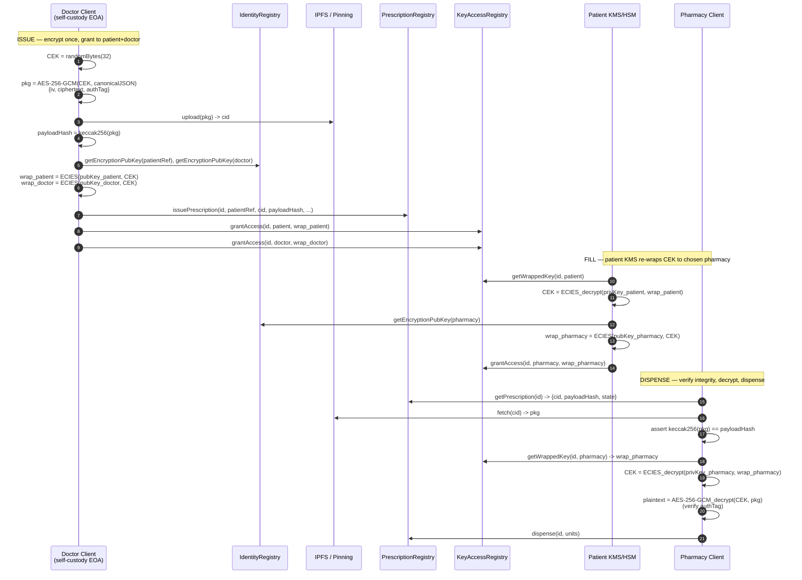

### 7.4 Selective Disclosure

Granularitas akses pada desain ini berada pada level **per-resep × per-recipient**: `KeyAccessRegistry` memetakan setiap `prescriptionId` ke himpunan recipient yang masing-masing memegang `wrappedKey` independen. Konsekuensinya, mengungkap satu resep ke satu apotek **tidak** mengungkap resep lain milik pasien yang sama, dan tidak mengungkap resep itu ke apotek lain. Ini adalah bentuk *selective disclosure* yang praktis dan auditable.

Untuk granularitas yang lebih halus pada level **per-field** (mis. mengungkap `medications` ke apotek tetapi menyembunyikan `diagnosisCode` ICD-10 yang lebih sensitif), terdapat dua jalur ekstensi yang dicatat sebagai arah penelitian lanjutan:

- **Field-level envelope** — memecah canonical JSON menjadi beberapa segmen, masing-masing dengan CEK tersendiri, sehingga grant dapat dilakukan per-segmen. Trade-off: pertambahan jumlah `wrappedKey` dan kompleksitas indexing.
- **Zero-knowledge / verifiable claims** — membuktikan properti tertentu (mis. "resep ini valid dan tidak kedaluwarsa") tanpa mengungkap isi, dibangun di atas `verify` view dan `payloadHash`. Ini dicatat sebagai *future work*, bukan bagian dari desain inti.

Desain inti mengadopsi pendekatan **per-resep** karena menyeimbangkan kerahasiaan, kesederhanaan, dan auditability — sambil membiarkan jalur per-field terbuka melalui `schemaVersion` dan crypto-agility.

### 7.5 Key Rotation dan Crypto-Agility

**Encryption key rotation.** Karena `IdentityRegistry` menyimpan `encryptionPubKey` per aktor secara mutable (via update yang di-gate `ADMIN_ROLE`/pemilik akun), aktor dapat merotasi encryption keypair-nya. Properti penting envelope encryption di sini: rotasi kunci aktor **tidak** mengharuskan re-enkripsi ciphertext di IPFS. Yang perlu dilakukan hanyalah **re-wrap CEK** ke pubkey baru untuk resep-resep yang masih relevan/aktif, lalu `grantAccess` ulang. Resep yang sudah `FULLY_DISPENSED`/`EXPIRED`/`REVOKED` umumnya tidak perlu di-rewrap. Kompromi sebuah encryption privkey ditangani dengan: merevoke akses (`revokeAccess`), merotasi pubkey, dan — bila perlu — me-*re-encrypt* payload di bawah CEK baru lalu re-pin (lihat 7.6).

**Signing key rotation** ditangani terpisah pada `IdentityRegistry` (status `Active|Suspended|Revoked` dan penggantian `address`), tidak bercampur dengan jalur enkripsi — keuntungan langsung dari pemisahan dua keypair.

**Crypto-agility.** Penanda algoritma yang eksplisit — `alg` pada paket enkripsi dan `schemaVersion` pada canonical JSON — memungkinkan migrasi algoritma tanpa memecah data lama. Jalur migrasi yang diantisipasi mencakup penggantian/penambahan suite (mis. ChaCha20-Poly1305 sebagai alternatif AEAD, atau transisi ke skema *post-quantum* untuk key-wrapping). Validator/klien memilih implementasi dekripsi berdasarkan `alg`, sehingga ciphertext lama tetap dapat dibuka selama suite-nya masih didukung. Ini menjadikan sistem *forward-compatible* terhadap evolusi standar kriptografi.

### 7.6 Zero PII On-Chain, `patientRef` Pseudonim, dan Right-to-Erasure

**Zero PII on-chain.** Tidak ada identitas langsung pasien yang disimpan di ledger. Pasien dirujuk semata-mata oleh:

```
patientRef = keccak256(salt, DID)
```

`patientRef` adalah pseudonim *salted hash*. Penggunaan `salt` (rahasia, dikelola institusi) mencegah serangan *dictionary/rainbow* atas ruang DID yang relatif tertebak: tanpa `salt`, lawan dapat menghitung `keccak256(DID)` untuk daftar DID yang dicurigai dan mencocokkannya on-chain (serangan pre-image atas domain kecil). Dengan `salt`, korelasi semacam itu menjadi tidak praktis. Properti ini secara langsung memperbaiki **V1** (PII plaintext yang dilayani publik) — kini ledger tidak memuat NIK, nama, tanggal lahir, maupun DID mentah; seluruh PII hanya hidup di dalam ciphertext IPFS dan terlindung CEK.

Perlu dicatat keterbatasan inheren: pseudonimitas **bukan** anonimitas. Pola transaksi (frekuensi penerbitan, keterkaitan dokter–apotek, waktu) berpotensi membuka *linkage/correlation*. Mitigasi pada level desain mencakup penghindaran metadata yang dapat dikorelasi on-chain dan, bila perlu, rotasi `salt`/`patientRef` antar-episode perawatan sebagai arah penelitian lanjutan.

**Right-to-erasure (penghapusan).** Imutabilitas ledger berbenturan dengan hak penghapusan (mis. amanat regulasi perlindungan data). Strategi yang diadopsi adalah **crypto-shredding plus tombstone**:

1. **Unpin dari IPFS** — pinning service melepas pin ciphertext sehingga konten tidak lagi dijamin tersedia dan dapat di-*garbage-collect* dari node yang menyimpannya.
2. **Crypto-shredding** — menghancurkan seluruh `wrappedKey` terkait (`revokeAccess` untuk semua recipient) dan men-destroy CEK di KMS; tanpa CEK, ciphertext yang mungkin masih tersisa menjadi *computationally inaccessible* — penghapusan efektif melalui ketidakmampuan dekripsi.
3. **Tombstone on-chain** — menandai record dengan flag *tombstone* (mis. transisi ke `REVOKED` disertai marker penghapusan) sehingga read-model dan klien memperlakukan resep sebagai dihapus, dan jejak audit pencabutan tetap terekam.

**Caveat imutabilitas (eksplisit, jujur).** Dua hal tetap bertahan:

- `cid` dan `payloadHash` yang sudah tercatat **tidak dapat dihapus** dari history ledger; keduanya tetap menjadi jejak bahwa suatu resep pernah ada (namun bukan isinya).
- Karena IPFS *content-addressed*, **unpin tidak menjamin penghapusan global** — node lain yang sempat meng-cache/men-pin konten dapat mempertahankannya. Inilah mengapa **crypto-shredding adalah jaminan privasi yang sebenarnya**: meskipun ciphertext bertahan di suatu tempat, tanpa CEK ia tidak dapat dibaca. Penghapusan di sini bersifat *erasure-by-key-destruction*, dan caveat ini dinyatakan terbuka sebagai batas desain.

### 7.7 Pin/Unpin Lifecycle

Ketersediaan ciphertext pada IPFS dikelola eksplisit melalui siklus pin/unpin yang selaras dengan lifecycle resep on-chain (lihat Bagian 5):

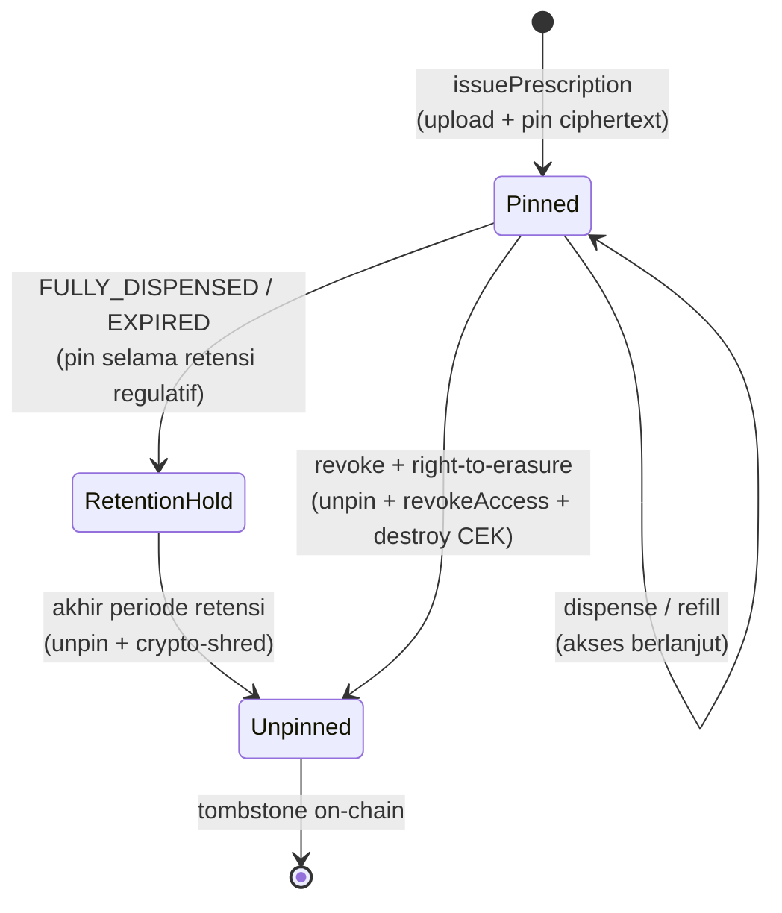

| Fase | Pemicu | Tindakan IPFS | Tindakan kunci/on-chain |
|---|---|---|---|
| **Pin** | `issuePrescription` | `add` + `pin` paket ciphertext, peroleh `cid` | catat `cid`+`payloadHash`; `grantAccess` ke patient+doctor |
| **Hold** | resep aktif / dalam retensi | pertahankan pin | `grantAccess`/`revokeAccess` per kebutuhan akses |
| **Retention** | `FULLY_DISPENSED`/`EXPIRED` | pertahankan pin selama periode retensi regulatif | tidak ada perubahan kunci |
| **Unpin** | akhir retensi atau right-to-erasure | lepas pin (memungkinkan GC) | `revokeAccess` semua recipient, destroy CEK, set tombstone |

Kebijakan retensi (durasi *RetentionHold*) ditentukan oleh kebutuhan regulatif consortium (mis. ketentuan penyimpanan rekam medis); pin dipertahankan selama periode tersebut untuk auditability, lalu transisi ke *Unpinned* digabung dengan crypto-shredding agar penghapusan bersifat menyeluruh. Dengan demikian, ketersediaan data dikendalikan secara sengaja sepanjang hidup resep — bukan dibiarkan permanen-publik seperti pada sistem naif (**V5**).

---

## 8. Keamanan & Threat Model

Bagian ini menyusun analisis keamanan formal terhadap rancangan *Smart Contract Based E-Prescription System*. Analisis dimulai dari identifikasi aset (*assets*), penetapan *trust boundaries*, dan karakterisasi *adversaries*, kemudian dilanjutkan dengan klasifikasi ancaman menggunakan kerangka STRIDE, katalog serangan beserta mitigasinya, matriks *Role-Based Access Control* (RBAC), pemetaan tiap kerentanan sistem naif (V1–V7) ke mekanisme penanggulangan pada desain baru, dan diakhiri dengan deklarasi *residual risks* yang tetap melekat secara inheren pada arsitektur permissioned blockchain.

### 8.1. Aset, Trust Boundaries, dan Adversaries

#### 8.1.1. Aset yang Dilindungi

Aset diklasifikasikan menurut properti keamanan dominan yang harus dipertahankan — *Confidentiality* (C), *Integrity* (I), *Availability* (A), serta *Authenticity/Non-repudiation* (N).

| ID | Aset | Lokasi | Properti dominan | Dampak jika dikompromikan |
|----|------|--------|------------------|---------------------------|
| A1 | Canonical prescription JSON (PII pasien, `medications`, `diagnosisCode` ICD-10) | Ciphertext di IPFS; plaintext sementara di KMS/klien | C, I, N | Pelanggaran privasi medis, pemalsuan terapi |
| A2 | Content Encryption Key (CEK) AES-256-GCM per-resep | Hanya dalam bentuk ter-*wrap* di `KeyAccessRegistry`; plaintext sementara di memori KMS/klien | C | Dekripsi seluruh resep terkait |
| A3 | SIGNING key (secp256k1 EOA) Doctor & Pharmacist | Self-custody browser/HSM | C, N | Penerbitan/dispensing palsu atas nama aktor sah |
| A4 | Patient managed key (KMS/HSM custodial) | Institutional KMS/HSM | C, N | Re-wrapping CEK ilegal, kebocoran lintas-resep |
| A5 | On-chain prescription record & lifecycle state | `PrescriptionRegistry` (Besu state) | I, A, N | *Double-dispensing*, repudiasi, denial layanan |
| A6 | Akunting `dispensedUnits` / `refillsUsed` | `PrescriptionRegistry` | I | Pelanggaran anti-double-dispensing |
| A7 | RBAC role assignment & `licenseHash` | `IdentityRegistry` | I, N | Eskalasi privilese, impersonasi lisensi |
| A8 | `encryptionPubKey` registry | `IdentityRegistry` | I, N | Key substitution -> *man-in-the-middle* envelope |
| A9 | Validator consensus & on-chain permissioning allowlist | Node IBFT 2.0 | I, A | Sensor transaksi, *chain halt*, *fork* |
| A10 | Off-chain read-model (Postgres) & event-indexer | Backend Next.js | I, A | Tampilan klinis menyesatkan (bukan *source of truth*) |

#### 8.1.2. Trust Boundaries

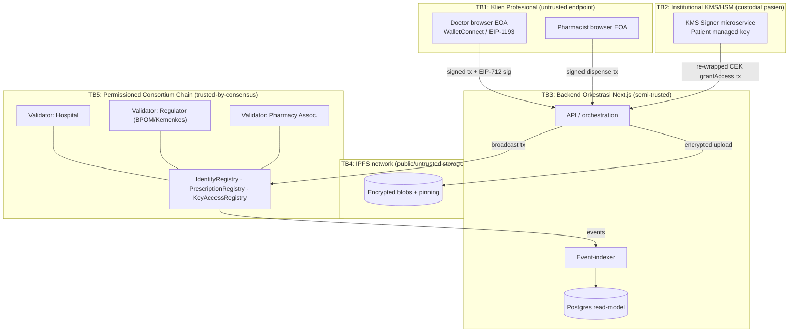

Garis batas kepercayaan yang melintasi setiap panah pada diagram di atas adalah titik di mana *input validation*, *authentication*, dan *authorization* wajib ditegakkan. Prinsip desain yang dianut: **chain adalah satu-satunya *source of truth*** (TB5), backend orkestrasi (TB3) diperlakukan sebagai *semi-trusted* dan tidak boleh memegang otoritas penandatanganan, IPFS (TB4) diperlakukan sebagai *fully untrusted public storage* sehingga semua data wajib terenkripsi sebelum melintasi batas TB3 -> TB4, dan endpoint profesional (TB1) dianggap sebagai *untrusted endpoint* yang hanya dipercaya menjaga *signing key*-nya sendiri.

#### 8.1.3. Karakterisasi Adversaries

| ID | Adversary | Kapabilitas | Motivasi | Posisi relatif boundary |
|----|-----------|-------------|----------|-------------------------|
| ADV1 | *External network attacker* | Membaca lalu lintas publik, mengambil CID dari IPFS, mencoba submit tx | Pencurian PII, penyalahgunaan resep | Di luar semua TB; tanpa kredensial node |
| ADV2 | *Malicious/compromised pharmacy* | Memegang `PHARMACIST_ROLE` sah | Over-dispensing, klaim asuransi fiktif | Dalam TB1 dengan privilese sah |
| ADV3 | *Malicious/compromised doctor* | Memegang `DOCTOR_ROLE` sah | Penerbitan resep abusif (mis. opioid) | Dalam TB1 dengan privilese sah |
| ADV4 | *Curious/compromised backend operator* | Mengontrol Next.js API, indexer, Postgres | Surveilans, manipulasi tampilan | Dalam TB3 |
| ADV5 | *Compromised KMS operator* | Akses patient managed key | Re-wrap CEK ilegal, dekripsi massal | Dalam TB2 |
| ADV6 | *Colluding minority validator(s)* | < 1/3 voting power IBFT 2.0 | Sensor, reordering | Dalam TB5 |
| ADV7 | *Colluding ≥ 1/3 validator(s)* | ≥ 1/3 voting power (liveness) / > 2/3 (safety) | *Chain halt*, *fork*, sensor permanen | Dalam TB5 (governance failure) |
| ADV8 | *Insider regulator (ADMIN_ROLE abuse)* | Memegang `ADMIN_ROLE` | Revoke abusif, registrasi aktor palsu | Dalam TB5 governance |

### 8.2. Tabel STRIDE

STRIDE diterapkan per kategori ancaman terhadap aset dan komponen yang relevan, beserta kontrol desain yang menanggulanginya.

| Kategori STRIDE | Ancaman konkret pada sistem | Aset/komponen terdampak | Kontrol desain |
|-----------------|-----------------------------|-------------------------|----------------|
| **S**poofing | Pemanggil mengaku sebagai doctor/pharmacist tanpa hak; impersonasi pasien | A3, A4, A7 | EOA self-custody + RBAC `isAuthorized(role,addr)` di `IdentityRegistry`; `msg.sender` mengikat identitas; KMS signer terisolasi untuk pasien; tidak ada shared hot-wallet |
| **T**ampering | Mengubah isi resep, `dispensedUnits`, atau state lifecycle | A1, A5, A6 | `payloadHash = keccak256(ciphertext)` on-chain mengikat integritas IPFS; mutasi state hanya lewat fungsi ber-guard; konsensus IBFT 2.0 finalitas; AES-256-GCM `authTag` mendeteksi ciphertext tampering |
| **R**epudiation | Dokter menyangkal penerbitan; apotek menyangkal dispensing | A1, A5 | Tanda tangan EIP-712 typed-data atas canonical payload (non-repudiation off-chain) + tx signature on-chain; event ter-emit untuk SETIAP transisi state; ledger immutable |
| **I**nformation Disclosure | Pembacaan PII/medikasi dari IPFS atau on-chain | A1, A2 | Envelope encryption (AES-256-GCM CEK) sebelum IPFS; zero PII on-chain; `patientRef = keccak256(salt, DID)` pseudonim; CEK hanya ter-*wrap* via ECIES di `KeyAccessRegistry` |
| **D**enial of Service | Spam tx, *chain halt*, unpin IPFS, indexer flooding | A5, A9, A10 | On-chain permissioning (allowlist node+account); IBFT 2.0 BFT (toleran < 1/3); gasPrice=0 namun gas limit per blok membatasi spam; pinning redundan multi-pin; read-model dapat di-rebuild dari event |
| **E**levation of Privilege | Pharmacist memanggil `issuePrescription`; non-aktor memodifikasi role | A7 | Modifier RBAC per fungsi (lihat §8.4); `ADMIN_ROLE` terbatas regulator; `registerActor`/`setActorStatus` hanya `ADMIN_ROLE`; UUPS upgrade dilindungi `_authorizeUpgrade` ber-role |

### 8.3. Katalog Serangan dan Mitigasi

#### 8.3.1. Double-Dispensing

**Vektor.** Dua apotek berbeda (atau apotek sama dua kali) mencoba men-*dispense* resep yang sama secara konkuren untuk melebihi `totalUnits`, atau men-*dispense* resep yang sudah `FULLY_DISPENSED`.

**Mitigasi.** Akunting `dispensedUnits` on-chain dengan invarian `remaining = totalUnits - dispensedUnits ≥ requested`. Fungsi `dispense` menolak permintaan ketika `requested > remaining`, dan state guard menolak dispense pada state `FULLY_DISPENSED`, `EXPIRED`, atau `REVOKED`. Yang krusial: **konsensus IBFT 2.0 menserialisasi** percobaan konkuren — meskipun dua transaksi tiba bersamaan dari validator berbeda, hanya satu urutan eksekusi yang difinalisasi per blok; transaksi kedua mengeksekusi atas state yang sudah ter-update sehingga gagal pada *require*. Tidak ada jendela *check-then-act* off-chain karena pemeriksaan dan mutasi terjadi atomik dalam satu eksekusi EVM.

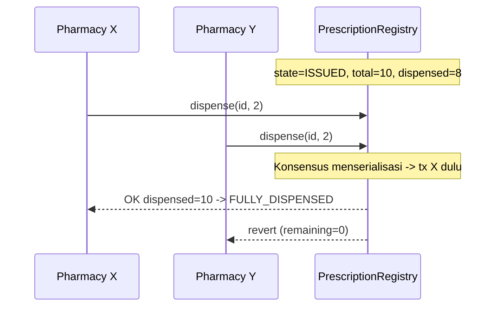

#### 8.3.2. Replay Attack

**Vektor.** Penyerang menangkap tanda tangan EIP-712 dokter atau tx yang ditandatangani dan menyiarkan ulang untuk menerbitkan/men-*dispense* berganda; atau *cross-chain replay* ke jaringan lain.

**Mitigasi.** Pada lapisan tx, nonce akun EOA dan `chainId` (EIP-155) mencegah replay transaksi dan *cross-chain replay*. Pada lapisan aplikatif, `prescriptionId: bytes32` bersifat unik dan `issuePrescription` menolak `prescriptionId` yang sudah ada (idempotensi). Domain separator EIP-712 menyertakan `chainId`, `verifyingContract`, dan `name/version` sehingga signature satu domain tidak valid di domain lain. Penyiaran ulang `dispense` tidak menambah efek karena akunting `dispensedUnits` bersifat monotonik dan dibatasi `totalUnits`.

#### 8.3.3. Unauthorized Issuance

**Vektor.** Aktor tanpa `DOCTOR_ROLE` (atau dokter ber-status `Suspended`/`Revoked`) mencoba menerbitkan resep.

**Mitigasi.** `issuePrescription` memanggil `IdentityRegistry.isAuthorized(DOCTOR_ROLE, msg.sender)` yang sekaligus memverifikasi `status == Active`. Lisensi diverifikasi melalui `licenseHash` yang terdaftar `ADMIN_ROLE`. Karena tidak ada shared hot-wallet, identitas penanda tangan tx persis sama dengan aktor yang dicatat sebagai `doctor` pada record — menutup penyamaran provenance yang ada pada sistem naif (V2/V3).

#### 8.3.4. Key Compromise

**Vektor.** Pencurian SIGNING key dokter/apotek (A3), patient managed key (A4), atau CEK (A2).

**Mitigasi.** Pemisahan SIGNING key vs ENCRYPTION key membatasi *blast radius*: kompromi signing key tidak otomatis mendekripsi resep lampau. `setActorStatus(addr, Revoked)` segera memutus otoritas EOA yang terkompromi pada lapisan kontrak. *Crypto-agility*: rotasi `encryptionPubKey` di `IdentityRegistry` dan re-wrapping CEK ke kunci baru; CEK bersifat per-resep sehingga kompromi satu CEK tidak meluas ke resep lain (*forward isolation* antar-resep). Patient managed key di-host di KMS/HSM dengan kontrol akses dan audit log. `revokeAccess` di `KeyAccessRegistry` mencabut grant ke recipient yang dicurigai, walau perlu dicatat bahwa pencabutan tidak dapat menarik kembali ciphertext/CEK yang sudah pernah diakses (*residual*, lihat §8.6).

#### 8.3.5. Sybil dan Role Abuse

**Vektor.** Pembuatan banyak identitas semu (Sybil) untuk memperoleh role; penyalahgunaan role oleh aktor sah (ADV2/ADV3) atau `ADMIN_ROLE` (ADV8).

**Mitigasi.** Sifat *permissioned*: registrasi aktor hanya melalui `registerActor` oleh `ADMIN_ROLE` regulator dengan `licenseHash` terikat lisensi profesi nyata — Sybil murni tidak mungkin tanpa kolusi regulator. Role abuse oleh aktor sah ditanggulangi secara *detektif* bukan preventif: setiap penerbitan/dispensing ter-emit event yang diindeks, memungkinkan audit pola anomali (mis. volume opioid). Abuse `ADMIN_ROLE` dimitigasi melalui *separation of governance* (multisig/threshold pada akun ADMIN direkomendasikan) dan auditabilitas penuh tindakan administratif on-chain.

#### 8.3.6. Front-running / MEV pada Konteks Permissioned

**Vektor.** Validator menyusun ulang/menyelipkan transaksi untuk keuntungan (mis. mendahului `dispense` apotek pesaing).

**Mitigasi.** Pada IBFT 2.0 dengan `gasPrice = 0`, insentif ekonomis MEV klasik (gas auction, *priority fee*) hilang. Pemilihan *proposer* bergilir deterministik mengurangi kontrol satu pihak atas ordering. Risiko residual adalah *proposer* yang berlaku jahat dapat menyensor/menunda satu blok, namun rotasi proposer dan finalitas BFT membatasi durasinya. Karena *dispense* dibatasi `remaining` dan diserialisasi konsensus, reordering tidak menghasilkan double-spend; dampak terburuk hanyalah penundaan, bukan pelanggaran integritas. *Accountability*: identitas proposer diketahui (permissioned), sehingga perilaku reordering dapat diatribusikan dan ditindak secara governance.

#### 8.3.7. IPFS Data Leakage

**Vektor.** ADV1 memperoleh CID (mis. dari log atau on-chain `cid`) dan mengambil blob dari IPFS.

**Mitigasi.** Blob di IPFS adalah `{ iv, ciphertext, authTag }` hasil AES-256-GCM; tanpa CEK, CID hanya mengungkap data acak. CEK hanya tersedia dalam bentuk ter-*wrap* via ECIES kepada recipient berwenang di `KeyAccessRegistry`. Tidak ada PII on-chain. *Right-to-erasure* melalui unpin ciphertext + *tombstone* flag on-chain — dengan caveat imutabilitas IPFS (blob yang sudah tersebar tidak dijamin terhapus dari semua node; karena itu kerahasiaan tetap bersandar pada enkripsi, bukan penghapusan).

#### 8.3.8. Kolusi Validator

**Vektor.** Subset validator consortium berkolusi (ADV6/ADV7).

**Mitigasi.** Properti BFT IBFT 2.0: *safety* terjaga selama kolusi < 1/3 (tepatnya butuh > 2/3 honest untuk *commit*), *liveness* terjaga selama ≥ 2/3 tersedia. Komposisi validator dari pemangku kepentingan dengan kepentingan berlawanan (Hospital, Regulator, Pharmacy Association) menjadikan kolusi ≥ 1/3 secara organisasi sukar. Permissioning membuat penambahan validator memerlukan persetujuan governance, mencegah pengambilalihan kuorum diam-diam. Kolusi > 2/3 adalah *governance failure* yang berada di luar jaminan teknis protokol (lihat *residual* §8.6).

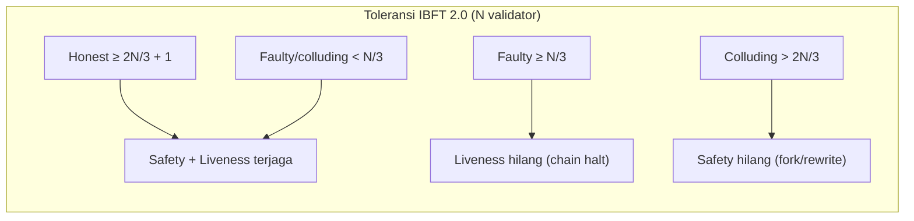

### 8.4. Matriks RBAC (Role × Fungsi Contract)

Notasi: **A** = Allow, **D** = Deny (revert pada modifier RBAC), **A\*** = Allow dengan syarat kepemilikan/kondisi tambahan (mis. hanya *issuing doctor*, atau hanya *patient-owner*/KMS pasien terkait).

| Contract / Fungsi | `ADMIN_ROLE` (Regulator) | `DOCTOR_ROLE` | `PHARMACIST_ROLE` | Patient (KMS, no signing role) | Unregistered / Public |
|-------------------|:------------------------:|:-------------:|:-----------------:|:------------------------------:|:---------------------:|
| **IdentityRegistry** | | | | | |
| `registerActor` | A | D | D | D | D |
| `setActorStatus` | A | D | D | D | D |
| `registerPatient` | A | D | D | D | D |
| `isAuthorized` (view) | A | A | A | A | A |
| `getEncryptionPubKey` (view) | A | A | A | A | A |
| **PrescriptionRegistry** | | | | | |
| `issuePrescription` | D | A | D | D | D |
| `dispense` | D | D | A | D | D |
| `revoke` | A | A\* (issuing doctor) | D | D | D |
| `markExpired` | A | A | A | A\* | A (permissionless, kondisi `now > expiresAt`) |
| `getPrescription` (view) | A | A | A | A | A |
| `verify` (view) | A | A | A | A | A |
| **KeyAccessRegistry** | | | | | |
| `grantAccess` | A\* | A\* (issuing doctor saat ISSUE) | D | A\* (KMS pasien saat FILL) | D |
| `getWrappedKey` (view) | A\* (recipient-bound) | A\* | A\* | A\* | D |
| `revokeAccess` | A\* | A\* (granter) | D | A\* (patient-centric) | D |

Catatan desain: `markExpired` sengaja dibuat *permissionless* dengan *condition guard* `block.timestamp > expiresAt` agar siapa pun (termasuk *keeper*/indexer) dapat memicu transisi `EXPIRED` tanpa mengandalkan otoritas tertentu — tidak menimbulkan risiko karena hanya men-*finalize* kondisi yang sudah benar secara objektif. Untuk `getWrappedKey`, akses dibatasi pada `recipient` yang bersangkutan: kontrak hanya mengembalikan *wrapped key* yang dialamatkan ke pemanggil, dan karena CEK ter-*wrap* via ECIES ke `encryptionPubKey` recipient, pihak lain tidak dapat memanfaatkannya meskipun mampu membaca state.

### 8.5. Pemetaan Kerentanan Lama (V1–V7) ke Mekanisme Penanggulangan

| ID | Kerentanan sistem naif | Mekanisme penanggulangan pada desain baru | Properti yang dipulihkan |
|----|------------------------|--------------------------------------------|--------------------------|
| **V1** | Private key + PII pasien plaintext di `public/data/pasien_wallets.json` yang dilayani publik | Tidak ada private key tersimpan di sisi server; Doctor/Pharmacist self-custody; patient key di KMS/HSM. Zero PII on-chain; `patientRef = keccak256(salt, DID)`. PII hanya dalam canonical JSON terenkripsi di IPFS | C (PII), C (key custody) |
| **V2** | Satu server hot-wallet menandatangani SEMUA tx -> provenance semu, sentralisasi | Hybrid signing: professionals tandatangani via WalletConnect/EIP-1193; KMS signer microservice untuk operasi pasien. `msg.sender` = aktor sebenarnya; **tanpa shared hot-wallet** | N (provenance), desentralisasi otoritas |
| **V3** | Tanpa RBAC — pemanggil mana pun bertindak sebagai "doctor" | On-chain RBAC OpenZeppelin AccessControl di `IdentityRegistry`; modifier per fungsi (lihat §8.4); status `Active/Suspended/Revoked` | Authorization, E (anti-EoP) |
| **V4** | Tanpa lifecycle dispensing & tanpa anti-double-dispensing | Enum `State` (ISSUED…REVOKED) + state guard; akunting `dispensedUnits`/`refillsUsed`; serialisasi konsensus; event per transisi | I (integritas dispensing) |
| **V5** | Data obat resep diunggah TANPA enkripsi ke IPFS | Envelope encryption: AES-256-GCM CEK; ECIES key-wrapping per recipient di `KeyAccessRegistry`; on-chain hanya `cid` + `payloadHash` | C (medikasi/PII) |
| **V6** | Penyimpanan file JSON datar, world-readable, tak auditable | Source of truth = ledger immutable + event-indexer -> Postgres read-model (turunan, dapat di-rebuild); audit trail on-chain | I, A (auditability), N |
| **V7** | Tanpa metodologi evaluasi | Kerangka evaluasi: gas/resource per fungsi, latency tx, throughput vs validator/block period, skalabilitas, storage growth, overhead enkripsi; analisis statis Slither/Mythril terhadap threat model | Evaluabilitas keamanan & kinerja |

### 8.6. Residual Risks

Desain ini memitigasi kelas ancaman utama, namun sejumlah risiko residual tetap melekat dan harus dideklarasikan secara eksplisit untuk kejujuran ilmiah:

1. **Governance / kolusi validator > 2/3 (ADV7, ADV8).** Safety IBFT 2.0 runtuh bila kolusi melampaui ambang BFT, atau bila `ADMIN_ROLE` disalahgunakan regulator. Ini adalah *trust assumption* permissioned yang tidak dapat dihilangkan secara teknis; mitigasi bersifat *governance* (komposisi validator berlawanan kepentingan, multisig/threshold pada `ADMIN_ROLE`, transparansi audit).

2. **Endpoint & key compromise (ADV5).** Kompromi total KMS pasien atau HSM institusi memungkinkan re-wrap CEK ilegal dan dekripsi massal. Keamanan akhir bersandar pada keamanan operasional KMS/HSM, di luar jaminan smart contract.

3. **Imutabilitas IPFS vs right-to-erasure.** Unpin + tombstone tidak menjamin penghapusan fisik blob terenkripsi yang sudah tersebar; kerahasiaan jangka panjang bergantung pada ketahanan AES-256-GCM/ECIES terhadap *harvest-now-decrypt-later* (motivasi *crypto-agility* dan rotasi).

4. **Insider abuse oleh aktor sah (ADV2/ADV3).** RBAC tidak mencegah dokter/apotek sah menerbitkan/men-*dispense* secara abusif dalam batas privilesenya; mitigasi bersifat *detektif* (analitik anomali atas event), bukan preventif.

5. **Wrapped key sudah terungkap.** `revokeAccess` mencegah grant baru, tetapi recipient yang sudah pernah meng-*unwrap* CEK telah memegang materi kunci; pencabutan tidak bersifat retroaktif terhadap salinan yang sudah didekripsi.

6. **Metadata / traffic analysis.** Walau payload terenkripsi dan `patientRef` pseudonim, pola temporal on-chain (frekuensi `issuePrescription` per dokter, korelasi waktu `dispense`) dapat membocorkan *metadata* yang berpotensi di-deanonimisasi melalui *linkage* dengan data off-chain.

7. **Ketergantungan correctness implementasi.** Jaminan di atas mengandaikan kontrak bebas *bug* logika/reentrancy/overflow; karena itu *static analysis* (Slither/Mythril), pengujian properti, dan audit menjadi prasyarat — bukan opsi — sebelum *deployment* produksi.

---

## 9. Sequence Flows

Bagian ini menjabarkan lima alur interaksi inti sistem dalam bentuk *sequence diagram* (Mermaid) yang dilengkapi narasi langkah demi langkah. Setiap alur memetakan secara presisi aktor, *off-chain service*, dan *on-chain contract* (`IdentityRegistry`, `PrescriptionRegistry`, `KeyAccessRegistry`) yang terlibat, beserta artefak kriptografis (CEK, *wrapped key*, `payloadHash`, EIP-712 signature) yang dipertukarkan. Tujuannya adalah menunjukkan bagaimana keputusan desain yang telah dikunci pada bab-bab sebelumnya — RBAC on-chain, *envelope encryption*, *patient-centric key control*, dan akunting `dispensedUnits` anti-*double-dispensing* — terealisasi sebagai protokol operasional yang dapat dievaluasi.

Konvensi penamaan partisipan yang konsisten di seluruh subbab:

| Partisipan | Peran |
|---|---|
| `Doctor` | Self-custody EOA (`DOCTOR_ROLE`), signing key di browser/HSM |
| `Pharmacist` | Self-custody EOA (`PHARMACIST_ROLE`), signing key di browser/HSM |
| `Patient` | Subjek data; key di-custody institutional KMS/HSM |
| `Regulator/Admin` | EOA `ADMIN_ROLE` (BPOM/Kemenkes) |
| `App` | Next.js orchestration API (tanpa shared hot-wallet) |
| `KMS` | Patient KMS signer microservice (custodial key pasien) |
| `IPFS` | IPFS client + pinning service |
| `Indexer` | Event-indexer service -> read-model Postgres |
| `IdReg` | `IdentityRegistry` contract |
| `PxReg` | `PrescriptionRegistry` contract |
| `KAReg` | `KeyAccessRegistry` contract |
| `Besu` | Permissioned consortium chain (Hyperledger Besu, IBFT 2.0) |

Semua transaksi penulisan (`registerActor`, `registerPatient`, `issuePrescription`, `dispense`, `grantAccess`, `revoke`, `markExpired`) bersifat *state-changing* sehingga finalitasnya tunduk pada konsensus IBFT 2.0; *finality* IBFT 2.0 bersifat *immediate/deterministic* (tanpa *probabilistic confirmation*), sebuah properti yang kelak menjadi dasar pengukuran *latency* `submit -> inclusion -> finality`.

---

### 9.1 Registrasi Pasien dan Provisioning Kunci

Alur ini memprovisi identitas pseudonim pasien tanpa menempatkan PII apa pun di rantai. Pasien tidak menerima *signing role*; ia hanya direpresentasikan oleh `patientRef = keccak256(salt, DID)` dan sebuah `encryptionPubKey` yang kuncinya di-custody oleh institutional KMS/HSM. Registrasi dilakukan oleh aktor ber-`ADMIN_ROLE` (regulator) atau aktor institusi yang berwenang, bukan oleh pasien sendiri.

```mermaid
sequenceDiagram
    autonumber
    actor Admin as Regulator/Admin
    participant App as Next.js App
    participant KMS as Patient KMS/HSM
    participant IdReg as IdentityRegistry
    participant Besu as Besu (IBFT 2.0)
    participant Indexer as Event-Indexer

    Note over Admin,KMS: Onboarding pasien (off-chain identity proofing)
    Admin->>App: requestPatientOnboarding(DID, PII terverifikasi)
    App->>KMS: generateKeypair(patientDID)
    KMS->>KMS: derive SIGNING? (tidak) + ENCRYPTION keypair (secp256k1)
    KMS-->>App: encryptionPubKey (custodial privkey tetap di HSM)
    App->>App: salt = CSPRNG(); patientRef = keccak256(salt, DID)
    App->>App: simpan (DID -> salt, patientRef) di vault rahasia (off-chain)

    Admin->>IdReg: registerPatient(patientRef, encryptionPubKey)
    Note right of IdReg: require(hasRole(ADMIN_ROLE, msg.sender))
    IdReg->>IdReg: patients[patientRef] = {encryptionPubKey, exists:true}
    IdReg-->>Besu: emit PatientRegistered(patientRef)
    Besu-->>Indexer: PatientRegistered(patientRef)
    Indexer->>Indexer: upsert read-model (zero PII)
    IdReg-->>Admin: tx receipt (finalized)
```

Narasi langkah:

1. **Identity proofing off-chain.** Pasien melalui proses verifikasi identitas konvensional (KTP/NIK, rekam medis) yang sepenuhnya berlangsung *off-chain*. Output yang relevan untuk rantai hanyalah sebuah `DID` (Decentralized Identifier) stabil bagi pasien tersebut. PII mentah tidak pernah dikirim ke `App` dalam bentuk yang akan menyentuh rantai.
2. **Provisioning encryption keypair.** `App` meminta `KMS` membangkitkan **ENCRYPTION keypair** (secp256k1, untuk ECIES key-wrapping) yang terikat pada `DID` pasien. Berbeda dengan dokter/apoteker, pasien **tidak** menerima SIGNING keypair untuk transaksi; private key enkripsinya tetap berada di dalam HSM (*custodial*) dan tidak pernah diekspor. Hanya `encryptionPubKey` yang dikembalikan ke `App`.
3. **Derivasi pseudonim.** `App` membangkitkan `salt` acak kriptografis (CSPRNG) lalu menghitung `patientRef = keccak256(salt, DID)`. Pasangan `(DID, salt, patientRef)` disimpan dalam *secret vault* off-chain. `salt` berfungsi sebagai pelindung terhadap serangan *dictionary/rainbow* atas ruang `DID`, sehingga `patientRef` tidak dapat dibalik menjadi `DID` oleh pihak yang hanya mengamati rantai.
4. **Registrasi on-chain.** `Regulator/Admin` memanggil `registerPatient(patientRef, encryptionPubKey)`. Modifier RBAC mensyaratkan `hasRole(ADMIN_ROLE, msg.sender)`; pemanggil tanpa peran ditolak. Kontrak menyimpan entri pasien **tanpa** *signing role* dan tanpa atribut PII apa pun.
5. **Event & indexing.** `IdentityRegistry` meng-emit `PatientRegistered(patientRef)`. `Event-Indexer` mengonsumsi event tersebut dan meng-*upsert* read-model Postgres. Karena event hanya membawa pseudonim, read-model tetap *zero PII*; pemetaan `patientRef -> DID/PII` hanya hidup di *secret vault* yang aksesnya dikontrol terpisah.
6. **Finalitas.** *Receipt* dikembalikan setelah blok terfinalisasi oleh IBFT 2.0. Sejak titik ini, `getEncryptionPubKey(patientRef)` dapat melayani permintaan *key-wrapping* pada alur *issue* dan *dispense*.

> Registrasi aktor profesional (`registerActor` untuk `DOCTOR_ROLE`/`PHARMACIST_ROLE`) mengikuti pola yang serupa namun mendaftarkan dua keypair: SIGNING EOA (self-custody, dipakai sebagai `address` aktor) dan `encryptionPubKey`, beserta `licenseHash = keccak256(kredensial lisensi)`, `institutionId`, dan `status = Active`. Perbedaan kuncinya: aktor profesional memiliki `role` dan menandatangani transaksinya sendiri, sedangkan pasien tidak.

---

### 9.2 Issue Prescription

Alur penerbitan resep menggabungkan tiga lapis jaminan: (i) **kerahasiaan** melalui AES-256-GCM atas canonical JSON; (ii) **integritas** melalui `payloadHash = keccak256(ciphertext)` yang dirujuk on-chain; dan (iii) **non-repudiation** melalui EIP-712 typed-data signature dokter atas canonical payload. Dokter menandatangani transaksi `issuePrescription` dengan EOA self-custody-nya — tidak ada *shared hot-wallet* — sehingga *provenance* bersifat otentik.

```mermaid
sequenceDiagram
    autonumber
    actor Doctor
    participant Wallet as Browser Wallet (EIP-1193)
    participant App as Next.js App
    participant IPFS as IPFS + Pinning
    participant IdReg as IdentityRegistry
    participant PxReg as PrescriptionRegistry
    participant KAReg as KeyAccessRegistry
    participant Besu as Besu (IBFT 2.0)
    participant Indexer as Event-Indexer

    Doctor->>App: compose resep (medications, patientRef, refillsAllowed, expiresAt)
    App->>App: build canonical prescription JSON (schemaVersion, prescriptionId, ...)
    App->>Wallet: requestSignTypedData(EIP-712 Prescription)
    Wallet->>Doctor: prompt persetujuan & tanda tangan
    Wallet-->>App: signature (EIP-712, secp256k1)
    App->>App: sisipkan signature ke canonical JSON

    Note over App: Envelope encryption
    App->>App: CEK = AES-256-GCM key (CSPRNG)
    App->>App: {iv, ciphertext, authTag} = AES-256-GCM(CEK, canonicalJSON)
    App->>App: payloadHash = keccak256(ciphertext)
    App->>IPFS: add({iv, ciphertext, authTag})
    IPFS-->>App: cid
    IPFS->>IPFS: pin(cid)

    Note over App,KAReg: Wrap CEK ke recipient awal
    App->>IdReg: getEncryptionPubKey(patientRef)
    IdReg-->>App: patientEncPubKey
    App->>IdReg: getEncryptionPubKey(doctorAddr)
    IdReg-->>App: doctorEncPubKey
    App->>App: wrappedKey_patient = ECIES(patientEncPubKey, CEK)
    App->>App: wrappedKey_doctor = ECIES(doctorEncPubKey, CEK)

    App->>Wallet: requestSignTx(issuePrescription(...))
    Wallet-->>PxReg: issuePrescription(prescriptionId, patientRef, cid, payloadHash, issuedAt, expiresAt, totalUnits, refillsAllowed)
    Note right of PxReg: require(IdReg.isAuthorized(DOCTOR_ROLE, msg.sender))
    PxReg->>PxReg: record.state = ISSUED; dispensedUnits = 0
    PxReg-->>Besu: emit PrescriptionIssued(prescriptionId, doctor, patientRef)

    App->>Wallet: requestSignTx(grantAccess x2)
    Wallet-->>KAReg: grantAccess(prescriptionId, patientRef, wrappedKey_patient)
    Wallet-->>KAReg: grantAccess(prescriptionId, doctorAddr, wrappedKey_doctor)
    KAReg-->>Besu: emit AccessGranted(prescriptionId, patientRef)
    KAReg-->>Besu: emit AccessGranted(prescriptionId, doctorAddr)

    Besu-->>Indexer: PrescriptionIssued + AccessGranted(s)
    Indexer->>Indexer: project read-model (state=ISSUED)
    PxReg-->>Doctor: tx receipt (finalized)
```

Narasi langkah:

1. **Komposisi & canonicalization.** Dokter menyusun resep di `App`. `App` membangun *canonical* prescription JSON sesuai skema terkunci (`schemaVersion`, `prescriptionId`, `issuedAt`, `expiresAt`, `doctor`, `patient`, `medications[]`, `refillsAllowed`, `diagnosisCode`, `notes`). *Canonicalization* (urutan field & encoding deterministik) wajib agar `payloadHash` dan EIP-712 hash dapat direproduksi oleh verifier mana pun.
2. **EIP-712 signing (non-repudiation).** Dokter menandatangani *typed data* `Prescription` dengan SIGNING key self-custody melalui browser wallet (EIP-1193). `signature` disisipkan ke dalam canonical JSON. Tanda tangan ini memungkinkan pembuktian off-chain bahwa isi resep otentik berasal dari dokter tertentu, terlepas dari jalur transaksi on-chain.
3. **Envelope encryption.** `App` membangkitkan **CEK** acak per-resep dan mengenkripsi canonical JSON dengan AES-256-GCM, menghasilkan paket `{iv, ciphertext, authTag}`. `authTag` GCM memberi *authenticated encryption* (kerahasiaan + integritas terhadap tampering blok terenkripsi).
4. **Upload IPFS & hash integritas.** Paket terenkripsi diunggah ke IPFS, menghasilkan `cid`, lalu di-*pin*. `App` menghitung `payloadHash = keccak256(ciphertext)`. Yang menyentuh rantai hanyalah `cid` dan `payloadHash` — **zero plaintext, zero PII on-chain**. Ini menambal kelemahan V5 (IPFS plaintext) sekaligus V1/V6.
5. **Wrap CEK ke recipient awal.** `App` mengambil `encryptionPubKey` pasien dan dokter via `getEncryptionPubKey`, lalu membungkus CEK dengan **ECIES (secp256k1)** menjadi `wrappedKey_patient` dan `wrappedKey_doctor`. CEK plaintext tidak pernah meninggalkan `App` dalam bentuk yang dapat dibaca pihak ketiga.
6. **Transaksi `issuePrescription`.** Dokter menandatangani dan mengirim transaksi. `PrescriptionRegistry` memanggil `IdentityRegistry.isAuthorized(DOCTOR_ROLE, msg.sender)`; pemanggil non-dokter ditolak (menambal V3). Record dibuat dengan `state = ISSUED`, `dispensedUnits = 0`, `refillsUsed = 0`, dan event `PrescriptionIssued` di-emit.
7. **Grant akses awal.** Dokter mengirim `grantAccess(prescriptionId, patientRef, wrappedKey_patient)` dan `grantAccess(prescriptionId, doctorAddr, wrappedKey_doctor)`. Mulai titik ini, **patient memegang kendali** atas siapa yang kelak dapat membuka CEK; dokter mempertahankan akses untuk audit/koreksi.
8. **Indexing & finalitas.** `Event-Indexer` memproyeksikan `state = ISSUED` ke read-model Postgres untuk query cepat. *Receipt* terfinalisasi dikembalikan ke dokter.

> Catatan transaksional: langkah 6–7 dapat di-*batch* (mis. multicall) agar `issuePrescription` dan kedua `grantAccess` masuk dalam satu transaksi atomik, menghindari keadaan antara di mana resep `ISSUED` namun belum memiliki *wrapped key*. Pemilihan *batched vs. sequential* adalah variabel yang akan diukur pada evaluasi gas/latency.

---

### 9.3 Dispense di Apotek

Alur ini adalah inti *patient-centric key control* dan *anti-double-dispensing*. Pasien memilih apotek; KMS pasien **me-re-wrap** CEK ke `encryptionPubKey` apotek tersebut (sehingga apotek lain tidak otomatis dapat membaca resep); apotek mendekripsi, **memverifikasi `payloadHash`**, lalu mengirim transaksi `dispense` dengan `quantity` tertentu. Akunting `dispensedUnits` di-*serialize* oleh konsensus sehingga percobaan ganda dari apotek berbeda tidak pernah melampaui `remaining`.

```mermaid
sequenceDiagram
    autonumber
    actor Patient
    actor Pharmacist
    participant PWallet as Pharmacy Wallet (EIP-1193)
    participant App as Next.js App
    participant KMS as Patient KMS/HSM
    participant IPFS as IPFS
    participant IdReg as IdentityRegistry
    participant PxReg as PrescriptionRegistry
    participant KAReg as KeyAccessRegistry
    participant Besu as Besu (IBFT 2.0)
    participant Indexer as Event-Indexer

    Patient->>App: pilih pharmacy (pharmacyAddr) untuk prescriptionId
    Note over App,KMS: Patient-centric re-wrap (custodial key pasien)
    App->>IdReg: getEncryptionPubKey(pharmacyAddr)
    IdReg-->>App: pharmacyEncPubKey
    App->>KAReg: getWrappedKey(prescriptionId, patientRef)
    KAReg-->>App: wrappedKey_patient
    App->>KMS: reWrap(prescriptionId, wrappedKey_patient, pharmacyEncPubKey)
    KMS->>KMS: CEK = ECIES_decrypt(patientPriv, wrappedKey_patient)
    KMS->>KMS: wrappedKey_pharmacy = ECIES(pharmacyEncPubKey, CEK)
    KMS-->>App: wrappedKey_pharmacy (CEK plaintext tetap di HSM)

    App->>KAReg: grantAccess(prescriptionId, pharmacyAddr, wrappedKey_pharmacy)
    Note right of KAReg: ditandatangani patient KMS signer (bukan hot-wallet)
    KAReg-->>Besu: emit AccessGranted(prescriptionId, pharmacyAddr)
    Besu-->>Indexer: AccessGranted(...)

    Note over Pharmacist,IPFS: Apotek membuka & memverifikasi resep
    Pharmacist->>App: open prescriptionId
    App->>KAReg: getWrappedKey(prescriptionId, pharmacyAddr)
    KAReg-->>App: wrappedKey_pharmacy
    App->>PWallet: ECIES_decrypt(pharmacyPriv, wrappedKey_pharmacy)
    PWallet-->>App: CEK
    App->>PxReg: getPrescription(prescriptionId)
    PxReg-->>App: {cid, payloadHash, state, totalUnits, dispensedUnits, expiresAt}
    App->>IPFS: cat(cid)
    IPFS-->>App: {iv, ciphertext, authTag}
    App->>App: assert keccak256(ciphertext) == payloadHash  // integritas
    App->>App: canonicalJSON = AES-256-GCM_decrypt(CEK, iv, ciphertext, authTag)
    App->>App: verify EIP-712 doctor signature (non-repudiation)

    Note over Pharmacist,PxReg: Dispense dengan quantity + anti-double-spend
    Pharmacist->>PWallet: confirm dispense(quantity)
    PWallet-->>PxReg: dispense(prescriptionId, quantity)
    Note right of PxReg: require(isAuthorized(PHARMACIST_ROLE, msg.sender))<br/>require(state==ISSUED || PARTIALLY_DISPENSED)<br/>require(block.timestamp <= expiresAt)<br/>require(quantity <= totalUnits - dispensedUnits)
    PxReg->>PxReg: dispensedUnits += quantity
    alt dispensedUnits < totalUnits
        PxReg->>PxReg: state = PARTIALLY_DISPENSED
    else dispensedUnits == totalUnits
        PxReg->>PxReg: state = FULLY_DISPENSED
    end
    PxReg-->>Besu: emit Dispensed(prescriptionId, pharmacyAddr, quantity, newState)
    Besu-->>Indexer: Dispensed(...)
    Indexer->>Indexer: project remaining = totalUnits - dispensedUnits
    PxReg-->>Pharmacist: tx receipt (finalized)
```

Narasi langkah:

1. **Pemilihan apotek (kendali pasien).** Pasien menetapkan `pharmacyAddr` untuk `prescriptionId` tertentu. Tidak ada apotek yang dapat membaca resep sebelum diberi akses eksplisit — ini menutup kebocoran V5 secara *least-privilege*.
2. **Re-wrap oleh KMS pasien.** `App` mengambil `pharmacyEncPubKey` dan `wrappedKey_patient`. `KMS` mendekripsi `wrappedKey_patient` menjadi CEK **di dalam HSM**, lalu membungkus ulang CEK ke `pharmacyEncPubKey` menjadi `wrappedKey_pharmacy`. **CEK plaintext tidak pernah keluar dari HSM**; yang keluar hanya *ciphertext* kunci.
3. **Grant akses ke apotek.** `App` mengirim `grantAccess(prescriptionId, pharmacyAddr, wrappedKey_pharmacy)`, **ditandatangani oleh patient KMS signer microservice** — bukan *shared hot-wallet* (menambal V2). Event `AccessGranted` di-emit. Inilah mekanisme *patient-centric*: hanya tindakan pasien (via KMS) yang membuka akses apotek.
4. **Apotek mengambil & mendekripsi.** Apoteker membuka resep. `App` mengambil `wrappedKey_pharmacy`, mendekripsinya dengan private key apotek (ECIES) untuk memperoleh CEK, lalu menarik `{cid, payloadHash, ...}` on-chain dan mengunduh `{iv, ciphertext, authTag}` dari IPFS.
5. **Verifikasi integritas.** `App` menegaskan `keccak256(ciphertext) == payloadHash`. Jika tidak cocok — misalnya CID di-*tamper* atau diganti — proses dibatalkan. Ini mengikat data IPFS yang mutable-by-CID ke komitmen on-chain yang immutable.
6. **Dekripsi & verifikasi tanda tangan.** CEK mendekripsi `ciphertext` (AES-256-GCM memverifikasi `authTag`), menghasilkan canonical JSON. `App` memverifikasi **EIP-712 signature** dokter, mengonfirmasi bahwa isi resep otentik dan tidak diubah sejak penerbitan.
7. **Transaksi `dispense` dengan guard.** Apoteker mengirim `dispense(prescriptionId, quantity)` dari EOA self-custody apotek (`PHARMACIST_ROLE`). Kontrak menegakkan empat *guard*:
   - `isAuthorized(PHARMACIST_ROLE, msg.sender)` — RBAC (V3).
   - `state == ISSUED || PARTIALLY_DISPENSED` — menolak dispense pada `FULLY_DISPENSED`/`EXPIRED`/`REVOKED`.
   - `block.timestamp <= expiresAt` — menolak resep kedaluwarsa.
   - `quantity <= totalUnits - dispensedUnits` — **inti anti-double-dispensing**: tidak pernah melebihi `remaining`.
8. **Transisi state.** `dispensedUnits += quantity`. Jika `dispensedUnits < totalUnits` -> `PARTIALLY_DISPENSED`; jika `== totalUnits` -> `FULLY_DISPENSED`. Event `Dispensed` di-emit untuk setiap transisi.
9. **Serialisasi konsensus (anti-double-spend).** Jika dua apotek berbeda mencoba men-*dispense* unit yang sama secara bersamaan, IBFT 2.0 menserialisasi kedua transaksi ke dalam urutan blok yang deterministik. Transaksi pertama menambah `dispensedUnits`; transaksi kedua dievaluasi terhadap `remaining` yang **sudah berkurang** dan akan *revert* bila `quantity > remaining`. Tidak ada *race* yang dapat menghasilkan *over-dispense* — analog *no double-spend* (menambal V4).
10. **Indexing & finalitas.** `Event-Indexer` memproyeksikan `remaining = totalUnits - dispensedUnits`. *Receipt* terfinalisasi dikembalikan ke apoteker.

> *Refill*: ketika `state == FULLY_DISPENSED` dan `refillsUsed < refillsAllowed`, sebuah siklus dispensing berikutnya dapat dibuka (`refillsUsed += 1`, reset `dispensedUnits` untuk siklus baru) sesuai kebijakan kontrak. Mekanisme grant kunci pada *refill* mengikuti pola §9.3 langkah 1–3.

---

### 9.4 Verify Prescription oleh Verifier

*Verifier* (mis. auditor, sistem klaim asuransi, atau apotek yang melakukan pengecekan awal) dapat memeriksa **status dan keabsahan** resep tanpa harus dapat membaca isinya. Pemeriksaan status bersifat *read-only* (`view`) dan tidak menimbulkan transaksi maupun biaya konsensus; pembacaan isi tetap tunduk pada kepemilikan *wrapped key*.

```mermaid
sequenceDiagram
    autonumber
    actor Verifier
    participant App as Next.js App
    participant Indexer as Event-Indexer (Postgres)
    participant PxReg as PrescriptionRegistry
    participant IdReg as IdentityRegistry
    participant IPFS as IPFS

    Verifier->>App: verify(prescriptionId)
    Note over App,Indexer: Jalur cepat (read-model)
    App->>Indexer: query projection(prescriptionId)
    Indexer-->>App: {state, dispensedUnits, totalUnits, expiresAt, doctor, payloadHash}

    Note over App,PxReg: Jalur autoritatif (on-chain view)
    App->>PxReg: verify(prescriptionId)
    PxReg->>PxReg: active = (state in {ISSUED, PARTIALLY_DISPENSED})<br/>&& block.timestamp <= expiresAt
    PxReg-->>App: isValid (bool), state, remaining
    App->>IdReg: isAuthorized(DOCTOR_ROLE, doctor) & status(doctor)
    IdReg-->>App: doctorActive (bool)

    opt Verifier berwenang membaca isi
        App->>App: butuh wrappedKey utk verifier (lihat §9.3) -> CEK
        App->>IPFS: cat(cid) -> {iv, ciphertext, authTag}
        App->>App: assert keccak256(ciphertext)==payloadHash
        App->>App: decrypt + verify EIP-712 signature
    end

    App-->>Verifier: hasil verifikasi (valid/invalid + alasan)
```

Narasi langkah:

1. **Permintaan verifikasi.** `Verifier` meminta pemeriksaan atas `prescriptionId`.
2. **Jalur cepat (read-model).** `App` lebih dulu menanyakan read-model Postgres untuk respons latensi rendah. Read-model bersifat *eventually consistent* dengan rantai; karenanya digunakan untuk *display*, bukan sebagai sumber kebenaran final.
3. **Jalur autoritatif (on-chain view).** `App` memanggil `PrescriptionRegistry.verify(prescriptionId)`, sebuah fungsi `view` yang mengembalikan `isValid = (state ∈ {ISSUED, PARTIALLY_DISPENSED}) && block.timestamp <= expiresAt`. Karena `view`, panggilan ini tidak mengubah state, tidak menghasilkan transaksi, dan tidak dikenai gas konsensus — properti penting untuk *throughput* verifikasi.
4. **Validasi penerbit.** `App` memanggil `IdentityRegistry.isAuthorized(DOCTOR_ROLE, doctor)` dan memeriksa `status` penerbit. Resep yang valid secara state namun diterbitkan oleh dokter yang kini `Suspended`/`Revoked` dapat ditandai mencurigakan sesuai kebijakan verifier — sebuah pemeriksaan yang mustahil pada sistem naif tanpa RBAC (V3).
5. **Pembacaan isi (opsional, berhak akses).** Jika dan hanya jika `Verifier` memegang *wrapped key* yang valid (diberikan via `grantAccess` mengikuti pola §9.3), ia dapat memperoleh CEK, mengunduh ciphertext, **memverifikasi `keccak256(ciphertext) == payloadHash`**, mendekripsi, dan memverifikasi EIP-712 signature dokter. Tanpa *wrapped key*, verifier tetap dapat memverifikasi **status & keabsahan struktural** tanpa pernah melihat PII — pemisahan tegas antara *verifiability* dan *confidentiality*.
6. **Hasil.** `App` mengembalikan kesimpulan terstruktur (valid/invalid beserta alasan: kedaluwarsa, ter-revoke, sudah `FULLY_DISPENSED`, atau penerbit non-aktif).

---

### 9.5 Revoke

*Revocation* membatalkan resep yang masih aktif. Hanya **issuing doctor** atau aktor `ADMIN_ROLE` yang boleh me-*revoke*. Setelah `REVOKED`, semua percobaan `dispense` ditolak oleh *state guard*; secara kriptografis, akses kunci pun dapat dicabut melalui `revokeAccess` agar apotek yang sebelumnya di-grant tidak dapat lagi mendekripsi resep di pengambilan berikutnya.

```mermaid
sequenceDiagram
    autonumber
    actor Doctor as Doctor / Admin
    participant Wallet as Wallet (EIP-1193)
    participant App as Next.js App
    participant PxReg as PrescriptionRegistry
    participant IdReg as IdentityRegistry
    participant KAReg as KeyAccessRegistry
    participant IPFS as IPFS + Pinning
    participant Besu as Besu (IBFT 2.0)
    participant Indexer as Event-Indexer

    Doctor->>App: revoke(prescriptionId, reason)
    App->>Wallet: requestSignTx(revoke(prescriptionId))
    Wallet-->>PxReg: revoke(prescriptionId)
    Note right of PxReg: require(msg.sender == record.doctor<br/>|| isAuthorized(ADMIN_ROLE, msg.sender))<br/>require(state==ISSUED || PARTIALLY_DISPENSED)
    PxReg->>PxReg: state = REVOKED
    PxReg-->>Besu: emit PrescriptionRevoked(prescriptionId, by, reason?)

    Note over App,KAReg: Pencabutan akses kunci (opsional, direkomendasikan)
    App->>Wallet: requestSignTx(revokeAccess x recipients)
    Wallet-->>KAReg: revokeAccess(prescriptionId, recipient)
    KAReg-->>Besu: emit AccessRevoked(prescriptionId, recipient)

    Note over App,IPFS: Right-to-erasure (opsional)
    App->>IPFS: unpin(cid)
    Note right of IPFS: caveat: imutabilitas IPFS — salinan ter-cache mungkin bertahan;<br/>tombstone on-chain menandai status REVOKED

    Besu-->>Indexer: PrescriptionRevoked + AccessRevoked(s)
    Indexer->>Indexer: project state=REVOKED, remaining tak dapat di-dispense
    PxReg-->>Doctor: tx receipt (finalized)
```

Narasi langkah:

1. **Permintaan revoke.** *Issuing doctor* atau `ADMIN_ROLE` memicu `revoke(prescriptionId)`, biasanya disertai `reason` off-chain (mis. kesalahan dosis, interaksi obat, atau resep palsu yang terdeteksi).
2. **Transaksi & guard otorisasi.** Kontrak menegakkan `msg.sender == record.doctor || isAuthorized(ADMIN_ROLE, msg.sender)` — hanya penerbit atau regulator yang boleh me-*revoke* (bukan sembarang pemanggil seperti pada V3). Selain itu `state` harus `ISSUED` atau `PARTIALLY_DISPENSED`; resep yang sudah `FULLY_DISPENSED`/`EXPIRED`/`REVOKED` tidak dapat di-*revoke* ulang.
3. **Transisi state.** `state = REVOKED`. Sejak finalitas transaksi ini, **setiap `dispense` berikutnya akan di-*revert*** oleh *state guard* (§9.3 langkah 7), termasuk percobaan dari apotek yang masih memegang *wrapped key*. Dengan demikian *revocation* efektif menghentikan dispensing bahkan jika kunci enkripsi sudah tersebar.
4. **Pencabutan akses kunci (direkomendasikan).** `App` mengirim `revokeAccess(prescriptionId, recipient)` untuk recipient yang relevan (mis. apotek). Event `AccessRevoked` di-emit. Ini memutus kemampuan apotek memperoleh *wrapped key* baru; namun perlu dicatat bahwa pihak yang telah mengunduh ciphertext dan menyimpan CEK sebelumnya secara kriptografis tetap dapat mendekripsi — sebagaimana keterbatasan inheren *revocation* pada data yang sudah didistribusikan.
5. **Right-to-erasure (opsional).** `App` dapat meng-*unpin* `cid` dari IPFS untuk menghapus *availability* ciphertext. Sebagaimana caveat terkunci, **imutabilitas/sifat ter-cache IPFS** berarti salinan dapat bertahan di node lain; karenanya rantai mempertahankan *tombstone* (status `REVOKED`) sebagai catatan auditabel ketimbang mengandalkan penghapusan fisik yang tak dapat dijamin.
6. **Indexing & finalitas.** `Event-Indexer` memproyeksikan `state = REVOKED` dan menandai sisa unit sebagai tak-dapat-di-dispense. *Receipt* terfinalisasi dikembalikan ke pemicu.

> **Kontras dengan `markExpired`.** Transisi ke `EXPIRED` berbeda dari `REVOKED`: `markExpired` dapat dipanggil oleh siapa pun (atau dipicu otomatis oleh indexer/keeper) ketika `block.timestamp > expiresAt`, dan bersifat deklaratif atas kondisi waktu — bukan keputusan kebijakan seorang aktor. Keduanya sama-sama *terminal* dan sama-sama menolak `dispense`, namun `REVOKED` membawa semantik pembatalan aktif oleh penerbit/regulator, sedangkan `EXPIRED` semata mencerminkan berakhirnya masa berlaku.

---

I have enough context. The locked decisions provide all the specific names I need. Now I'll write the two sections, resolving the reviewer's authorization-gap note by specifying option (a): an institutional `PATIENT_CUSTODIAN_ROLE` service EOA held by the KMS, authorized in `IdentityRegistry`, with `grantAccess` checking `msg.sender` against this allowlisted role.

```markdown
## 10. Desain API & Backend

Bagian ini menjabarkan lapisan orkestrasi off-chain yang menghubungkan aktor (dokter, apoteker, pasien) dengan permissioned consortium blockchain (Hyperledger Besu, IBFT 2.0) dan dengan penyimpanan terdistribusi IPFS. Prinsip desain yang memandu seluruh lapisan ini adalah **non-custodial untuk profesional** dan **custodial-terbatas untuk pasien**, dengan penegasan eksplisit: **tidak ada satu pun shared hot-wallet** yang menandatangani transaksi atas nama semua aktor (memperbaiki kelemahan V2). Backend bersifat *stateless* terhadap kewenangan: ia tidak pernah memegang signing key dokter/apoteker, dan tidak pernah dapat menerbitkan resep secara mandiri.

### 10.1 Lapisan Next.js sebagai Orkestrator

Aplikasi Next.js berperan sebagai *orchestration layer* dan *Backend-for-Frontend* (BFF), bukan sebagai *authority*. Tanggung jawabnya dibatasi pada penyusunan (composition), validasi pra-transaksi, penyajian read-model, dan pengelolaan artefak off-chain (ciphertext IPFS). Lapisan ini dipecah menjadi tiga sub-lapisan yang dipisahkan secara tegas (trust boundary):

```mermaid
flowchart TB
  subgraph Client["Client Tier (Browser)"]
    UI["Next.js App Router UI<br/>(Doctor / Pharmacist consoles)"]
    WC["WalletConnect / EIP-1193 provider<br/>(self-custody signing key, secp256k1 EOA)"]
  end

  subgraph BFF["Next.js Server Tier (Orchestration / BFF)"]
    RH["Route Handlers (/api/*)<br/>tx-builder, EIP-712 typed-data builder"]
    SVC["Domain Services<br/>(Prescription, Identity, KeyAccess, Crypto)"]
    QRY["Query Service<br/>(reads Postgres read-model)"]
  end

  subgraph Services["Internal Microservices (private network)"]
    KMS["KMS Signer Microservice<br/>(patient-side ops only)"]
    IDX["Event-Indexer Service"]
    IPFSC["IPFS Client / Pinning Service"]
  end

  subgraph Infra["Infrastructure"]
    BESU["Besu RPC Node (org-local)"]
    PG[("Postgres read-model")]
    IPFS[("IPFS Cluster")]
    REDIS[("Redis cache")]
  end

  UI --> WC
  UI -->|HTTPS| RH
  WC -->|signed tx / typed-data sig| RH
  RH --> SVC
  RH --> QRY
  SVC --> KMS
  SVC --> IPFSC
  QRY --> PG
  QRY --> REDIS
  KMS -->|grantAccess tx| BESU
  RH -->|eth_sendRawTransaction relay| BESU
  IDX -->|eth_getLogs / subscribe| BESU
  IDX --> PG
  IPFSC --> IPFS
```

Pemisahan ini menegaskan bahwa transaksi *state-changing* dari profesional (dokter, apoteker) **selalu** ditandatangani di sisi klien dan hanya di-*relay* oleh Next.js dalam bentuk *raw signed transaction*; Next.js tidak pernah memegang material kunci profesional. Satu-satunya komponen yang memegang signing key adalah **KMS Signer Microservice**, yang dibatasi secara ketat hanya pada operasi sisi-pasien (lihat §10.2).

### 10.2 Arsitektur Signer

Arsitektur identitas bersifat *hybrid*, sehingga pola penandatanganan transaksi pun bercabang menurut kelas aktor. Tabel berikut memetakan setiap aktor ke signing key, mekanisme penandatanganan, dan jenis transaksi yang diizinkan.

| Aktor | Signing key (secp256k1 EOA) | Mekanisme tanda tangan | On-chain identity & role | Operasi tx yang diizinkan |
|---|---|---|---|---|
| **Doctor** | Self-custody (browser/HSM); diterbitkan institusi | WalletConnect / EIP-1193 (`eth_signTypedData_v4` untuk EIP-712 + `eth_sendRawTransaction`) | `DOCTOR_ROLE` di `IdentityRegistry`; alamat EOA terdaftar | `issuePrescription`, `revoke`, `grantAccess` (saat ISSUE: ke patientRef + diri sendiri) |
| **Pharmacist** | Self-custody (browser/HSM); diterbitkan institusi | WalletConnect / EIP-1193 | `PHARMACIST_ROLE`; alamat EOA terdaftar | `dispense`, `markExpired` |
| **Patient** | **Tidak memiliki signing EOA sendiri** | — (pasien tidak menandatangani tx apa pun) | Hanya `patientRef = keccak256(salt, DID)` + `encryptionPubKey`; terdaftar via `registerPatient` (tanpa address) | — (tidak menerbitkan/mengeksekusi tx) |
| **KMS (patient custodian)** | Institutional **service EOA** di KMS/HSM | KMS Signer Microservice (server-side signing) | `PATIENT_CUSTODIAN_ROLE` di `IdentityRegistry`; alamat service EOA di-allowlist | `grantAccess` atas nama patientRef (saat FILL: re-wrap CEK ke apotek) |
| **Regulator (ADMIN)** | Self-custody (HSM) | WalletConnect / EIP-1193 atau KMS terpisah | `ADMIN_ROLE` | `registerActor`, `setActorStatus`, `registerPatient`, `revoke` (override) |

#### 10.2.1 Penyelesaian Otorisasi Patient-Side `grantAccess` (Authorization Binding)

Keputusan terkunci menyatakan bahwa pasien **hanya** dirujuk oleh `patientRef` dan didaftarkan melalui `registerPatient(patientRef, encryptionPubKey)` **tanpa menyimpan address/EOA apa pun**. Sementara itu, pada fase *fill*, KMS pasien harus me-*re-wrap* CEK ke `encryptionPubKey` apotek terpilih lalu mengirim `grantAccess` sebagai **transaksi on-chain** — yang secara teknis membutuhkan signing EOA. Tanpa address pasien on-chain, timbul *authorization gap*: bagaimana `KeyAccessRegistry` memverifikasi bahwa pengirim `grantAccess` adalah representasi sah dari `patientRef` resep tersebut?

Desain ini mengadopsi **Opsi (a) — institutional custodian role**. KMS memegang sebuah **institutional service EOA** yang didaftarkan di `IdentityRegistry` dengan role baru `PATIENT_CUSTODIAN_ROLE`. Otorisasi diverifikasi *on-chain* dengan dua lapis pemeriksaan, tanpa pernah memerlukan signing key per-pasien:

1. **Role check** — `KeyAccessRegistry.grantAccess` memanggil `IdentityRegistry.isAuthorized(PATIENT_CUSTODIAN_ROLE, msg.sender)`. Hanya service EOA KMS yang di-allowlist (berstatus `Active`) yang lolos. Ini mengikat *kapabilitas* "boleh memberi akses atas nama pasien" pada role kustodian, bukan pada satu profesional.
2. **Scope/binding check** — `grantAccess` mensyaratkan bahwa `recipient` adalah aktor ber-`PHARMACIST_ROLE` aktif, dan bahwa `prescriptionId` yang dirujuk berada pada state yang mengizinkan *fill* (`ISSUED` atau `PARTIALLY_DISPENSED`). Selain itu, kontrak memverifikasi keterikatan kustodian-ke-pasien melalui mapping `patientCustodian[patientRef] => custodianEOA` yang ditetapkan saat `registerPatient` (regulator menetapkan institusi KMS mana yang berwenang untuk `patientRef` tersebut). `grantAccess` me-resolve `patientRef` dari `prescriptionId` (via `PrescriptionRegistry.getPrescription`) lalu menuntut `patientCustodian[patientRef] == msg.sender`.

```solidity
// Sketsa guard pada KeyAccessRegistry.grantAccess (patient-side path)
// recipient bertipe bytes32 (kanonik, lihat Konvensi Kanonik K-2 & §4.4): EOA aktor
// di-encode sebagai bytes32(uint256(uint160(addr))); pasien memakai patientRef.
function grantAccess(bytes32 prescriptionId, bytes32 recipient, bytes calldata wrappedKey) external {
    Prescription memory p = prescriptions.getPrescription(prescriptionId);
    address recipientAddr = address(uint160(uint256(recipient)));           // decode untuk role check

    bool isIssuingDoctor = (msg.sender == p.doctor);                        // ISSUE-time grant
    bool isPatientCustodian =
        identity.isAuthorized(PATIENT_CUSTODIAN_ROLE, msg.sender) &&        // (1) role check
        (patientCustodian[p.patientRef] == msg.sender);                     // (2) binding check

    require(isIssuingDoctor || isPatientCustodian, "KAR: unauthorized grantor");
    require(identity.isAuthorized(PHARMACIST_ROLE, recipientAddr) || recipient == p.patientRef,
            "KAR: invalid recipient");
    require(p.state == State.ISSUED || p.state == State.PARTIALLY_DISPENSED, "KAR: not fillable");

    wrapped[prescriptionId][recipient] = wrappedKey;
    emit AccessGranted(prescriptionId, recipient, msg.sender);
}
```

Dengan demikian, narasi otorisasi `grantAccess` pada §4.4 — "pihak yang sah mewakili patientRef resep (KMS signer)" — kini berarti secara konkret: **pengirim transaksi adalah service EOA ber-`PATIENT_CUSTODIAN_ROLE` yang terikat ke `patientRef` resep melalui `patientCustodian[patientRef]`, dan keterikatan tersebut ditetapkan oleh regulator (`ADMIN_ROLE`) pada saat `registerPatient`.** Pasien tetap *patient-centric* secara kebijakan (CEK hanya pernah di-*re-wrap* atas instruksi terotentikasi pasien ke KMS melalui kanal aplikasi), namun *enforcement* on-chain bersandar pada role kustodian, bukan pada signing EOA pasien yang tidak pernah ada. Caveat keamanan dicatat: kustodian KMS menjadi *trusted component* untuk integritas keputusan pemberian akses; mitigasinya adalah audit trail penuh (event `AccessGranted` mencatat `msg.sender` kustodian), pembatasan status `Active`/`Suspended` oleh regulator, serta isolasi jaringan dan kebijakan dual-control pada KMS (§11.5).

> **Catatan migrasi opsi (b).** Untuk iterasi penelitian lanjutan, *binding* kunci yang dikontrol pasien ke `patientRef` (mis. derivasi EOA pasien yang disimpan custodial dan didaftarkan sebagai field opsional pada `registerPatient`) dapat menggantikan model role kustodian untuk memperkuat non-repudiation sisi-pasien. Desain ini sengaja memilih Opsi (a) sebagai *baseline* karena konsisten dengan keputusan terkunci "patient TIDAK menandatangani" dan "zero PII / zero signing role on-chain untuk pasien".

### 10.3 Daftar Endpoint & Service Utama

Endpoint *write* tidak pernah menandatangani transaksi profesional; ia mengembalikan *unsigned tx* atau *typed-data* untuk ditandatangani klien, lalu menerima *raw signed tx* untuk di-relay. Endpoint *read* menyajikan read-model Postgres.

| Method & Path | Kelas | Deskripsi & alur tanda tangan |
|---|---|---|
| `POST /api/prescriptions/prepare` | write-prepare | Validasi canonical JSON, hitung `prescriptionId`, susun EIP-712 typed-data + *unsigned tx* `issuePrescription`. Mengembalikan ke klien dokter untuk ditandatangani. |
| `POST /api/prescriptions/submit` | write-relay | Menerima *raw signed tx* (+ EIP-712 signature) dari dokter; mengenkripsi canonical JSON (AES-256-GCM), upload ciphertext ke IPFS, lalu relay `issuePrescription` via `eth_sendRawTransaction`. |
| `POST /api/dispense/prepare` | write-prepare | Susun *unsigned tx* `dispense(prescriptionId, units)` setelah cek `remaining = totalUnits - dispensedUnits` pada read-model. |
| `POST /api/dispense/submit` | write-relay | Relay *raw signed tx* apoteker. |
| `POST /api/key-access/grant` | write (patient-side) | Memicu **KMS Signer Microservice**: re-wrap CEK (ECIES) ke `encryptionPubKey` apotek, lalu KMS service EOA menandatangani & mengirim `grantAccess`. Satu-satunya jalur server-signed. |
| `POST /api/prescriptions/:id/revoke` | write-prepare/relay | `revoke` oleh issuing doctor atau ADMIN. |
| `GET /api/prescriptions/:id` | read | Baca dari read-model + `verify` (aktif & belum kedaluwarsa). |
| `GET /api/patients/:patientRef/prescriptions` | read | Daftar resep per pseudonim. |
| `GET /api/key-access/:id/wrapped-key?recipient=` | read | Ambil `wrappedKey` recipient (untuk dekripsi klien). |
| `POST /api/identity/actors` | admin-prepare | `registerActor` / `setActorStatus` (ADMIN). |
| `POST /api/identity/patients` | admin-prepare | `registerPatient(patientRef, encryptionPubKey)` + set `patientCustodian`. |
| `GET /api/ipfs/:cid` | read | Proxy fetch ciphertext (verifikasi `payloadHash` di klien). |

Service domain internal yang mendasari endpoint: `PrescriptionService`, `IdentityService`, `KeyAccessService`, `CryptoService` (AES-GCM + ECIES, lihat §6/§7), `IpfsService`, dan `IndexerQueryService`.

### 10.4 Event-Indexer → Read-Model Postgres

Membaca state langsung dari kontrak melalui `eth_call` untuk setiap query mahal dan lambat (memperbaiki V6: penyimpanan datar non-auditable). **Event-Indexer Service** mengonsumsi event yang di-*emit* untuk setiap transisi state (`PrescriptionIssued`, `Dispensed`, `Revoked`, `Expired`, `AccessGranted`, `AccessRevoked`, `ActorRegistered`, `ActorStatusChanged`) dan memproyeksikannya ke read-model Poststgres yang ter-normalisasi untuk query cepat dan dapat diaudit. Pola yang dipakai: *idempotent upsert* dengan kunci `(blockNumber, logIndex)`, *cursor* posisi terakhir yang diproses, dan penanganan *chain reorg* (pada IBFT 2.0 finalitas instan sehingga reorg praktis nihil, namun cursor tetap menyimpan `blockHash` untuk deteksi anomali).

```mermaid
sequenceDiagram
  participant C as Contracts (Besu)
  participant I as Event-Indexer
  participant P as Postgres read-model
  C-->>I: emit Dispensed(prescriptionId, units, by, newState)
  I->>I: decode log; check (blockNumber, logIndex) > cursor
  I->>P: UPSERT prescription_state (idempotent)
  I->>P: INSERT prescription_event (append-only audit)
  I->>P: UPDATE indexer_cursor
```

Sketsa skema tabel read-model:

```sql
-- Proyeksi state terkini per resep (1 baris per prescriptionId)
CREATE TABLE prescription (
  prescription_id   BYTEA PRIMARY KEY,            -- bytes32
  doctor_addr       BYTEA NOT NULL,
  patient_ref       BYTEA NOT NULL,               -- keccak256(salt, DID)
  cid               TEXT  NOT NULL,
  payload_hash      BYTEA NOT NULL,               -- keccak256(ciphertext)
  issued_at         BIGINT NOT NULL,
  expires_at        BIGINT NOT NULL,
  total_units       INTEGER NOT NULL,
  dispensed_units   INTEGER NOT NULL DEFAULT 0,
  refills_allowed   SMALLINT NOT NULL DEFAULT 0,
  refills_used      SMALLINT NOT NULL DEFAULT 0,
  state             SMALLINT NOT NULL,            -- enum: 0=ISSUED..4=REVOKED
  updated_block     BIGINT NOT NULL,
  updated_log_index INTEGER NOT NULL
);
CREATE INDEX idx_rx_patient ON prescription (patient_ref);
CREATE INDEX idx_rx_doctor  ON prescription (doctor_addr);
CREATE INDEX idx_rx_state   ON prescription (state);
CREATE INDEX idx_rx_expiry  ON prescription (expires_at);

-- Audit append-only: satu baris per event (immutable history)
CREATE TABLE prescription_event (
  block_number    BIGINT NOT NULL,
  log_index       INTEGER NOT NULL,
  block_hash      BYTEA NOT NULL,
  tx_hash         BYTEA NOT NULL,
  prescription_id BYTEA NOT NULL,
  event_type      TEXT NOT NULL,                  -- 'Issued'|'Dispensed'|'Revoked'|...
  actor_addr      BYTEA,
  units_delta     INTEGER,
  new_state       SMALLINT,
  ts              BIGINT NOT NULL,
  payload         JSONB,
  PRIMARY KEY (block_number, log_index)
);
CREATE INDEX idx_evt_rx ON prescription_event (prescription_id);

-- Registry aktor (proyeksi IdentityRegistry)
CREATE TABLE actor (
  address          BYTEA PRIMARY KEY,
  role             TEXT NOT NULL,                 -- ADMIN_ROLE|DOCTOR_ROLE|PHARMACIST_ROLE|PATIENT_CUSTODIAN_ROLE
  license_hash     BYTEA,
  institution_id   TEXT,
  encryption_pubkey BYTEA,
  status           TEXT NOT NULL                  -- Active|Suspended|Revoked
);

-- Patient pseudonim (zero PII)
CREATE TABLE patient (
  patient_ref       BYTEA PRIMARY KEY,
  encryption_pubkey BYTEA NOT NULL,
  custodian_addr    BYTEA NOT NULL                -- patientCustodian[patientRef]
);

-- Akses envelope-encryption (proyeksi KeyAccessRegistry)
CREATE TABLE key_access (
  prescription_id BYTEA NOT NULL,
  recipient       BYTEA NOT NULL,                 -- address atau patientRef
  wrapped_key     BYTEA NOT NULL,                 -- ECIES-wrapped CEK
  granted_by      BYTEA NOT NULL,
  revoked         BOOLEAN NOT NULL DEFAULT FALSE,
  PRIMARY KEY (prescription_id, recipient)
);

-- Cursor indexer (single-row checkpoint)
CREATE TABLE indexer_cursor (
  id              SMALLINT PRIMARY KEY DEFAULT 1,
  last_block      BIGINT NOT NULL,
  last_log_index  INTEGER NOT NULL,
  last_block_hash BYTEA NOT NULL
);
```

Read-model bersifat *derivable*: ia dapat di-rebuild sepenuhnya dari log on-chain (chain sebagai *source of truth*). Tabel `prescription_event` bersifat *append-only* sehingga menyediakan jejak audit yang utuh — kontras dengan file JSON datar V6.

### 10.5 Klien IPFS & Pinning

`IpfsService` menangani siklus hidup artefak terenkripsi. Hanya **ciphertext** (`{ iv, ciphertext, authTag }` hasil AES-256-GCM) yang pernah menyentuh IPFS — *plaintext* canonical prescription JSON tidak pernah meninggalkan batas terenkripsi (memperbaiki V5).

- **Upload**: `add(ciphertext)` → `cid`. Konsistensi CID dijamin oleh penggunaan CIDv1, codec `raw`, dan hash `sha2-256`; klien menghitung `payloadHash = keccak256(ciphertext)` secara independen sebelum submit on-chain untuk integritas (`cid` ≠ jaminan integritas konten karena pinning bisa lepas).
- **Pinning**: ciphertext di-*pin* ke **IPFS Cluster** consortium (replikasi `replication-factor-min/max`) agar ketersediaan tidak bergantung pada satu node. Pinning dilakukan setelah konfirmasi inclusion tx `issuePrescription` agar tidak ada artefak yatim.
- **Right-to-erasure**: `unpin(cid)` melepas ciphertext dari cluster; on-chain di-set *tombstone flag* pada record. Caveat imutabilitas IPFS dicatat — konten yang sudah tersebar pada node luar tidak dapat dijamin terhapus; karena itu privasi bertumpu pada enkripsi (CEK dapat *di-burn* dengan `revokeAccess` + rotasi), bukan pada penghapusan fisik.

### 10.6 Caching

Lapisan cache (Redis) memitigasi beban baca dan beban dekripsi:

| Lapisan | Kunci | TTL / invalidasi |
|---|---|---|
| Query read-model | `rx:{prescriptionId}`, `rx:patient:{ref}` | Invalidasi event-driven: indexer mem-*publish* pesan invalidasi saat upsert proyeksi. |
| Ciphertext IPFS | `ipfs:{cid}` | Immutable (CID = content hash) → TTL panjang/permanen, aman di-cache agresif. |
| Identity/role | `role:{addr}` | TTL pendek + invalidasi pada event `ActorStatusChanged` (status keamanan harus segar). |
| EIP-712 domain/nonce | per-request | Tidak di-cache lintas request (anti-replay). |

Cache identity/role sengaja ber-TTL pendek dengan invalidasi event-driven karena keputusan otorisasi (`Suspended`/`Revoked`) harus konsisten-cepat; *stale* role berimplikasi keamanan, berbeda dari ciphertext yang *content-addressed* dan aman di-cache permanen.

---

## 11. Deployment & Infrastruktur

### 11.1 Topologi Consortium

Setiap organisasi consortium (Hospital, Drug/Health Regulator, Pharmacy Association) mengoperasikan minimal satu **validator node** (peserta konsensus IBFT 2.0) dan satu atau lebih **RPC node** (non-validator, melayani aplikasi). Pemisahan validator/RPC mengisolasi konsensus dari beban query publik dan permukaan serangan.

```mermaid
flowchart TB
  subgraph ORG1["Hospital Org"]
    V1["Besu Validator #1<br/>(IBFT 2.0)"]
    R1["Besu RPC Node<br/>(non-validator)"]
    APP1["Next.js + KMS + Indexer<br/>+ Postgres + Redis"]
    IPFS1["IPFS node + Cluster peer"]
  end
  subgraph ORG2["Regulator Org (BPOM/Kemenkes)"]
    V2["Besu Validator #2"]
    R2["Besu RPC Node"]
    APP2["Admin console + Indexer"]
    IPFS2["IPFS node + Cluster peer"]
  end
  subgraph ORG3["Pharmacy Association Org"]
    V3["Besu Validator #3"]
    R3["Besu RPC Node"]
    APP3["Pharmacy console + Indexer"]
    IPFS3["IPFS node + Cluster peer"]
  end
  subgraph ORG4["Hospital Org #2 (opsional)"]
    V4["Besu Validator #4"]
    R4["Besu RPC Node"]
  end

  V1 <-->|IBFT P2P 30303| V2
  V2 <-->|IBFT P2P| V3
  V3 <-->|IBFT P2P| V4
  V4 <-->|IBFT P2P| V1
  V1 <-.->|P2P| V3
  V2 <-.->|P2P| V4

  R1 --> V1
  R2 --> V2
  R3 --> V3
  APP1 --> R1
  APP2 --> R2
  APP3 --> R3
  IPFS1 <--> IPFS2
  IPFS2 <--> IPFS3
  IPFS3 <--> IPFS1
```

Jumlah validator `N = 4` dipilih sebagai *baseline* agar IBFT 2.0 dapat mentoleransi `f = floor((N-1)/3) = 1` validator Byzantine/offline (kuorum `ceil(2N/3) = 3`). Evaluasi (§ metrik) memvariasikan `N ∈ {4, 7, 10}` untuk mengukur throughput vs jumlah validator.

### 11.2 Konfigurasi Besu IBFT 2.0

Konsensus menggunakan **IBFT 2.0 (PoA)** dengan finalitas instan (tidak ada reorg) — properti yang mendasari klaim anti-double-dispensing (§5): percobaan `dispense` bersamaan dari apotek berbeda diserialisasi oleh konsensus dalam blok yang sama, mustahil ganda.

```jsonc
// genesis.json (ekstrak)
{
  "config": {
    "chainId": 1337,
    "berlinBlock": 0,
    "ibft2": {
      "blockperiodseconds": 2,        // block period 2s (baseline; divariasikan {1,2,5})
      "epochlength": 30000,
      "requesttimeoutseconds": 4,     // = 2 * blockperiod
      "blockreward": "0x0"
    }
  },
  "gasLimit": "0x1fffffffffffff",
  "difficulty": "0x1",
  // extraData meng-encode validator set awal (RLP) untuk IBFT 2.0
  "extraData": "0xf8...<RLP: vanity || [validator1..validatorN] || ...>",
  "alloc": { /* allocation untuk deployer admin; gasPrice = 0 */ }
}
```

Parameter operasional kunci:

| Parameter | Nilai baseline | Catatan |
|---|---|---|
| Consensus | IBFT 2.0 | Finalitas instan, BFT, `f=1` pada `N=4` |
| `blockperiodseconds` | `2` | Divariasikan `{1, 2, 5}` untuk evaluasi latency/throughput |
| `gasPrice` | `0` (free gas) | Resource/gas units **tetap diukur** untuk evaluasi (lihat metrik) |
| `min-gas-price` (CLI) | `0` | Konsisten dengan free-gas consortium |
| Validator management | IBFT API (`ibft_proposeValidatorVote`) | Tambah/hapus validator via voting on-chain |
| Block reward | `0` | Tidak ada inflasi token |

**On-chain permissioning** memakai *allowlist node + account* (memperbaiki sifat terbuka jaringan publik V2). Dua kontrak permissioning standar Besu di-deploy: `NodeIngressContract` (allowlist enode/node) dan `AccountIngressContract` (allowlist account yang boleh mengirim tx). Konfigurasi CLI:

```toml
# besu-config.toml (ekstrak)
permissioning-flexible-enabled=true
permissions-nodes-contract-enabled=true
permissions-nodes-contract-address="0x0000...NodeIngress"
permissions-accounts-contract-enabled=true
permissions-accounts-contract-address="0x0000...AccountIngress"
rpc-http-enabled=true
rpc-http-api=["ETH","NET","IBFT","WEB3","PERM"]
min-gas-price=0
```

Hanya enode validator/RPC consortium yang masuk node-allowlist; hanya EOA terdaftar di `IdentityRegistry` (dokter, apoteker, KMS custodian, admin) yang masuk account-allowlist. Ini menjadi lapisan pertahanan kedua di bawah RBAC kontrak (§3).

### 11.3 IPFS Cluster

IPFS di-deploy sebagai **IPFS Cluster** (bukan node tunggal) dengan satu *cluster peer* per organisasi, mereplikasi *pinset* secara konsisten:

| Aspek | Konfigurasi |
|---|---|
| Topologi | 1 IPFS daemon (`kubo`) + 1 `ipfs-cluster-service` peer per org |
| Replikasi | `replication_factor_min=2`, `replication_factor_max=3` |
| Konsensus pinset | CRDT (eventually consistent, cocok untuk consortium dinamis) |
| Akses | Private swarm key (`swarm.key`) — IPFS *private network*, bukan public DHT |
| Konten | Hanya ciphertext AES-256-GCM; tidak ada plaintext |

Private swarm key memastikan ciphertext tidak terekspos ke jaringan IPFS publik; digabung dengan enkripsi envelope, kebocoran `cid` saja tidak membuka konten (memperbaiki V5 secara berlapis).

### 11.4 Layout Docker / Compose

Per organisasi, stack di-orkestrasi via Docker Compose (untuk produksi multi-host, manifest setara Kubernetes/Helm). Setiap service berjalan dalam container terpisah pada jaringan privat; hanya RPC dan UI yang ter-ekspos terkendali.

```yaml
# docker-compose.yml (ekstrak — stack per organisasi)
services:
  besu-validator:
    image: hyperledger/besu:latest
    command: ["--config-file=/cfg/besu-config.toml", "--genesis-file=/cfg/genesis.json"]
    volumes: ["./cfg:/cfg:ro", "besu-data:/data"]
    ports: ["30303:30303"]          # P2P IBFT (internal swarm)
    networks: [consortium-net]
    restart: unless-stopped

  besu-rpc:
    image: hyperledger/besu:latest
    command: ["--config-file=/cfg/besu-rpc.toml"]
    ports: ["8545:8545"]            # RPC (di belakang reverse proxy/mTLS)
    networks: [consortium-net, app-net]
    depends_on: [besu-validator]

  postgres:
    image: postgres:16
    environment:
      POSTGRES_PASSWORD_FILE: /run/secrets/pg_password
    volumes: ["pg-data:/var/lib/postgresql/data"]
    networks: [app-net]
    secrets: [pg_password]

  redis:
    image: redis:7
    networks: [app-net]

  ipfs:
    image: ipfs/kubo:latest
    volumes: ["ipfs-data:/data/ipfs", "./swarm.key:/data/ipfs/swarm.key:ro"]
    networks: [app-net]

  ipfs-cluster:
    image: ipfs/ipfs-cluster:latest
    environment:
      CLUSTER_SECRET_FILE: /run/secrets/cluster_secret
    depends_on: [ipfs]
    networks: [app-net, consortium-net]
    secrets: [cluster_secret]

  indexer:
    build: ./services/indexer
    environment:
      RPC_URL: http://besu-rpc:8545
      DATABASE_URL: postgres://app@postgres/eprescription
    depends_on: [besu-rpc, postgres]
    networks: [app-net]

  kms-signer:
    build: ./services/kms-signer
    environment:
      KMS_PROVIDER: ${KMS_PROVIDER}        # e.g. AWS KMS / Vault Transit / cloud HSM
      RPC_URL: http://besu-rpc:8545
    networks: [app-net]                     # TIDAK ter-ekspos publik
    secrets: [kms_credentials]

  nextjs-app:
    build: .
    environment:
      RPC_URL: http://besu-rpc:8545
      DATABASE_URL: postgres://app@postgres/eprescription
      REDIS_URL: redis://redis:6379
    ports: ["3000:3000"]
    depends_on: [besu-rpc, postgres, redis, indexer]
    networks: [app-net]

networks:
  consortium-net: { driver: overlay }       # antar-org (P2P + cluster)
  app-net:        { driver: bridge }         # intra-org privat

volumes:
  besu-data: {}
  pg-data: {}
  ipfs-data: {}

secrets:
  pg_password:     { file: ./secrets/pg_password.txt }
  cluster_secret:  { file: ./secrets/cluster_secret.txt }
  kms_credentials: { external: true }
```

`kms-signer` sengaja ditempatkan **hanya** pada `app-net` privat tanpa port ter-ekspos: ia tidak pernah dapat dijangkau dari internet, sejalan dengan prinsip "tidak ada shared hot-wallet yang dapat diakses publik" (memperbaiki V2 di mana hot-wallet melayani semua tx).

### 11.5 Manajemen Secret & KMS

Tidak ada *private key* atau PII yang tersimpan plaintext di file world-readable (memperbaiki V1 secara langsung).

| Kelas secret | Penyimpanan | Akses |
|---|---|---|
| Signing key dokter/apoteker | **Self-custody** (browser keystore / HSM institusi) | Tidak pernah menyentuh server |
| Patient managed signing — **tidak ada** | — | Pasien tak punya EOA (§10.2.1) |
| KMS custodian service EOA | Cloud HSM / Vault Transit / AWS KMS (non-extractable key) | Hanya `kms-signer` via IAM/policy; **dual-control** + audit log |
| Patient encryption keys (custodial) | KMS/HSM (CEK re-wrapping) | Hanya `kms-signer` |
| DB password, cluster secret, swarm key | Docker secrets / Vault | Per-service, least-privilege |

Operasi penandatanganan KMS untuk `grantAccess` di-gate oleh kebijakan: hanya dipicu oleh otentikasi pasien yang valid pada lapisan aplikasi, dengan *audit log* yang mencatat korelasi (sessionId pasien → tx hash). Signing key custodian bersifat *non-extractable* (operasi sign terjadi di dalam HSM), sehingga kompromi host aplikasi tidak mengungkap material kunci.

### 11.6 CI/CD

```mermaid
flowchart LR
  DEV["Commit / PR"] --> LINT["Lint + Unit tests<br/>(Hardhat / Foundry)"]
  LINT --> SEC["Static analysis<br/>Slither + Mythril"]
  SEC --> COV["Coverage + gas report<br/>(hardhat-gas-reporter)"]
  COV --> BUILD["Build images<br/>(Next.js, indexer, kms-signer)"]
  BUILD --> STAGE["Deploy ke devnet/staging<br/>(N=4 validators)"]
  STAGE --> E2E["E2E + evaluasi metrik<br/>(gas/latency/TPS)"]
  E2E --> PROD["Promote (manual gate)<br/>+ UUPS upgrade (proxy)"]
```

Pipeline menjadikan **analisis statis Slither/Mythril** sebagai *gate* wajib (sesuai metodologi evaluasi keamanan V7). Upgrade kontrak memanfaatkan **UUPS proxy (OpenZeppelin)**: alamat kontrak stabil, implementasi dapat diiterasi; otorisasi `upgradeTo` dipegang `ADMIN_ROLE` (regulator) dengan timelock untuk transparansi consortium. Deployment kontrak ke chain memakai Hardhat Ignition module yang deterministik.

### 11.7 Monitoring & Observability

| Lapisan | Tooling | Metrik kunci |
|---|---|---|
| Besu | Prometheus (`--metrics-enabled`) + Grafana | Block time, peer count, validator liveness, txpool, gas used/block |
| Konsensus | IBFT/Prometheus | Round changes, missed proposals (deteksi validator bermasalah) |
| Indexer | App metrics | Lag (head − cursor), event throughput, error rate |
| Postgres / Redis | Exporters | Query latency, cache hit ratio, connection pool |
| KMS-signer | Audit + metrics | Jumlah `grantAccess` signed, latency sign, anomali kebijakan |
| IPFS Cluster | Cluster metrics | Pin queue, replication health, peer reachability |
| App E2E | Tracing (OpenTelemetry) | Latency end-to-end issue & fill (sejalan metrik evaluasi) |

Instrumentasi ini langsung memberi makan metodologi evaluasi (§ metrik): *block time* dan *gas used/block* dari Besu, *latency tx submit→inclusion→finality* dari tracing, serta *throughput (TPS)* dari beban sintetik yang divariasikan terhadap `N` validator dan `blockperiodseconds`. *Validator liveness* dan *round changes* memvalidasi asumsi toleransi `f=1` pada evaluasi keamanan terhadap *threat model*.
```

---

## 12. Metodologi Evaluasi

Metodologi evaluasi pada bagian ini dirancang untuk menjawab apakah ulang-rancang sistem e-prescription berbasis smart contract di atas Hyperledger Besu (IBFT 2.0) mampu mengoreksi tujuh kelemahan sistem naif (V1–V7) tanpa menimbulkan biaya kinerja yang tidak dapat diterima untuk konteks operasional consortium kesehatan. Evaluasi disusun secara *mixed-method*: pengukuran kuantitatif yang dapat direproduksi terhadap kinerja jaringan, kriptografi, dan penyimpanan, dipadukan dengan analisis kualitatif keamanan terhadap *threat model* eksplisit serta penilaian kepatuhan regulasi. Prinsip yang dipegang adalah reprodusibilitas (setiap angka dapat diturunkan kembali dari skrip dan konfigurasi yang sama), keadilan pembanding (baseline diukur pada beban kerja identik), dan ketertelusuran (setiap klaim perbaikan dipetakan ke kelemahan V1–V7 yang ditangani).

### 12.1 Research Questions

Evaluasi diorganisasikan di sekitar enam *research questions* (RQ) yang masing-masing memiliki metrik dan kriteria keberhasilan terukur.

| RQ | Pertanyaan | Kelemahan yang ditangani | Metrik utama |
|----|------------|--------------------------|--------------|
| **RQ1** | Berapa biaya komputasi on-chain (gas/resource units) tiap fungsi kontrak inti, dan apakah konstan terhadap ukuran payload resep? | V7 | gas per fungsi; sensitivitas gas vs ukuran payload |
| **RQ2** | Bagaimana karakteristik latency transaksi (submit → inclusion → finality) di bawah IBFT 2.0, dan apakah finality deterministik memenuhi kebutuhan klinis (issue/fill)? | V2, V7 | latency per fase; latency end-to-end issue & fill |
| **RQ3** | Berapa throughput maksimum (TPS) yang berkelanjutan, dan bagaimana ia berskala terhadap jumlah validator dan block period? | V7 | TPS vs jumlah validator; TPS vs block period; saturation point |
| **RQ4** | Bagaimana sistem berskala terhadap pertumbuhan jumlah resep, dan berapa laju pertumbuhan storage on-chain serta read-model? | V6, V7 | latency query read-model vs N resep; bytes on-chain per resep |
| **RQ5** | Berapa overhead kriptografi (envelope encryption AES-256-GCM + ECIES key-wrapping) terhadap waktu dan ukuran, dan apakah dapat diabaikan relatif terhadap latency konsensus? | V1, V5 | waktu enc/dec; ekspansi ukuran; overhead grantAccess |
| **RQ6** | Sejauh mana desain menutup permukaan serangan yang dieksploitasi sistem naif, diukur terhadap *threat model* dan analisis statis? | V1–V5 | cakupan mitigasi; temuan Slither/Mythril; properti yang diuji formal/uji |

Hipotesis terarah: (H1) seluruh fungsi inti memiliki gas mendekati konstan karena hanya menyimpan referensi (`cid`, `payloadHash`) dan akunting integer on-chain; (H2) finality IBFT 2.0 bersifat *single-block deterministik* sehingga latency finality ≈ satu *block period* tanpa risiko *reorg*; (H3) TPS berkelanjutan menurun secara monoton-lembut seiring bertambahnya validator (overhead komunikasi O(n²) IBFT) tetapi tetap di atas kebutuhan beban kesehatan riil; (H5) overhead kriptografi berordo milidetik dan tidak signifikan dibanding *block period* berordo detik.

### 12.2 Tabel Metrik Evaluasi

Tabel berikut adalah kontrak pengukuran formal: setiap metrik memiliki definisi operasional, satuan, instrumen, dan faktor yang divariasikan.

| # | Metrik | Definisi operasional | Satuan | Variabel independen | Instrumen | RQ |
|---|--------|----------------------|--------|---------------------|-----------|-----|
| M1 | Gas/resource per fungsi | Gas units yang dikonsumsi `issuePrescription`, `dispense`, `revoke`, `markExpired`, `registerActor`, `registerPatient`, `grantAccess`, `revokeAccess` | gas units | fungsi; ukuran payload (panjang `cid`) | `gasUsed` dari transaction receipt; Hardhat gas reporter | RQ1 |
| M2 | Latency submit → inclusion | Δt dari `eth_sendRawTransaction` diterima hingga tx masuk block ter-mined | ms | block period; beban offered | timestamp klien + `blockNumber`/`minedAt` | RQ2 |
| M3 | Latency inclusion → finality | Δt dari inclusion hingga finality (untuk IBFT 2.0 = commit block, deterministik) | ms | jumlah validator; block period | event commit IBFT; konfirmasi block | RQ2 |
| M4 | Latency end-to-end issue | Δt total alur penerbitan: enkripsi → IPFS pin → `issuePrescription` → `grantAccess` → terindeks di read-model | ms | beban; ukuran payload | tracing terinstrumentasi end-to-end | RQ2 |
| M5 | Latency end-to-end fill | Δt total alur dispensing: verify → re-wrap CEK (KMS) → `grantAccess`(apotek) → `dispense` → indeks | ms | beban; concurrency apotek | tracing end-to-end | RQ2 |
| M6 | Throughput (TPS) | Transaksi sukses ter-finalisasi per detik pada kondisi *steady-state* | tx/s | jumlah validator (4,7,10); block period (1s,2s,5s); mix fungsi | load generator (Caliper/k6) | RQ3 |
| M7 | Skalabilitas vs jumlah resep | Latency p50/p95 query read-model dan `getPrescription` saat N resep ∈ {10³,10⁴,10⁵,10⁶} | ms | N resep total | benchmark query Postgres + RPC | RQ4 |
| M8 | Pertumbuhan storage on-chain | Pertambahan ukuran state DB Besu per resep (slot storage + kalkulasi byte) | bytes/resep | jumlah resep; jumlah grant per resep | snapshot ukuran datadir; `debug_storageRangeAt` | RQ4 |
| M9 | Overhead enkripsi (waktu) | Waktu AES-256-GCM encrypt + ECIES wrap CEK per recipient | ms | ukuran payload; jumlah recipient | microbenchmark (perf_hooks) | RQ5 |
| M10 | Overhead dekripsi (waktu) | Waktu ECIES unwrap + AES-256-GCM decrypt + verifikasi `authTag` | ms | ukuran payload | microbenchmark | RQ5 |
| M11 | Ekspansi ukuran | Rasio ukuran ciphertext+envelope terhadap plaintext canonical JSON | rasio / bytes | ukuran payload; jumlah medications | pengukuran ukuran paket `{iv,ciphertext,authTag}` + wrappedKey | RQ5 |
| M12 | Cakupan mitigasi keamanan | Proporsi item *threat model* yang termitigasi by-design / by-control | kualitatif + skor | — | matriks STRIDE + pengujian | RQ6 |
| M13 | Temuan analisis statis | Jumlah & severity temuan Slither/Mythril setelah triase | count per severity | tool; konfigurasi | Slither, Mythril | RQ6 |

Catatan satuan gas: meskipun jaringan beroperasi *free gas* (`gasPrice = 0`), `gasUsed` tetap dilaporkan sebagai proksi beban komputasi/EVM dan untuk perbandingan apel-ke-apel dengan baseline Sepolia.

### 12.3 Setup Eksperimen

#### 12.3.1 Testbed dan Topologi

Testbed direplikasi sebagai jaringan IBFT 2.0 Besu *containerized* dengan satu node per *stakeholder* consortium agar mendekati topologi produksi (validator = Hospital, Drug/Health Regulator, Pharmacy Association). Eksperimen dijalankan dalam tiga konfigurasi validator (n ∈ {4, 7, 10}) untuk mengukur sensitivitas konsensus O(n²) IBFT.

```mermaid
flowchart LR
  subgraph Testbed["Besu IBFT 2.0 Consortium (Docker / single host atau multi-VM)"]
    V1[("Validator 1\nHospital")]
    V2[("Validator 2\nRegulator BPOM/Kemenkes")]
    V3[("Validator 3\nPharmacy Assoc.")]
    V4[("Validator 4\nHospital-2")]
    V1 --- V2 --- V3 --- V4 --- V1
    V1 --- V3
    V2 --- V4
  end
  LG["Load Generator\n(Caliper / k6)"] -->|JSON-RPC eth_sendRawTransaction| V1
  LG --> V2
  subgraph App["Off-chain Orchestration (Next.js)"]
    KMS["Patient KMS Signer\n(microservice)"]
    IDX["Event Indexer\n→ Postgres read-model"]
    IPFS[("IPFS node\n(encrypted upload + pin)")]
  end
  V1 -->|events| IDX
  KMS -->|grantAccess tx| V1
  App --> IPFS
```

Untuk mengisolasi efek jaringan dari efek host, dua mode dijalankan: (a) *single-host* (semua kontainer pada satu mesin, latency jaringan ≈ 0, mengisolasi biaya konsensus/EVM murni) dan (b) *multi-VM* dengan *network emulation* (`tc netem`) untuk menyuntikkan RTT realistis antar-institusi (mis. 5 ms, 20 ms, 50 ms) sehingga komponen latency komunikasi IBFT dapat dibedakan.

#### 12.3.2 Spesifikasi

| Komponen | Spesifikasi (dilaporkan eksak saat eksekusi) |
|----------|----------------------------------------------|
| Host / VM | CPU x cores @ y GHz, RAM z GB, NVMe SSD, OS Linux (kernel dilaporkan) |
| Besu | versi dilaporkan; JVM heap; IBFT 2.0; `gasPrice=0`; gas limit per block dilaporkan |
| Konsensus | `blockperiodseconds` ∈ {1,2,5}; `requesttimeoutseconds`; `epochlength` |
| Smart contract | Solidity versi terkunci; optimizer runs dilaporkan; OpenZeppelin AccessControl/UUPS versi |
| Kriptografi | AES-256-GCM (WebCrypto/Node `crypto`); ECIES secp256k1 (lib dilaporkan) |
| Read-model | PostgreSQL versi; indeks pada `prescriptionId`, `patientRef`, `state` |
| IPFS | implementasi (Kubo) versi; mode pin |

Seluruh nilai placeholder di atas wajib dilaporkan secara eksak pada saat eksekusi agar memenuhi reprodusibilitas; konfigurasi genesis IBFT, `Dockerfile`, dan skrip beban di-*version-control* dan di-rilis sebagai artefak.

#### 12.3.3 Parameter Jaringan yang Divariasikan

Desain faktorial parsial atas tiga faktor utama:

```mermaid
flowchart TD
  A["Faktor evaluasi"] --> B["#Validator n ∈ {4,7,10}"]
  A --> C["Block period ∈ {1s,2s,5s}"]
  A --> D["Beban: offered TPS ramp\n(open-loop & closed-loop)"]
  A --> E["Mix fungsi:\n70% dispense / 20% issue / 10% lainnya"]
  A --> F["RTT antar-node ∈ {0,5,20,50 ms}"]
```

#### 12.3.4 Workload dan Dataset Generator

Beban kerja menggunakan *synthetic prescription generator* deterministik (di-*seed* agar reprodusibel) yang menghasilkan canonical prescription JSON sesuai skema terkunci (`schemaVersion`, `medications[]` dengan kode ATC/RxNorm, `diagnosisCode` ICD-10 opsional, dst). Generator memproduksi distribusi realistis: jumlah `medications` per resep mengikuti distribusi empiris (mis. 1–5 item, modus 2), variasi `totalUnits`, `refillsAllowed`, dan proporsi resep yang mengalami *partial dispense* maupun *revoke*. Tidak ada PII nyata yang digunakan; identitas pasien disintesis lalu dipetakan ke `patientRef = keccak256(salt, DID)`.

Profil beban mencakup dua rezim: (i) *closed-loop* dengan populasi *virtual user* tetap untuk mengukur latency pada utilisasi terkendali, dan (ii) *open-loop* dengan *arrival rate* yang dinaikkan bertahap (ramp) untuk menemukan *saturation point* / *knee* throughput. *Workload mix* default mencerminkan operasi nyata (dispense lebih sering daripada issue). Setiap titik data dijalankan dengan minimal R repetisi independen (mis. R ≥ 10) setelah periode *warm-up* untuk menyingkirkan efek JIT/cache.

### 12.4 Baseline Pembanding

Dua baseline diukur pada *workload* dan *dataset generator* yang identik untuk perbandingan yang adil.

| Aspek | Baseline-A: DB Terpusat | Baseline-B: Naif Sepolia (single hot-wallet) | Sistem Usulan (Besu + envelope) |
|-------|-------------------------|----------------------------------------------|----------------------------------|
| Penyimpanan | RDBMS terpusat (Postgres), tanpa blockchain | Public testnet + file JSON datar | On-chain record + read-model Postgres |
| Penandatangan | App server (trusted) | Satu `PRIVATE_KEY` server (V2) | Hybrid self-custody + patient KMS |
| Privasi data resep | Plaintext di DB (akses kontrol app) | Plaintext IPFS via CID (V5) | Envelope encryption AES-256-GCM + ECIES |
| RBAC | Aplikasi-level | Tidak ada (V3) | On-chain `IdentityRegistry` AccessControl |
| Anti-double-dispense | Logika app/transaksi DB | Tidak ada (V4) | On-chain `dispensedUnits` + state guard |
| Finality | Commit DB lokal | Probabilistik (PoW/PoS publik, risiko reorg) | Deterministik single-block IBFT 2.0 |
| Biaya tx | — | Gas riil (volatil) | `gasUsed` diukur, `gasPrice=0` |

Baseline-A (DB terpusat) berperan sebagai *lower bound* kinerja (batas teoretis tercepat tanpa konsensus terdistribusi) sehingga *overhead* desentralisasi dapat dikuantifikasi sebagai selisih latency/throughput. Baseline-B (Sepolia naif, merepresentasikan implementasi V1–V5 saat ini) berperan sebagai pembanding *apple-to-apple* untuk menunjukkan bahwa pindah ke permissioned chain memperbaiki determinisme finality, provenance (penandatangan jamak), dan privasi, sekaligus untuk membandingkan `gasUsed` per fungsi. Karena Sepolia bersifat publik dan latency-nya didikte parameter eksternal, perbandingan latency dengannya dilaporkan sebagai *order-of-magnitude* dengan disclaimer, sementara perbandingan `gasUsed` per fungsi bersifat presisi.

### 12.5 Evaluasi Keamanan

Evaluasi keamanan dilakukan terhadap *threat model* eksplisit yang mengikuti dekomposisi STRIDE, lalu setiap ancaman dipetakan ke mitigasi by-design (properti protokol/kontrak) atau by-control (operasional), dan—bila relevan—divalidasi dengan pengujian atau analisis statis.

```mermaid
flowchart LR
  subgraph TM["Threat Model (STRIDE)"]
    S["Spoofing\n(impersonasi dokter/apotek)"]
    T["Tampering\n(ubah isi resep/CID)"]
    R["Repudiation\n(dokter menyangkal resep)"]
    I["Info Disclosure\n(bocor PII/obat)"]
    D["DoS\n(banjir tx / node)"]
    E["Elevation\n(naik privilege RBAC)"]
  end
  S --> MS["IdentityRegistry RBAC + EOA self-custody"]
  T --> MT["payloadHash on-chain + EIP-712 signature"]
  R --> MR["EIP-712 non-repudiation + event log immutable"]
  I --> MI["Envelope encryption + patientRef pseudonim + KeyAccessRegistry"]
  D --> MD["Permissioned allowlist node/account + IBFT validator set"]
  E --> ME["AccessControl roles + setActorStatus revoke"]
```

| Ancaman (STRIDE) | Vektor pada sistem naif | Mitigasi pada desain | Kelemahan ditutup |
|------------------|-------------------------|----------------------|-------------------|
| Spoofing | Siapa pun memanggil = "doctor" | `isAuthorized(DOCTOR_ROLE)`, EOA institusi | V3 |
| Tampering | Edit JSON publik / re-pin CID | `payloadHash = keccak256(ciphertext)` + cek on-chain; EIP-712 | V1, V5 |
| Repudiation | Hot-wallet tunggal → provenance semu | Tanda tangan dokter per-tx + EIP-712 typed data | V2 |
| Info Disclosure | PII & private key plaintext; obat plaintext IPFS | Zero PII on-chain; `patientRef`; AES-256-GCM+ECIES | V1, V5 |
| DoS | Endpoint publik tanpa kontrol akses node | On-chain permissioning (allowlist node+account) | — |
| Elevation of Privilege | Tidak ada RBAC | OpenZeppelin AccessControl; `setActorStatus` (Suspend/Revoke) | V3 |
| Double-dispensing | Tidak ada akunting/lifecycle | `dispensedUnits` + state guard + serialisasi konsensus | V4 |

#### 12.5.1 Analisis Statis dan Properti yang Diuji

Kontrak (`IdentityRegistry`, `PrescriptionRegistry`, `KeyAccessRegistry`) dianalisis dengan **Slither** (detektor reentrancy, access-control, arithmetic, uninitialized-storage, dan—khusus pola UUPS—`unprotected-upgrade`) dan **Mythril** (eksekusi simbolik untuk integer issues, assertion violations, dan reachability). Pelaporan mengikuti alur: jalankan → triase per severity (High/Medium/Low/Informational) → klasifikasikan setiap temuan sebagai *true positive* (diperbaiki) atau *false positive* (didokumentasikan dengan justifikasi) → jalankan ulang hingga konvergen. Hasil disajikan sebagai tabel temuan sebelum/sesudah remediasi.

Selain analisis statis, properti keamanan kritis diuji secara *property-based / invariant testing* (mis. Foundry invariant atau Echidna) untuk menjamin invarian lifecycle:

- **INV-1** `dispensedUnits ≤ totalUnits` selalu benar (anti-over-dispense, V4).
- **INV-2** Tidak ada transisi state yang melanggar diagram (mis. `FULLY_DISPENSED → PARTIALLY_DISPENSED` mustahil).
- **INV-3** `dispense` hanya berhasil oleh pemegang `PHARMACIST_ROLE` berstatus `Active`.
- **INV-4** `revoke` hanya oleh issuing doctor atau `ADMIN_ROLE`.
- **INV-5** Tidak ada PII pada kalkulasi field on-chain (verifikasi statis skema record).
- **INV-6** Concurrency: dua `dispense` bersamaan dari apotek berbeda atas resep yang sama tidak pernah menghasilkan `dispensedUnits > totalUnits` (diuji via tx bersaing pada konsensus).

### 12.6 Aspek Kualitatif dan Kepatuhan Regulasi

Selain metrik kuantitatif, desain dinilai terhadap dimensi kualitatif yang relevan untuk *digital health* dan kerangka regulasi.

| Dimensi kualitatif | Kriteria penilaian | Bukti pada desain |
|--------------------|--------------------|-------------------|
| Auditability | Setiap transisi state ter-log immutable & dapat ditelusuri | Event per transisi di `PrescriptionRegistry`; read-model Postgres |
| Patient-centric control | Pasien mengontrol siapa yang membaca resep | Re-wrap CEK oleh KMS pasien → `grantAccess` saat fill |
| Non-repudiation | Asal resep tidak dapat disangkal | EIP-712 signature + EOA dokter |
| Decentralization / governance | Tidak ada *single point of trust/failure* | Validator multi-stakeholder; allowlist on-chain |
| Right-to-erasure | Penghapusan data terenkripsi praktis | Unpin ciphertext IPFS + tombstone flag on-chain |
| Crypto-agility | Kemampuan rotasi algoritma/kunci | `schemaVersion`; rotasi `encryptionPubKey` di `IdentityRegistry`; re-wrap |
| Upgradeability | Iterasi kontrak tanpa migrasi state besar | UUPS proxy (opsional) |

Pemetaan kepatuhan regulasi dilakukan terhadap kerangka perlindungan data dan kesehatan yang relevan: **UU PDP (UU No. 27/2022)** dan prinsip GDPR (minimisasi data, *purpose limitation*, *storage limitation*, *right-to-erasure*), serta regulasi telemedicine/rekam medis elektronik (mis. **Permenkes No. 24/2022** tentang Rekam Medis Elektronik). Tabel pemetaan menghubungkan tiap prinsip ke mekanisme desain.

| Prinsip regulasi | Mekanisme desain pemenuh | Caveat |
|------------------|--------------------------|--------|
| Data minimization | Zero PII on-chain; hanya `cid` + `payloadHash` + akunting | — |
| Pseudonymization | `patientRef = keccak256(salt, DID)` | Keamanan bergantung kerahasiaan `salt` |
| Confidentiality | Envelope encryption; akses via `KeyAccessRegistry` | Manajemen kunci KMS jadi titik kritis |
| Right-to-erasure | Unpin IPFS + tombstone on-chain | Imutabilitas IPFS: salinan ter-cache dapat bertahan |
| Auditability/Integrity | Event immutable + `payloadHash` | — |
| Access governance | RBAC + lisensi (`licenseHash`) + `status` | Bergantung proses verifikasi kredensial off-chain |

Caveat imutabilitas dicatat secara eksplisit: *right-to-erasure* pada arsitektur IPFS hanya menjamin penghapusan ketersediaan melalui *unpinning* dan invalidasi kunci (tanpa kunci, ciphertext yang tersisa adalah *cryptographically inert*), bukan penghapusan fisik dari setiap salinan ter-cache; kombinasi *crypto-shredding* (menghancurkan CEK) dan *tombstone* on-chain merupakan pendekatan yang dipakai.

### 12.7 Rencana Analisis dan Ancaman terhadap Validitas

#### 12.7.1 Rencana Analisis Statistik

Setiap metrik dilaporkan dengan statistik distribusi, bukan sekadar rerata: median (p50), persentil ekor (p95, p99), dan dispersi (IQR/standar deviasi), karena latency sistem terdistribusi tipikal *right-skewed*. Untuk membandingkan kondisi (mis. n=4 vs n=10, atau usulan vs baseline) digunakan uji non-parametrik (Mann–Whitney U) dengan pelaporan *effect size* dan *confidence interval* via *bootstrap*; perbandingan throughput memakai *saturation analysis* (titik *knee* dari kurva offered-vs-attained TPS). Sensitivitas gas terhadap ukuran payload diuji via regresi untuk memverifikasi klaim gas mendekati konstan (kemiringan ≈ 0 karena hanya `cid` string yang bervariasi). Hasil disajikan sebagai *latency-throughput curves*, *box plots* per fungsi/kondisi, dan tabel ringkasan; seluruh data mentah dan skrip analisis dirilis.

```mermaid
flowchart LR
  W["Workload generator\n(seeded)"] --> RUN["Eksekusi R≥10 repetisi\n+ warm-up"]
  RUN --> COL["Kumpulkan: receipts, timestamps,\ngasUsed, ukuran, traces"]
  COL --> AGG["Agregasi p50/p95/p99 + IQR"]
  AGG --> STAT["Uji statistik\n(Mann–Whitney, bootstrap CI)"]
  STAT --> VIZ["Latency–throughput curves,\nbox plots, tabel"]
```

#### 12.7.2 Ancaman terhadap Validitas

**Validitas internal.** Variabel pengganggu seperti efek *warm-up* JIT JVM Besu, *caching* OS/disk, dan *garbage collection* dikendalikan via periode pemanasan, randomisasi urutan kondisi, dan repetisi independen. Instrumentasi tracing dapat menambah *observer overhead*; ini dimitigasi dengan *sampling* ringan dan pengukuran *baseline* overhead instrumentasi.

**Validitas eksternal.** Hasil pada testbed *single-host* atau VM terbatas mungkin tidak tergeneralisasi ke deployment geografis nyata; karena itu *network emulation* (`tc netem`) dan konfigurasi multi-VM disertakan untuk memperluas keberlakuan. Distribusi *synthetic workload* mungkin berbeda dari pola peresepan riil; generator dikalibrasi terhadap distribusi empiris terpublikasi bila tersedia, dan parameter distribusi dilaporkan agar dapat dievaluasi ulang.

**Validitas konstruk.** `gasUsed` sebagai proksi biaya komputasi valid untuk perbandingan EVM tetapi tidak mencerminkan biaya off-chain (IPFS, KMS, indexer); karena itu latency *end-to-end* (M4, M5) dilaporkan terpisah agar konstruk "biaya nyata operasional" terwakili utuh. Throughput diukur pada transaksi ter-finalisasi (bukan sekadar ter-submit) agar TPS merefleksikan kemajuan nyata sistem.

**Validitas kesimpulan.** Jumlah repetisi (R ≥ 10) dan pelaporan *confidence interval* mengurangi risiko kesimpulan dari *noise*; uji non-parametrik dipilih karena asumsi normalitas latency sering tidak terpenuhi. Keterbatasan dicatat eksplisit: evaluasi keamanan via Slither/Mythril dan *invariant testing* mengurangi—bukan membuktikan ketiadaan—kerentanan; klaim keamanan dibatasi pada *threat model* yang dinyatakan dan tidak mencakup serangan di luar cakupan (mis. kompromi HSM/KMS institusional, kolusi mayoritas validator IBFT, atau serangan rantai pasok pada dependensi).

---

## 13. Pemetaan ke Repo & Rencana Migrasi

Bagian ini menjembatani keputusan desain pada bab-bab sebelumnya dengan basis kode yang ada (*as-is*) sehingga proses transformasi menjadi *traceable* dan dapat dieksekusi secara inkremental. Repositori saat ini merepresentasikan sistem naif yang sedang di-*redesign*: aplikasi **Next.js (Pages Router)** dengan tooling **Hardhat** dan klien **viem**, sebuah modul **`lib/ipfs.ts`** untuk unggah IPFS, satu kontrak monolitik **`EPrescription.sol`**, utilitas **`createEWallet`** untuk membangkitkan wallet pasien, serta penyimpanan berbasis berkas JSON di **`public/data/`**. Pemetaan dilakukan dengan klasifikasi tegas **KEEP / REPLACE / ADD**, diikuti analisis kesenjangan terhadap tujuh kelemahan (V1–V7) dan *roadmap* migrasi bertahap.

### 13.1 Matriks Pemetaan Komponen (As-Is → To-Be)

Tabel berikut memetakan setiap komponen repositori saat ini ke keputusan: dipertahankan (**KEEP**), diganti/ditulis-ulang (**REPLACE**), atau ditambahkan baru (**ADD**). Kolom *rasional* menautkan keputusan ke kelemahan (V1–V7) yang dimitigasi.

| # | Komponen As-Is (repo saat ini) | Lapisan | Keputusan | Komponen To-Be | Kelemahan yang dimitigasi | Rasional |
|---|---|---|---|---|---|---|
| 1 | **Next.js (Pages Router)** UI | Frontend | **KEEP (refactor)** | Next.js UI + integrasi signer self-custody (EIP-1193/WalletConnect) | V2, V3 | Kerangka UI dipertahankan; ditambah jalur tanda tangan di sisi klien, tanpa hot-wallet. |
| 2 | **viem** client (read/write kontrak) | Frontend/SDK | **KEEP (perluas)** | viem + EIP-712 typed-data signing + ABI kontrak modular | V2 | viem tetap memadai; perluas untuk `signTypedData` dan tiga ABI baru. |
| 3 | **Hardhat** toolchain | DevOps/Build | **KEEP (perluas)** | Hardhat + plugin upgrades (UUPS), test gas reporter, target jaringan Besu | V7 | Pertahankan workflow kompilasi/test; tambah profil deploy Besu + pengukuran gas. |
| 4 | **`EPrescription.sol`** (monolitik) | Smart Contract | **REPLACE** | `IdentityRegistry` + `PrescriptionRegistry` + `KeyAccessRegistry` (Approach A modular) | V3, V4 | Kontrak naif tanpa RBAC/lifecycle ditulis ulang menjadi tiga kontrak modular dengan on-chain RBAC dan state machine. |
| 5 | **`createEWallet`** (generate wallet pasien) | Backend util | **REPLACE** | KMS/HSM custodial key untuk pasien + `registerPatient(patientRef, encryptionPubKey)` | V1, V2 | Pembangkitan kunci pasien di sisi klien yang bocor ke JSON diganti dengan managed key di KMS; pasien dirujuk via `patientRef = keccak256(salt, DID)`. |
| 6 | **`public/data/pasien_wallets.json`** (private key + PII plaintext, dilayani publik) | Storage | **REPLACE (hapus total)** | IdentityRegistry on-chain (pseudonim) + KMS untuk kunci + Postgres read-model (PII di luar publik) | V1, V6 | Sumber kelemahan paling kritis; dihapus sepenuhnya. Zero PII on-chain; tidak ada artefak rahasia world-readable. |
| 7 | **`public/data/*.json`** (recipe/tx data datar) | Storage | **REPLACE** | Postgres read-model yang diisi event-indexer + canonical record on-chain | V6 | Berkas JSON datar non-auditable diganti DB ter-index dari event kontrak. |
| 8 | **`lib/ipfs.ts`** (unggah plaintext ke IPFS) | Backend/Integrasi | **KEEP (refactor)** | `lib/ipfs.ts` + lapisan envelope encryption (AES-256-GCM) sebelum upload + pinning | V5 | Klien IPFS dipertahankan namun hanya menerima ciphertext; `{iv, ciphertext, authTag}` di-upload, on-chain simpan `cid` + `payloadHash`. |
| 8 | **Server `PRIVATE_KEY`** (single hot-wallet) | Backend/Signer | **REPLACE (hapus)** | Self-custody EOA (professionals) + KMS signer microservice (operasi pasien) | V2 | Provenance semu diganti tanda tangan aktor sebenarnya; tidak ada satu kunci penanda-tangan global. |

> **Catatan numerasi:** dua baris berbeda secara sengaja menyentuh isu signer untuk menegaskan bahwa `createEWallet`/JSON (kustodi kunci) dan `PRIVATE_KEY` (kustodi penanda-tangan) adalah dua sumber sentralisasi yang berbeda.

Komponen yang sepenuhnya **ADD** (tidak ada padanannya di repo saat ini) dirangkum terpisah:

| Komponen baru (ADD) | Lapisan | Fungsi | Kelemahan yang dimitigasi |
|---|---|---|---|
| **Hyperledger Besu + IBFT 2.0** permissioned network | Infrastruktur | Konsensus PoA, validator consortium, `gasPrice = 0`, on-chain permissioning | V2, V7 |
| **`KeyAccessRegistry`** | Smart Contract | Grant/revoke `wrappedKey` per resep per recipient (envelope encryption) | V5 |
| **EIP-712 typed-data signer** | Frontend/SDK | Tanda tangan dokter atas canonical payload (non-repudiation off-chain) | V2, V3 |
| **KMS signer microservice** | Backend | Menandatangani operasi sisi-pasien (custodial), re-wrapping CEK saat *fill* | V1, V2 |
| **Event-indexer service** | Backend | Konsumsi event kontrak → Postgres read-model | V6, V7 |
| **Postgres read-model** | Storage | Query cepat, auditable, PII tidak publik | V6 |
| **Evaluation harness** (gas/latency/throughput, Slither/Mythril) | Tooling | Metodologi evaluasi kuantitatif & analisis statis keamanan | V7 |

### 13.2 Diagram Transformasi Arsitektur

```mermaid
flowchart LR
    subgraph AsIs["As-Is (sistem naif)"]
        A1["Next.js Pages Router"]
        A2["Server PRIVATE_KEY<br/>(single hot-wallet)"]
        A3["EPrescription.sol<br/>(monolitik, no RBAC)"]
        A4["public/data/*.json<br/>(PII + privkey plaintext)"]
        A5["lib/ipfs.ts<br/>(plaintext upload)"]
        A6["Sepolia testnet"]
        A1 --> A2 --> A3 --> A6
        A1 --> A4
        A1 --> A5
    end

    subgraph ToBe["To-Be (Approach A modular)"]
        B1["Next.js UI<br/>+ self-custody signer"]
        B2["KMS signer microservice<br/>(patient ops)"]
        B3["IdentityRegistry"]
        B4["PrescriptionRegistry"]
        B5["KeyAccessRegistry"]
        B6["lib/ipfs.ts<br/>+ AES-256-GCM envelope"]
        B7["Event-indexer → Postgres"]
        B8["Hyperledger Besu<br/>IBFT 2.0 PoA"]
        B1 -->|EIP-1193 sign tx| B4
        B1 -->|EIP-712 payload| B6
        B2 -->|re-wrap CEK| B5
        B4 --> B3
        B4 --> B8
        B5 --> B8
        B3 --> B8
        B8 --> B7
    end

    AsIs -.->|migrasi bertahap| ToBe
```

### 13.3 Roadmap Migrasi Bertahap

Migrasi disusun sebagai enam fase dengan urutan yang menjamin tiap fase menghasilkan sistem yang tetap dapat dijalankan (*incremental, releasable*) dan secara progresif menutup V1–V7. Prinsip pemandu: **hentikan kebocoran terlebih dahulu** (V1/V5), lalu **bangun fondasi identitas & RBAC** (V3), kemudian **lifecycle & kripto** (V4/V5), dan akhirnya **infrastruktur consortium & evaluasi** (V2/V6/V7).

| Fase | Nama | Sasaran utama | Output kunci | V tertutup |
|---|---|---|---|---|
| **F0** | Containment | Hentikan kebocoran data segera | Tarik `public/data/pasien_wallets.json` dari layanan publik; rotasi semua kunci yang ter-ekspos; matikan endpoint yang membaca JSON rahasia | V1 (parsial) |
| **F1** | Identity & RBAC | Fondasi identitas on-chain | Deploy `IdentityRegistry` (AccessControl: `ADMIN_ROLE`, `DOCTOR_ROLE`, `PHARMACIST_ROLE`); `registerActor`/`registerPatient`; migrasi pasien ke `patientRef = keccak256(salt, DID)` + KMS key | V1, V3 |
| **F2** | Core Lifecycle | State machine resep | Deploy `PrescriptionRegistry`; `issuePrescription`/`dispense`/`revoke`/`markExpired`; akunting `dispensedUnits`; event per transisi | V4 |
| **F3** | Privacy & Keys | Envelope encryption end-to-end | Refactor `lib/ipfs.ts` ke AES-256-GCM; upload `{iv, ciphertext, authTag}`; deploy `KeyAccessRegistry`; ECIES key-wrapping; EIP-712 payload signing | V5 |
| **F4** | Decentralized Signing & Network | Hapus sentralisasi | Pindah ke **Besu IBFT 2.0** + on-chain permissioning; self-custody EOA + KMS signer microservice; hapus `PRIVATE_KEY` | V2 |
| **F5** | Read-model & Evaluation | Auditability & metrik | Event-indexer → Postgres; pensiunkan seluruh `public/data/*.json`; harness gas/latency/throughput + Slither/Mythril | V6, V7 |

```mermaid
gantt
    title Roadmap Migrasi Bertahap (F0–F5)
    dateFormat  X
    axisFormat  F%d
    section Containment
    F0 Tarik JSON + rotasi kunci        :f0, 0, 1
    section Fondasi On-chain
    F1 IdentityRegistry + RBAC          :f1, after f0, 1
    F2 PrescriptionRegistry lifecycle   :f2, after f1, 1
    section Privasi & Desentralisasi
    F3 Envelope encryption + KeyAccess  :f3, after f2, 1
    F4 Besu IBFT + signer terdesentralisasi :f4, after f3, 1
    section Auditability
    F5 Indexer/Postgres + evaluasi      :f5, after f4, 1
```

**Strategi *cutover* dan ko-eksistensi.** Selama F1–F3, sistem dapat berjalan dalam mode *dual-write* terbatas: kontrak modular di-*deploy* pada jaringan pengembangan (Hardhat node) paralel dengan basis kode lama, sementara UI secara bertahap dialihkan ke ABI baru di belakang *feature flag*. Tidak ada migrasi data rahasia dari JSON ke on-chain (justru sebaliknya — JSON rahasia dimusnahkan di F0); yang dimigrasi hanyalah identitas aktor (dengan kredensial baru) dan resep aktif yang masih relevan, yang harus **diterbitkan ulang** melalui `issuePrescription` karena tidak memiliki canonical payload terenkripsi maupun tanda tangan EIP-712 yang valid. Resep historis bersifat *read-only legacy* dan tidak dibawa ke state on-chain baru. F4 (pindah ke Besu) dilakukan setelah kontrak terbukti benar pada jaringan dev agar perubahan konsensus tidak mengaburkan *bug* logika kontrak. UUPS proxy (opsional) memungkinkan iterasi F1–F3 tanpa perlu redeploy alamat kontrak, sehingga referensi di read-model tetap stabil.

## 14. Keterbatasan & Future Work

### 14.1 Keterbatasan

Desain ini, meskipun menutup tujuh kelemahan sistem naif, tetap membawa asumsi dan batasan yang harus dinyatakan secara eksplisit agar klaim keamanan dan privasinya tidak ditafsirkan berlebihan.

**(L1) Asumsi *trust* pada jaringan *permissioned*.** Model konsensus IBFT 2.0 (PoA) memindahkan akar kepercayaan dari mekanisme ekonomi (seperti PoW/PoS pada jaringan publik) ke **identitas validator consortium** — Hospital(s), Drug/Health Regulator, dan Pharmacy Association. Sifat *Byzantine fault tolerant* IBFT 2.0 mensyaratkan kurang dari sepertiga validator berperilaku jahat (toleransi `f` dari `3f + 1`). Konsekuensinya, kolusi mayoritas validator dapat melakukan *censorship* transaksi atau, dalam kasus ekstrem, *fork* terkontrol. Desentralisasi di sini bersifat **federatif, bukan tanpa-izin (*permissionless*)**; properti keamanan bergantung pada asumsi *governance* off-chain antar pemangku kepentingan, bukan murni kriptografi. Ini adalah kompromi sadar demi kepatuhan regulasi dan throughput, bukan kekuatan absolut.

**(L2) *Key recovery* dan *custody* hybrid.** Model identitas hybrid menciptakan dua kelas risiko kustodi. Untuk **doctor/pharmacist** yang ber-*self-custody*, hilangnya *signing key* berarti hilangnya kapabilitas menerbitkan/men-*dispense* hingga institusi me-*register* ulang aktor dengan kunci baru dan men-*set* status kunci lama menjadi `Revoked` — tidak ada mekanisme *social recovery* atau *key rotation* mulus dalam desain inti. Untuk **patient** yang kuncinya dikelola **KMS/HSM custodial**, terdapat *single point of trust*: operator KMS secara teknis mampu meng-*unwrap* CEK pasien. Privasi pasien karenanya bergantung pada kontrol operasional dan pemisahan tugas di institusi pengelola KMS, bukan semata jaminan kriptografis *end-to-end* yang dipegang pasien sendiri.

**(L3) *Right-to-erasure* di IPFS bersifat *best-effort*.** Mekanisme penghapusan yang diusulkan — *unpin* ciphertext dari IPFS ditambah *tombstone flag* on-chain — tidak dapat menjamin penghapusan mutlak. IPFS bersifat *content-addressed* dan dapat di-*replicate*: setiap node yang sempat me-*pin* atau men-*cache* CID dapat menyimpan ciphertext tanpa batas waktu. Yang dapat dijamin adalah (a) ketiadaan *pin* pada infrastruktur yang dikontrol consortium, dan (b) **crypto-shredding** — penghancuran/rotasi kunci sehingga ciphertext menjadi tak-terbaca secara praktis. Dengan demikian klaim *erasure* harus dibingkai sebagai *erasure-by-key-destruction*, bukan penghapusan byte fisik, dan ketegangan ini dengan Pasal *right-to-be-forgotten* (mis. GDPR) harus diakui sebagai keterbatasan, bukan diselesaikan.

**(L4) *Trust off-chain* dan batas verifikasi on-chain.** Blockchain hanya menjamin integritas dan provenance dari apa yang *dicatat*, bukan kebenaran fakta dunia nyata yang mendasarinya. Kontrak memverifikasi bahwa pemanggil memegang `DOCTOR_ROLE`, namun **tidak** dapat memverifikasi bahwa diagnosis medisnya tepat, bahwa `licenseHash` masih sah secara hukum di luar registry, atau bahwa obat fisik benar-benar diserahkan saat `dispense` dipanggil. Integritas `payloadHash` hanya mengikat ciphertext, bukan kebenaran isinya. Terdapat pula *trusted off-chain components*: KMS signer, event-indexer, dan klien IPFS — yang masing-masing merupakan permukaan serangan di luar jangkauan jaminan konsensus. Sistem ini mengamankan **alur kustodi data resep**, bukan menggantikan tata kelola klinis.

**(L5) Keterbatasan lingkup evaluasi.** Metrik (gas/latency/throughput) diukur pada lingkungan *testbed* dengan jumlah validator dan *block period* terkontrol; ekstrapolasi ke deployment produksi berskala nasional memerlukan validasi lanjutan. *Threat model* yang dianalisis (termasuk Slither/Mythril) berfokus pada kerentanan kontrak dan alur kripto, bukan keamanan *endpoint* institusional secara menyeluruh.

### 14.2 Future Work

**(F-A) Approach C — *soulbound non-transferable prescription token*.** Sebagai alternatif arsitektural terhadap Approach A (record modular), resep dapat dimodelkan sebagai **soulbound token (SBT)** — token non-*fungible* yang terikat permanen ke `patientRef` dan tidak dapat ditransfer (*non-transferable*, meng-override `transfer`/`approve` agar selalu *revert*). Lifecycle (`ISSUED → … → FULLY_DISPENSED`) direpresentasikan sebagai *token state*, sedangkan *dispensing* menjadi pembaruan atribut token oleh `PHARMACIST_ROLE`. Keunggulan potensial: *composability* dengan ekosistem token-standard, *wallet-native UX*, dan kepemilikan resep yang eksplisit di sisi pasien. Tantangan: *binding* SBT ke pseudonim `patientRef` tanpa membocorkan PII, serta semantik *revoke*/*burn* yang konsisten dengan *right-to-erasure*. Perbandingan empiris Approach A vs Approach C (gas, kompleksitas, *auditability*) merupakan arah riset terbuka.

```mermaid
flowchart TB
    subgraph SBT["Approach C — Soulbound Prescription Token"]
        P["patientRef (pseudonim)"]
        T["Prescription SBT<br/>non-transferable"]
        ST["tokenState:<br/>ISSUED→PARTIALLY→FULLY"]
        P -. bound .- T
        T --> ST
        T -.->|transfer/approve| X["revert (selalu)"]
        PH["PHARMACIST_ROLE"] -->|update attr saat dispense| ST
        AD["ADMIN/DOCTOR"] -->|revoke = burn / tombstone| T
    end
```

**(F-B) *Zero-knowledge selective disclosure*.** Saat ini verifikasi mengandalkan akses ciphertext melalui `KeyAccessRegistry`. Dengan **ZK proofs**, pihak ketiga (mis. asuransi atau apotek) dapat memverifikasi properti resep — *"resep ini aktif, belum kedaluwarsa, dan `remaining > 0"* atau *"obat termasuk kelas terapeutik X"* — **tanpa** mengungkap isi `medications`, `diagnosisCode` (ICD-10), maupun identitas pasien. Skema *commitment* + zk-SNARK/STARK atas canonical payload memungkinkan *predicate proof* tanpa membuka *envelope*. Ini akan memperkuat *minimal disclosure* melampaui yang dicapai envelope encryption, terutama untuk `diagnosisCode` yang sensitif.

**(F-C) Interoperabilitas FHIR/HL7.** Canonical off-chain JSON saat ini bersifat *ad hoc* (mengandung `medications[]` dengan kode ATC/RxNorm dan `diagnosisCode` ICD-10). Pemetaan ke standar **HL7 FHIR** (resource `MedicationRequest`, `Patient`, `Practitioner`) akan memungkinkan interoperabilitas dengan *Electronic Health Records* (EHR) rumah sakit dan sistem nasional. Arah kerja: profil FHIR untuk *e-prescription*, transformasi *bidirectional* FHIR ↔ canonical payload, dan penyelarasan terminologi (RxNorm/ATC/SNOMED).

**(F-D) Cross-consortium dan *federated networks*.** Desain saat ini mengasumsikan satu consortium tunggal. Skala nasional/regional menuntut **interoperabilitas antar-consortium** — pasien yang resepnya diterbitkan di consortium A dan di-*dispense* di apotek anggota consortium B. Arah riset: *cross-chain* verifikasi resep (relay/bridge dengan jaminan keamanan eksplisit), *federated* `IdentityRegistry` dengan *trust anchor* regulator nasional, dan *standar* `patientRef` lintas-domain yang menjaga *unlinkability* (mencegah korelasi pasien antar-consortium). Hal ini bersinggungan dengan ZK selective disclosure (F-B) untuk verifikasi lintas-domain tanpa berbagi *plaintext*.

```mermaid
flowchart LR
    subgraph CA["Consortium A"]
        IRA["IdentityRegistry-A"]
        PRA["PrescriptionRegistry-A"]
    end
    subgraph CB["Consortium B"]
        IRB["IdentityRegistry-B"]
        PRB["PrescriptionRegistry-B"]
    end
    NR["National Trust Anchor<br/>(Regulator)"]
    BR["Cross-consortium bridge/relay<br/>+ ZK proof verifier"]
    IRA --- NR
    IRB --- NR
    PRA <-->|verifikasi resep lintas-domain| BR
    PRB <-->|verifikasi resep lintas-domain| BR
    BR -.->|predicate proof, no plaintext| PRB
```

Secara keseluruhan, keempat arah ini (Approach C, ZK selective disclosure, FHIR/HL7, cross-consortium) bergerak dari *system hardening* menuju *ecosystem integration*: dari mengamankan satu alur resep dalam satu consortium menuju resep yang *privacy-preserving*, *interoperable*, dan *portable* lintas batas institusional maupun yurisdiksi.

---

_Dokumen ini adalah draft desain hasil sesi brainstorming; mohon direview sebelum tahap penyusunan rencana implementasi._